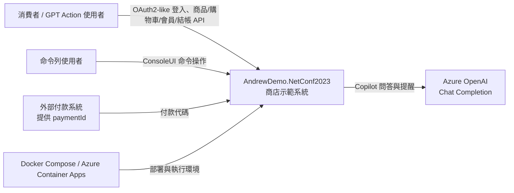
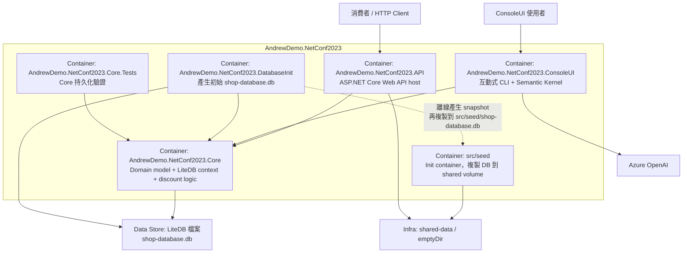
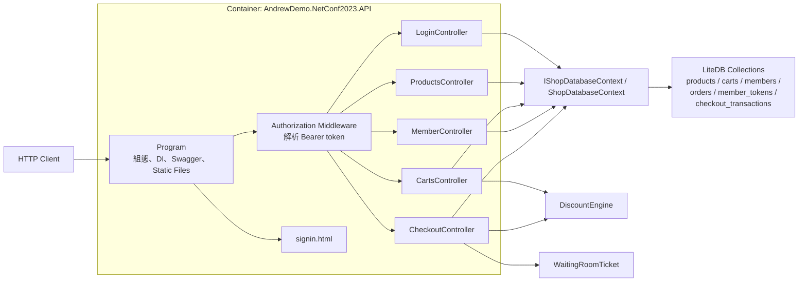
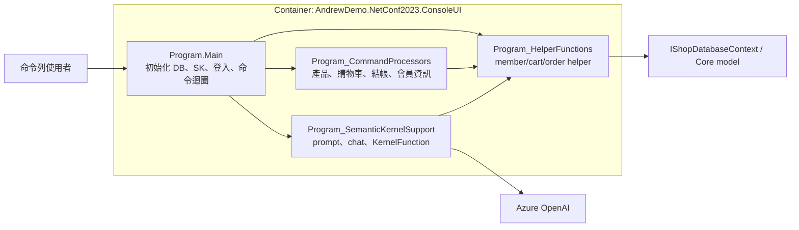

# C4 Model

這份 C4 文件描述的是 commit `cb466d49cc2f971fd20917f397ac8ab7bdd99c08` 的實際樣貌。

## 說明

- `Container` 這一層刻意對應 solution project / deployable directory，而不是嚴格只畫 deploy process。
- `AndrewDemo.NetConf2023.Core` 在技術上是 library，不是獨立程序；但為了對應你指定的「container 對應到 project」，此處仍把它當成 container 來描述。
- `src/seed` 雖然不是 `.csproj`，但它在部署上是一個獨立 init container，所以也列入 container 圖。

## 1. System Context

### Context 解讀

- 這版系統同時支援 API client 與 ConsoleUI 兩種互動入口。
- `paymentId` 並不是系統內建支付流程的一部分，而是假設由外部系統先完成付款，再把代碼帶回 `CheckoutController`。
- `ConsoleUI` 的 AI 對話能力由 Azure OpenAI 提供，不影響 API container 的核心業務流程。

## 2. Container

### Container 解讀

#### `AndrewDemo.NetConf2023.API`

- 提供 `/api/login`、`/api/products`、`/api/carts`、`/api/member`、`/api/checkout`。
- 透過 `Program.cs` 註冊 `IShopDatabaseContext`，資料庫路徑由 `SHOP_DATABASE_FILEPATH` 或 `appsettings.json` 決定。
- 在 compose / ACA 情境下，這個路徑會被指到 `/data/shop-database.db`。

#### `AndrewDemo.NetConf2023.ConsoleUI`

- 以命令列流程操作商品、購物車、結帳與會員資料。
- 同時把一部分 shop 功能包成 `KernelFunction`，讓 copilot 可直接呼叫。
- 使用 Azure OpenAI 做提醒、checkout 前確認與開放式問答。

#### `AndrewDemo.NetConf2023.Core`

- 內含 `Cart`、`Product`、`Member`、`Order`、`ShopDatabaseContext`、`DiscountEngine`、`WaitingRoomTicket`。
- 這版沒有抽象 contract project，API 與 ConsoleUI 都直接依賴 concrete model。

#### `AndrewDemo.NetConf2023.DatabaseInit`

- 產生一份新的 LiteDB 初始檔。
- 主要責任是建立產品主檔，供 API 本地執行或 seed image 製作時使用。

#### `src/seed`

- 使用 `alpine` + `bash` 的 init container。
- 啟動時把 `/seed-src/*` 複製到 `/data`，並建立 `.seed_done` 旗標。
- 用來模擬 Azure Container Apps 的 init container + emptyDir 模式。

#### `AndrewDemo.NetConf2023.Core.Tests`

- 只驗證 `Core` 的 LiteDB persistence 行為。
- 這版尚未涵蓋 checkout controller 或 ConsoleUI flow 的自動化測試。

## 3. Component View A: API Container

### API component 解讀

- `Program` 同時扮演 composition root 與簡單 auth middleware 的掛載點。
- `LoginController` 是唯一不依賴 Bearer token 的 API path。
- `CartsController` 與 `CheckoutController` 直接呼叫 `DiscountEngine`；這版還沒有把折扣邏輯抽成獨立 application service。
- `CheckoutController` 會在完成結帳前插入 `WaitingRoomTicket`，模擬排隊或延遲處理。

## 4. Component View B: ConsoleUI Container

### ConsoleUI component 解讀

- `Main` 會先初始化資料庫與商品，再要求使用者登入/註冊。
- `CommandProcessors` 提供傳統命令列操作。
- `SemanticKernelSupport` 把 shopping functions 包成 plugin，讓 copilot 在對話中呼叫。
- 這版 `ConsoleUI` 與 `Core` 的整合有持久化落差，已記錄在 [review-notes.md](./review-notes.md)。

## 5. Component 邊界小結

- 主要業務入口集中在 API controller 與 ConsoleUI command processor。
- 主要業務資料與規則仍緊耦合在 `Core`。
- 部署初始化流程則由 `DatabaseInit -> seed -> API` 這條路徑串起來。
