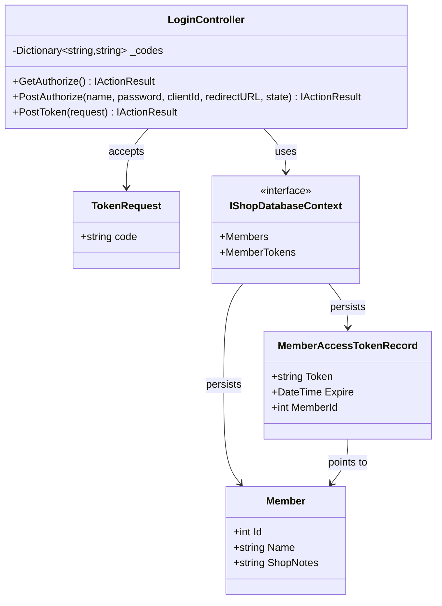
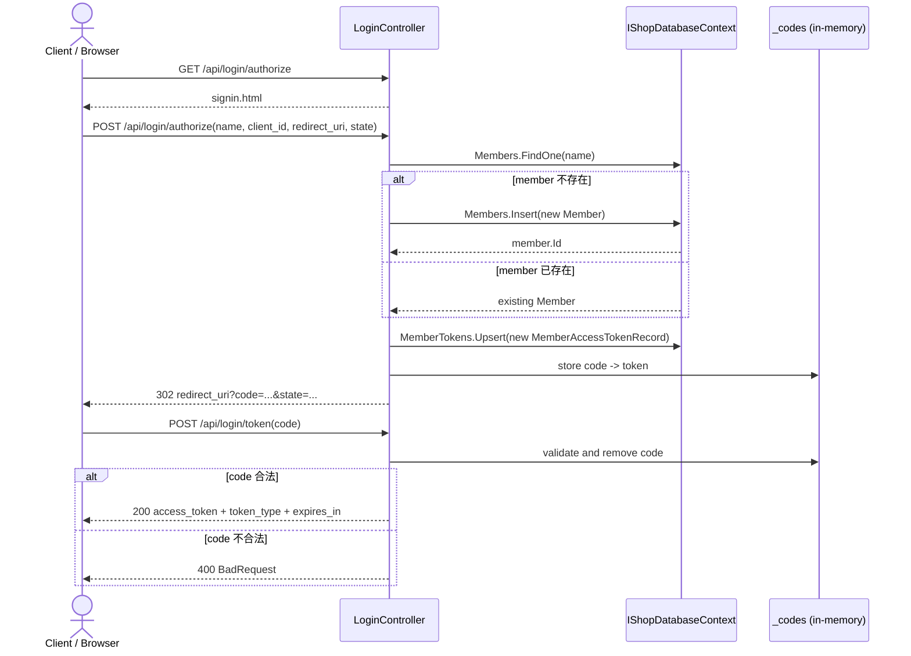

# TC-01 OAuth2-like 登入與 Access Token 交換

## 目的

驗證 API 這版提供的 OAuth2-like 流程是否能：

1. 顯示登入頁面。
2. 依使用者名稱自動建立或取得 `Member`。
3. 發出一次性 `code`。
4. 用 `code` 交換成 `access_token`。

## 主要來源

- `src/AndrewDemo.NetConf2023.API/Controllers/LoginController.cs`
- `src/AndrewDemo.NetConf2023.API/wwwroot/signin.html`
- `src/AndrewDemo.NetConf2023.API/oauth2.http`
- `src/AndrewDemo.NetConf2023.API/AndrewDemo.NetConf2023.API.http`

## 前置條件

- API host 已啟動。
- 使用者知道 `client_id`、`redirect_uri`、`state`。
- 這版不驗證密碼；只要 `name` 有值就可登入或自動註冊。

## 主流程

1. Client 呼叫 `GET /api/login/authorize` 取得 `signin.html`。
2. 使用者送出 `POST /api/login/authorize`。
3. `LoginController` 先依 `name` 尋找 `Member`；找不到就自動建立。
4. 系統建立 `MemberAccessTokenRecord`，再產生一次性 `code` 存在 controller 的記憶體字典。
5. API 以 `302` redirect 把 `code` 帶回 `redirect_uri`。
6. Client 呼叫 `POST /api/login/token`，用 `code` 交換 access token。
7. API 回傳 `access_token`、`token_type=Bearer`、`expires_in=3600`。

## 預期結果

- 第一次登入時，`members` collection 會新增使用者。
- `member_tokens` collection 會新增或覆寫對應 token。
- 授權碼只能使用一次，成功交換後會自記憶體字典移除。

## Class Diagram

## Sequence Diagram

## 與這版設計相關的重點

- `code` 並沒有寫入資料庫，只存在 `LoginController` 的 static dictionary。
- token 寫入 `member_tokens` collection，後續所有 `/api/*` 業務 API 都靠它辨識會員。
- 這版流程已接近 OAuth2 authorize code exchange，但仍是 demo 版本。
