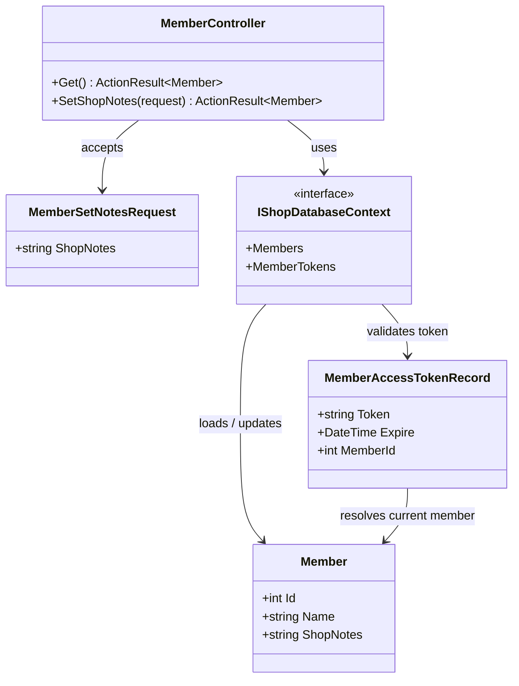
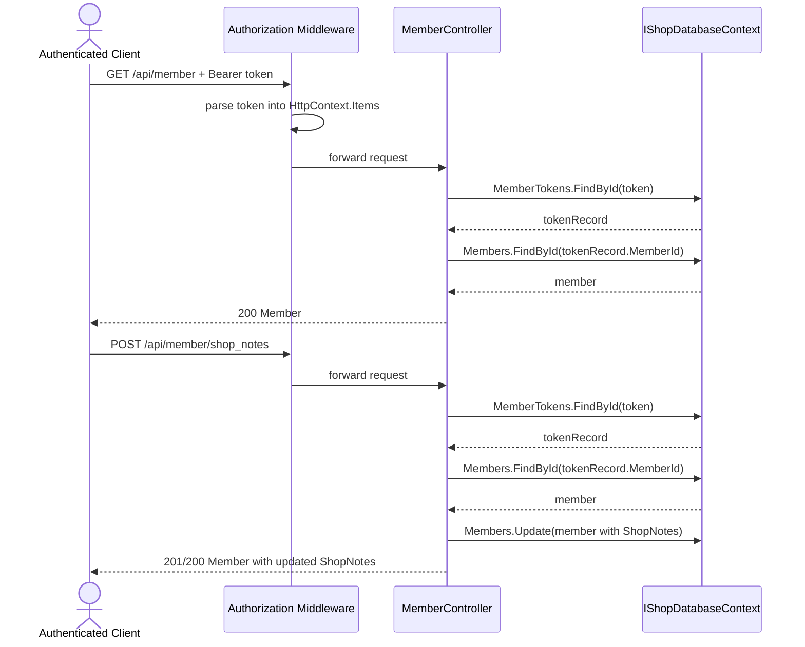

# TC-02 會員辨識與商店註記更新

## 目的

驗證已登入使用者是否能：

1. 透過 Bearer token 取得目前會員資料。
2. 更新商店端對會員的註記 `ShopNotes`。
3. 在下次查詢時讀回相同資料。

## 主要來源

- `src/AndrewDemo.NetConf2023.API/Controllers/MemberController.cs`
- `src/AndrewDemo.NetConf2023.Core/Member.cs`
- `src/AndrewDemo.NetConf2023.Core/ShopDatabaseContext.cs`
- `tests/AndrewDemo.NetConf2023.Core.Tests/MemberPersistenceTests.cs`

## 前置條件

- 已完成 TC-01，取得有效 Bearer token。
- Middleware 已把 `Authorization: Bearer <token>` 寫入 `HttpContext.Items["access-token"]`。

## 主流程

1. Client 呼叫 `GET /api/member`。
2. `MemberController` 先從 `MemberTokens` collection 驗證 token 是否存在且未過期。
3. Controller 依 `MemberId` 載入 `Member` 並回傳。
4. Client 呼叫 `POST /api/member/shop_notes`，送入新的 `ShopNotes`。
5. `MemberController` 重複 token 驗證流程，更新 `Member.ShopNotes` 後寫回資料庫。
6. Client 再次查詢 `GET /api/member`，應看到更新後的註記。

## 預期結果

- 無 token、token 不存在、token 過期、member 不存在，都會回 `Unauthorized`。
- 更新成功後，`Member.ShopNotes` 會持久化到 LiteDB。
- 這個流程與 `SetShopNotes_PersistsNotesToLiteDb` 的單元測試邏輯一致。

## Class Diagram

## Sequence Diagram

## 與這版設計相關的重點

- 這版沒有獨立 auth service；member 身分解析直接寫在 controller。
- `ShopNotes` 是商店端對會員的註記，不是 checkout order 的註記。
- `GetMemberOrders` 雖然同在 `MemberController`，但它依賴訂單資料，放在 TC-04 一起說明。
