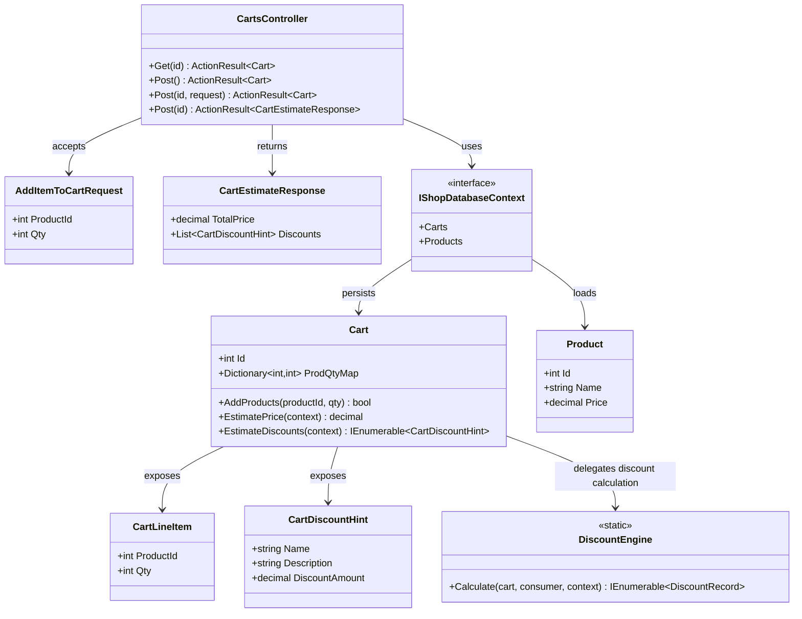
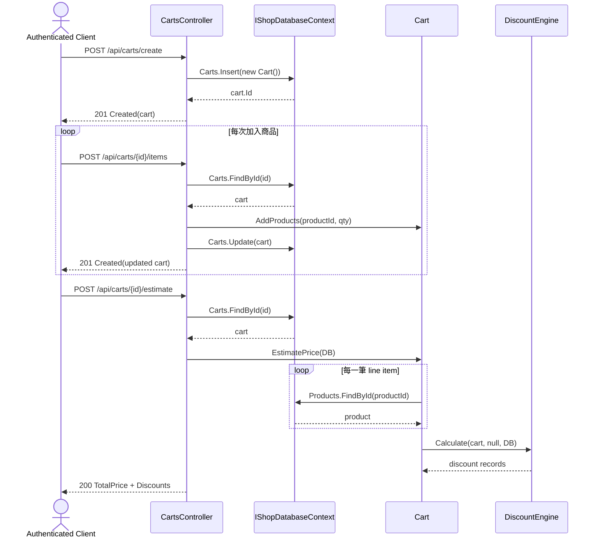

# TC-03 建立購物車、加入商品、試算折扣

## 目的

驗證購物車主流程是否能：

1. 建立新的 cart。
2. 把商品與數量寫入 cart。
3. 依商品價格與折扣規則試算總額。

## 主要來源

- `src/AndrewDemo.NetConf2023.API/Controllers/CartsController.cs`
- `src/AndrewDemo.NetConf2023.Core/Cart.cs`
- `src/AndrewDemo.NetConf2023.Core/DiscountEngine.cs`
- `src/AndrewDemo.NetConf2023.Core/Product.cs`
- `tests/AndrewDemo.NetConf2023.Core.Tests/CartPersistenceTests.cs`
- `tests/AndrewDemo.NetConf2023.Core.Tests/ProductPersistenceTests.cs`

## 前置條件

- API host 已啟動。
- Bearer token 有效。
- 商品資料已存在資料庫，至少包含 `Product.Id = 1` 的啤酒商品。

## 主流程

1. Client 呼叫 `POST /api/carts/create` 建立 cart。
2. Client 多次呼叫 `POST /api/carts/{id}/items`，加入不同商品與數量。
3. `CartsController` 會先載入 cart，再呼叫 `cart.AddProducts(productId, qty)`，最後明確執行 `Context.Carts.Update(cart)`。
4. Client 呼叫 `POST /api/carts/{id}/estimate`。
5. `Cart.EstimatePrice` 逐筆讀取 `Product` 價格，算出商品小計。
6. `Cart.EstimateDiscounts` 轉呼叫 `DiscountEngine.Calculate(...)`，取得折扣列表。
7. API 回傳 `TotalPrice` 與 `Discounts`。

## 預期結果

- Cart 內容會被持久化，重新讀取仍能看到 line items。
- 若商品 `Id = 1` 的數量達到 2 件以上，偶數件會產生「第二件六折」折扣。
- `CartPersistenceTests` 已驗證：呼叫端若明確 `Update(cart)`，之後可以正確讀回資料並試算價格。

## Class Diagram

## Sequence Diagram

## 與這版設計相關的重點

- `Cart.AddProducts` 本身不再自動持久化，呼叫端必須自行 `Update(cart)`。
- 折扣規則直接依賴 `Product.Id = 1` 這個硬編碼條件。
- 這版 `estimate` 是 `POST`，而不是 `GET`。
