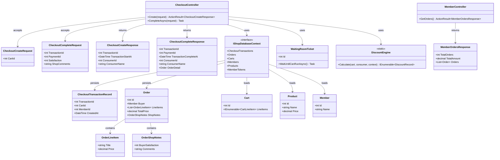
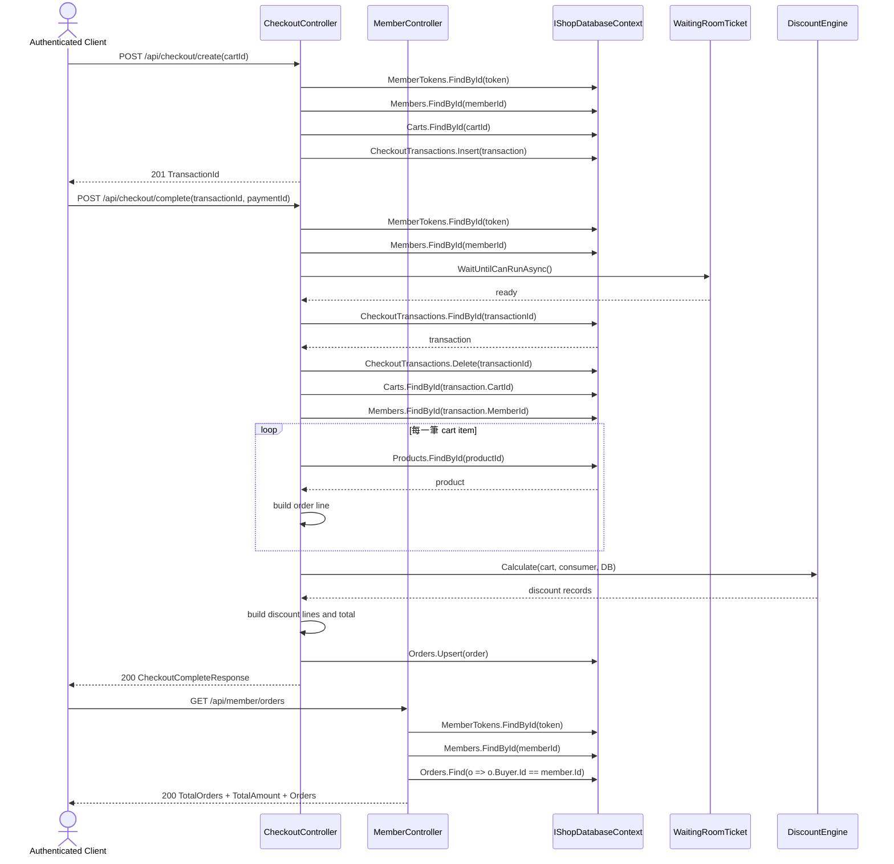

# TC-04 建立 Checkout Transaction、完成結帳、查詢訂單

## 目的

驗證結帳主流程是否能：

1. 先建立 checkout transaction。
2. 在完成付款後產生正式訂單。
3. 讓會員查詢自己的訂單歷史。

## 主要來源

- `src/AndrewDemo.NetConf2023.API/Controllers/CheckoutController.cs`
- `src/AndrewDemo.NetConf2023.API/Controllers/MemberController.cs`
- `src/AndrewDemo.NetConf2023.Core/Order.cs`
- `src/AndrewDemo.NetConf2023.Core/Checkout.cs`
- `src/AndrewDemo.NetConf2023.Core/DiscountEngine.cs`
- `src/AndrewDemo.NetConf2023.API/AndrewDemo.NetConf2023.API.http`

## 前置條件

- Bearer token 有效。
- 指定 cart 已存在，且 cart 內已有商品。
- 外部支付流程已先完成，能提供 `paymentId`。

## 主流程

1. Client 呼叫 `POST /api/checkout/create`，送入 `cartId`。
2. `CheckoutController` 驗證 token、member、cart，建立 `CheckoutTransactionRecord`。
3. Client 呼叫 `POST /api/checkout/complete`，送入 `transactionId`、`paymentId`、滿意度與評論。
4. Controller 建立 `WaitingRoomTicket`，等待可執行時機。
5. Controller 讀出 transaction，之後立即刪除該 transaction record。
6. Controller 載入 cart、member、products，建立 `Order` 與商品明細。
7. Controller 呼叫 `DiscountEngine.Calculate(...)`，把折扣轉成 `OrderLineItem`。
8. Controller 寫入 `Orders` collection，回傳 `CheckoutCompleteResponse`。
9. Client 之後可呼叫 `GET /api/member/orders` 查詢這位會員的所有訂單。

## 預期結果

- `checkout_transactions` 只在 create 到 complete 之間短暫存在。
- `orders` collection 會新增一筆 `Order.Id = transactionId` 的資料。
- `GET /api/member/orders` 會依 `Buyer.Id` 聚合這位會員的訂單數與金額。
- 這版實作實際上不會清空 cart；這點已記錄在 review notes。

## Class Diagram

## Sequence Diagram

## 與這版設計相關的重點

- `paymentId` 只被帶入 response 與 order completion context，沒有真正的 payment integration。
- 訂單編號直接沿用 `transactionId`。
- 這版 controller 註解聲稱完成結帳後會清空購物車，但實作沒有做這件事。
