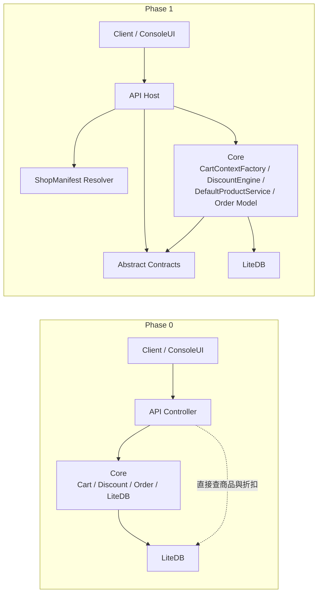
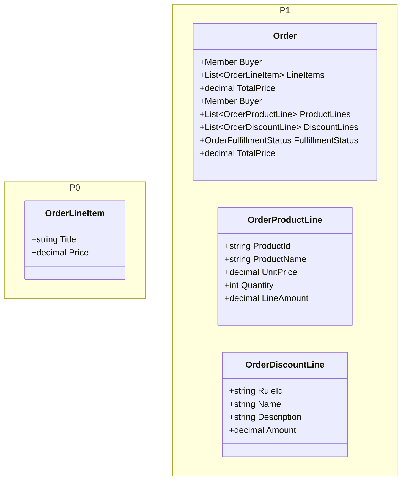

# 2026 Phase 1 文件集

這份目錄是依照 commit `37ae0a2ed76cbea448f668226a90f6ed312643a8` 反推整理的 phase 1 文件，目的是固定這個版本已經凍結中的 contract、runtime wiring 與主要 testcase，並且明確對照 phase 0 的架構變化。

## 範圍與判讀原則

- 主要來源以該 commit 的 `spec/`、`spec/testcases/`、`src/AndrewDemo.NetConf2023.Abstract`、`src/AndrewDemo.NetConf2023.API`、`src/AndrewDemo.NetConf2023.Core`、`tests/AndrewDemo.NetConf2023.Core.Tests` 為準。
- 這版已進入 phase 1，因此 `/spec` 與 `.Abstract` 優先於 controller 註解或舊版 `.http` sample。
- 若規格、sample、註解、實作之間有落差，文件主體以實作與正式 contract 為準，差異另外記錄在 [review-notes.md](./review-notes.md)。

## 文件索引

- [c4-model.md](./c4-model.md)
- [testcases/README.md](./testcases/README.md)
- [review-notes.md](./review-notes.md)
- phase 0 對照基準：[phase0 文件集](../2026-phase-0-cb466d49cc2f971fd20917f397ac8ab7bdd99c08/README.md)

## phase0 -> phase1 異動摘要

### 結構層級的變化

| 主題 | phase 0 | phase 1 |
| --- | --- | --- |
| 正式 contract | 無，API / ConsoleUI 直接依賴 `.Core` concrete model | 新增 `.Abstract`，凍結 `ShopManifest`、`CartContext`、`IDiscountRule`、`IProductService` 與 product event contract |
| 啟動模型 | 單一資料庫路徑 + 單一 demo host | `ShopManifest` + `IShopManifestResolver`，啟動時解析 `shop-id` |
| 商品邊界 | controller / cart / checkout 直接讀 `_database.Products` | 改由 `IProductService` 負責 published product 查詢與 hidden product 解析 |
| 折扣邊界 | `Cart.EstimatePrice` 直接呼叫靜態 `DiscountEngine.Calculate(cart, consumer, db)` | `CartContextFactory` 建立 `CartContext`，`DiscountEngine` 執行已注入的 `IDiscountRule` |
| 訂單模型 | `Order.LineItems` 混合商品列與折扣列 | 拆成 `ProductLines`、`DiscountLines`，並新增 `FulfillmentStatus` |
| Product callback | 無 | checkout 後建立 `ProductOrderCompletedEvent`，同步呼叫 `IProductService.HandleOrderCompleted(...)` |
| ProductId 型別 | `int` | `string` |
| 技術基準 | `net9.0` + `.sln` | `net10.0` + `.slnx` |

### 對照圖 1：架構邊界

### 對照圖 2：訂單模型

### 這個版本真正落地的重點

1. `Program` 啟動時會先解析 `ShopManifest`，再用它決定資料庫路徑、`IProductService` 與啟用折扣規則。
2. `ProductsController`、`CartsController`、`CheckoutController` 已不再直接依賴 `products` collection 的細節，而是經過 `IProductService` 與 `CartContextFactory`。
3. `Order` 現在已能明確表示商品列、折扣列與 fulfillment 結果，這是後續 reservation / cancellation 擴充的前提。
4. `ProductOrderEventFactory` 已提供 `Completed` / `Cancelled` event payload 組裝方式，但 phase 1 這個 commit 還沒有真正的 cancel flow。

## phase1 系統摘要

- `AndrewDemo.NetConf2023.Abstract` 正式定義了 shop、cart、discount、product 的共享 contract。
- `AndrewDemo.NetConf2023.API` 變成 runtime composition root，負責解析 manifest、組裝 `DefaultProductService` 與 `DiscountEngine`。
- `AndrewDemo.NetConf2023.Core` 仍持有 LiteDB context 與 domain model，但 product lookup 與 discount evaluation 已被限制在較清楚的邊界中。
- `AndrewDemo.NetConf2023.DatabaseInit` 與 `src/seed` 仍保留 phase 0 的部署初始化路徑，只是產品資料已跟隨新的 `Product` contract 演進。

## 驗證摘要

- 我已在 exact snapshot `/private/tmp/andrewshop-37ae0a2e` 執行 `dotnet test tests/AndrewDemo.NetConf2023.Core.Tests/AndrewDemo.NetConf2023.Core.Tests.csproj`。
- 結果：`6` 個測試全部通過。
- API project 的獨立 build 我有啟動，但沒有在本輪內拿到穩定結論，因此 review 結論仍以 `spec + source + Core.Tests` 為主。
