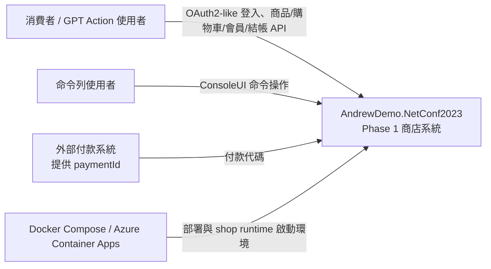
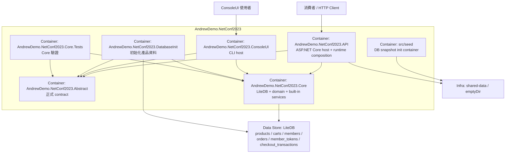
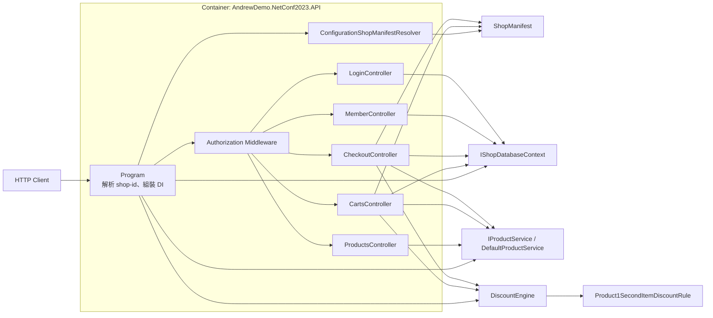
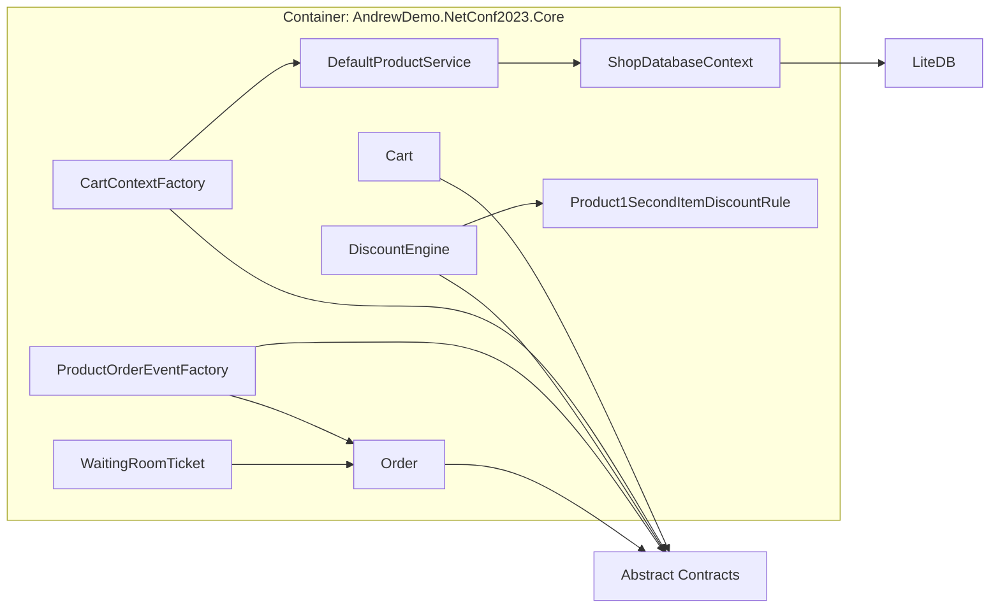

# C4 Model

這份 C4 文件描述的是 commit `37ae0a2ed76cbea448f668226a90f6ed312643a8` 的 phase 1 架構。

## 說明

- `Container` 這層仍依你的要求對應到 project / deployable directory。
- `AndrewDemo.NetConf2023.Abstract` 雖然是 library，不是 process，但 phase 1 它已經是正式 contract 專案，因此在 container view 中保留。
- `src/seed` 不是 `.csproj`，但在部署上仍是獨立 init container。

## 1. System Context

### Context 解讀

- phase 1 與 phase 0 一樣同時有 API 與 ConsoleUI 兩種入口，但 phase 1 的主要演進點是內部邊界，而不是新的外部 actor。
- 外部支付仍然只表現在 `paymentId` 輸入，沒有正式 payment integration。

## 2. Container

### Container 解讀

#### `AndrewDemo.NetConf2023.API`

- phase 1 新責任是 runtime composition root。
- 啟動時解析 `ShopManifest`，並依 `ProductServiceId`、`EnabledDiscountRuleIds` 組裝 service 與 rule。
- controller 雖然仍然保有一部分 orchestration，但已不再直接決定 product boundary 的細節。

#### `AndrewDemo.NetConf2023.Abstract`

- phase 1 新增的正式 contract project。
- 定義 `ShopManifest`、`CartContext` / `LineItem`、`IDiscountRule` / `DiscountRecord`、`Product` / `IProductService` / product order event。

#### `AndrewDemo.NetConf2023.Core`

- 保留 LiteDB context 與 domain model。
- 新增 `CartContextFactory`、新 `DiscountEngine`、`Product1SecondItemDiscountRule`、`DefaultProductService`、`ProductOrderEventFactory`。
- `Order` 模型已能分離商品列與折扣列。

#### `AndrewDemo.NetConf2023.ConsoleUI`

- 仍是第二個 host。
- 在這個 commit 裡已部分跟上新 contract，例如 `ProductId: string`、`DefaultProductService`、新的 `Order` 模型。
- 但主要驗證重心仍在 API + Core。

#### `AndrewDemo.NetConf2023.DatabaseInit`

- 用新的 shared `Product` contract 初始化產品資料。
- `Product.Id` 已改成 `string`，且多了 `IsPublished`。

#### `src/seed`

- 延續 phase 0 的 init container 模式，把資料庫 snapshot 複製到 `/data`。

## 3. Component View A: API Container

### API component 解讀

- `Program` 是 phase 1 最關鍵的新 component，因為 shop runtime 與 product service selection 都在這裡完成。
- `ProductsController` 只負責 published / by-id 查詢，不再知道 LiteDB `products` collection 的實作細節。
- `CartsController` 在 add item 前會用 `IProductService` 驗證商品，再用 `CartContextFactory + DiscountEngine` 做試算。
- `CheckoutController` 仍把 checkout orchestration 放在 controller 內，但已經會建立 `ProductLines`、`DiscountLines` 與 product completed event。

## 4. Component View B: Core Container

### Core component 解讀

- `CartContextFactory` 是 phase 1 cart/discount 邊界的轉接點。
- `DiscountEngine` 已經變成只處理 `CartContext -> DiscountRecord[]` 的協調器。
- `DefaultProductService` 把既有 LiteDB `products` collection 包成 `IProductService` 的第一個 built-in 實作。
- `ProductOrderEventFactory` 把 order product lines 轉成 product domain callback payload。

## 5. Component 邊界小結

- phase 1 的核心變化不是多了更多 host，而是 `API` 與 `Core` 之間多出正式 contract 與明確 service boundary。
- `Order` 現在已經能承接後續 fulfillment / cancellation 擴充，但這個 commit 仍停在最小 callback 與狀態模型。
