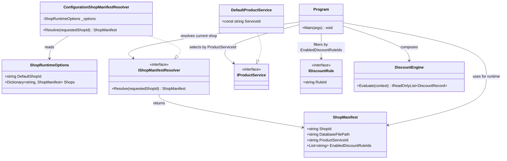
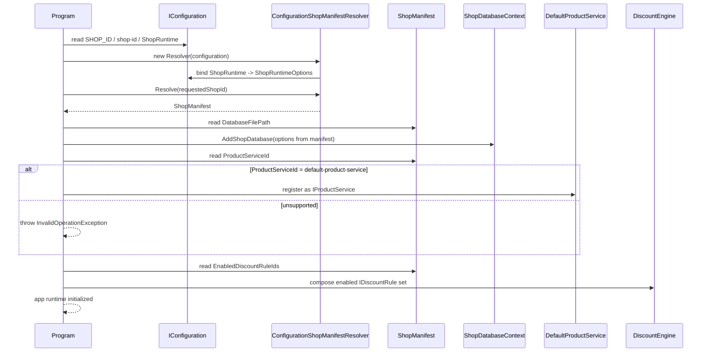

# TC-P1-01 啟動時解析 ShopManifest 並組裝 Runtime

## 目的

驗證 phase 1 啟動時是否能：

1. 解析目前要服務的 `shop-id`。
2. 取得對應 `ShopManifest`。
3. 依 manifest 決定資料庫路徑、`IProductService` 與啟用的 discount rule。

## 主要來源

- `spec/shop-runtime-and-discount-rule.md`
- `spec/product-service-and-order-events.md`
- `src/AndrewDemo.NetConf2023.API/Program.cs`
- `src/AndrewDemo.NetConf2023.API/Configuration/ShopRuntimeOptions.cs`
- `src/AndrewDemo.NetConf2023.API/Configuration/ConfigurationShopManifestResolver.cs`
- `src/AndrewDemo.NetConf2023.API/appsettings.json`

## 前置條件

- host 已載入 `appsettings.json`。
- `SHOP_ID` 或 `--shop-id` 可選，若未指定則 fallback 到 `ShopRuntime.DefaultShopId`。

## 主流程

1. `Program` 從 `SHOP_ID` 或 `shop-id` 讀取 requested shop id。
2. DI 註冊 `ConfigurationShopManifestResolver`。
3. resolver 從 `ShopRuntimeOptions.Shops` 取得對應的 `ShopManifest`。
4. `Program` 用 `ShopManifest.DatabaseFilePath` 建立 `ShopDatabaseOptions`。
5. `Program` 依 `ShopManifest.ProductServiceId` 選擇 `IProductService`，phase 1 只有 `DefaultProductService`。
6. `Program` 依 `EnabledDiscountRuleIds` 從已註冊的 `IDiscountRule` 篩出可用規則，組成 `DiscountEngine`。

## 預期結果

- 找不到 `shop-id` 時，啟動直接失敗。
- 相對資料庫路徑以 `AppContext.BaseDirectory` 為基準解析。
- `default-product-service` 會被解析成 `DefaultProductService`。
- manifest 中未啟用的 discount rule 不會進入 `DiscountEngine`。

## Class Diagram

## Sequence Diagram

## 與這版設計相關的重點

- `Program` 已從 phase 0 的「直接綁資料庫路徑」演進成 phase 1 的「先解析商店 manifest，再組裝 runtime」。
- `ShopManifest` 現在同時決定資料庫、product service 與 discount rule 啟用狀態。
