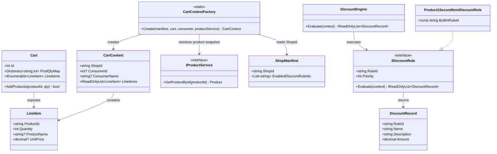
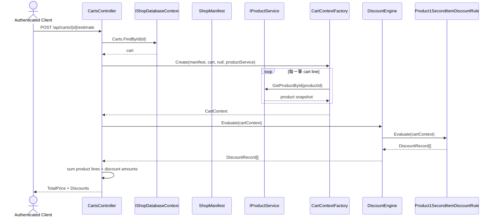

# TC-P1-02 CartContext 與 DiscountEngine 折扣試算

## 目的

驗證 phase 1 的購物車試算是否真的改為：

1. 先把 `Cart` 投影成 `CartContext`。
2. 再交由 `DiscountEngine` 執行已啟用的 `IDiscountRule`。

## 主要來源

- `spec/shop-runtime-and-discount-rule.md`
- `spec/testcases/shop-runtime-and-discount-rule.md`
- `src/AndrewDemo.NetConf2023.Core/Carts/CartContextFactory.cs`
- `src/AndrewDemo.NetConf2023.Core/Discounts/DiscountEngine.cs`
- `src/AndrewDemo.NetConf2023.Core/Discounts/Product1SecondItemDiscountRule.cs`
- `src/AndrewDemo.NetConf2023.API/Controllers/CartsController.cs`
- `tests/AndrewDemo.NetConf2023.Core.Tests/CartPersistenceTests.cs`
- `tests/AndrewDemo.NetConf2023.Core.Tests/DiscountEngineTests.cs`

## 前置條件

- `ShopManifest.EnabledDiscountRuleIds` 包含 `product-1-second-item-40-off`。
- cart 內至少有商品 `"1"` 兩件。
- `IProductService` 可依 `ProductId` 解析出價格與名稱。

## 主流程

1. `CartsController` 讀出 cart。
2. `CartContextFactory.Create(manifest, cart, consumer, productService)` 逐筆把 cart line item 轉成帶價格與名稱快照的 `CartContext.LineItems`。
3. `DiscountEngine.Evaluate(cartContext)` 依 priority / rule id 執行已啟用規則。
4. `Product1SecondItemDiscountRule` 找出商品 `"1"` 的數量，對每個偶數件產生一筆 `DiscountRecord`。
5. controller 以 `CartContext.LineItems` 的商品小計加上 `DiscountRecord.Amount` 合成 `TotalPrice`。

## 預期結果

- `Cart.LineItems` 與 `CartContext.LineItems` 共用 `LineItem` 型別，但 `CartContext` 會補齊 `ProductName` / `UnitPrice`。
- engine 只執行 manifest 啟用的規則。
- 購物車中商品 `"1"` 數量為 2 時，折扣金額應為 `UnitPrice * -0.4`。

## Class Diagram

## Sequence Diagram

## 與這版設計相關的重點

- 折扣邏輯不再直接看資料庫，也不再接受 raw `Cart + Member + Database`。
- `CartContextFactory` 是 phase 1 discount 邊界最核心的轉接點。
