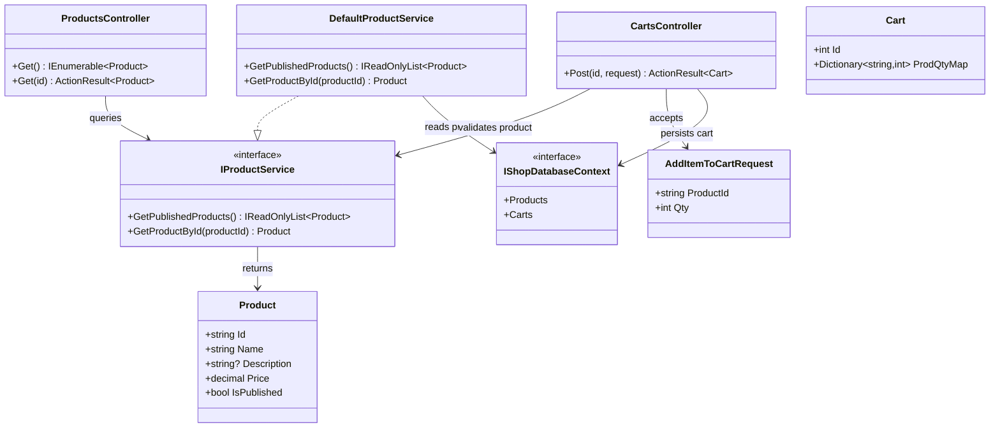
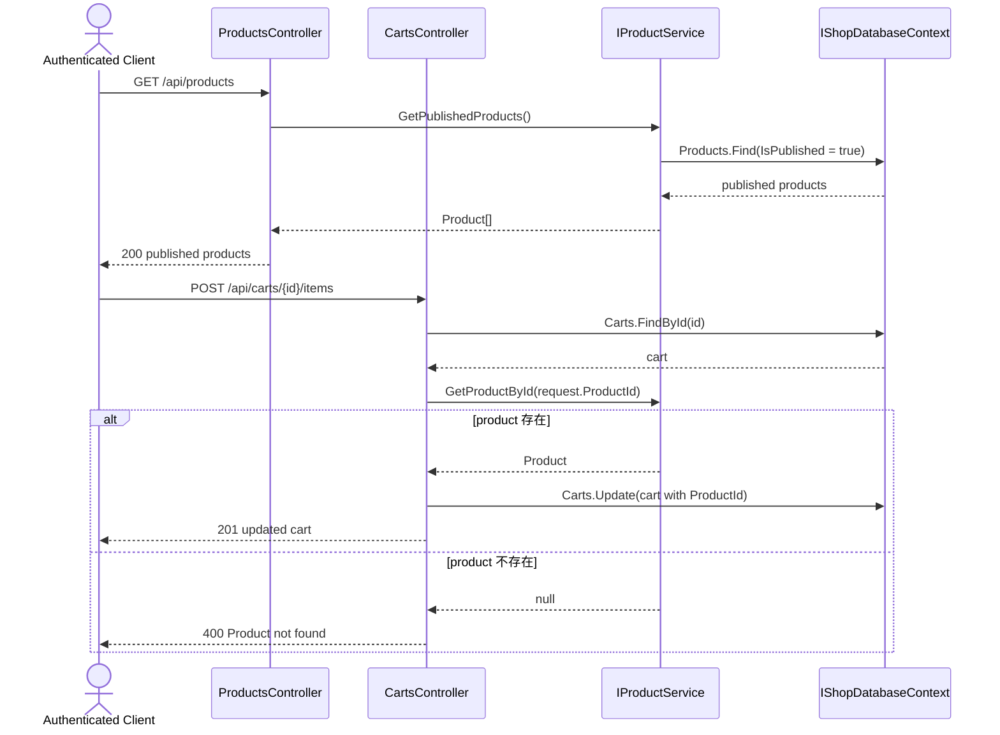

# TC-P1-03 IProductService 商品查詢與購物車驗證

## 目的

驗證 phase 1 的 product 邊界是否真的落在 `IProductService`：

1. 商品列表只能列出 published product。
2. 加入購物車前必須先驗證 `ProductId` 是否存在。
3. `ProductId` 已全面改為 `string`。

## 主要來源

- `spec/product-service-and-order-events.md`
- `spec/testcases/product-service-and-order-events.md`
- `src/AndrewDemo.NetConf2023.Abstract/Products/ProductContracts.cs`
- `src/AndrewDemo.NetConf2023.Core/Products/DefaultProductService.cs`
- `src/AndrewDemo.NetConf2023.API/Controllers/ProductsController.cs`
- `src/AndrewDemo.NetConf2023.API/Controllers/CartsController.cs`
- `src/AndrewDemo.NetConf2023.DatabaseInit/Program.cs`

## 前置條件

- `DefaultProductService` 已由 DI 註冊為目前 shop 的 `IProductService`。
- 資料庫中至少有若干 `Product`，且 `IsPublished` 欄位已正確設值。

## 主流程

1. Client 呼叫 `GET /api/products`。
2. `ProductsController` 轉呼叫 `IProductService.GetPublishedProducts()`，只回傳 `IsPublished = true` 的商品。
3. Client 呼叫 `POST /api/carts/{id}/items`。
4. `CartsController` 先以 `IProductService.GetProductById(request.ProductId)` 驗證商品存在。
5. 找得到商品才會把 `ProductId` 與數量寫進 cart。

## 預期結果

- `Product.Id` 已是 `string`。
- `GET /api/products` 不直接碰 `_database.Products`。
- `POST /api/carts/{id}/items` 對不存在的 product id 回傳錯誤，不會直接污染 cart。

## Class Diagram

## Sequence Diagram

## 與這版設計相關的重點

- phase 1 的 product boundary 已經把「商品可列出」與「商品可被 cart / checkout 解析」明確分開。
- hidden product 的支援點在 `GetProductById`，不是在 `/api/products` 列表。
