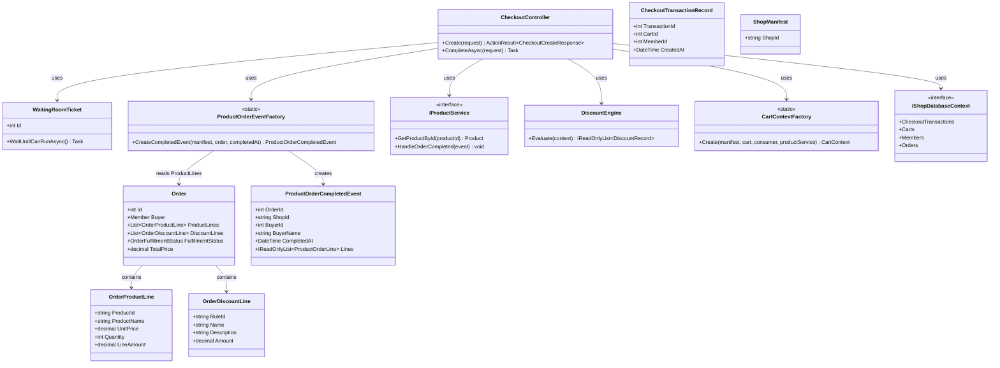
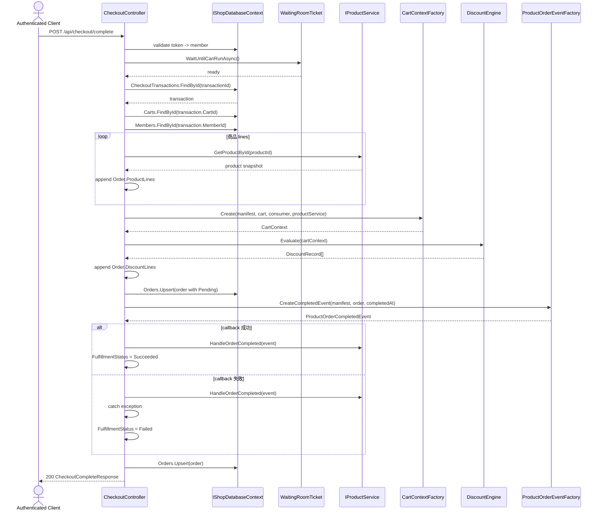

# TC-P1-04 Checkout、Product Event 與 Fulfillment Status

## 目的

驗證 phase 1 的 checkout 流程是否已支援：

1. 以商品快照建立 `Order.ProductLines`。
2. 以折扣結果建立 `Order.DiscountLines`。
3. 建立 `ProductOrderCompletedEvent`。
4. 用 callback 結果更新 `FulfillmentStatus`。

## 主要來源

- `spec/product-service-and-order-events.md`
- `spec/testcases/product-service-and-order-events.md`
- `src/AndrewDemo.NetConf2023.API/Controllers/CheckoutController.cs`
- `src/AndrewDemo.NetConf2023.Core/Order.cs`
- `src/AndrewDemo.NetConf2023.Core/Products/ProductOrderEventFactory.cs`
- `src/AndrewDemo.NetConf2023.Core/Carts/CartContextFactory.cs`
- `src/AndrewDemo.NetConf2023.Core/Discounts/DiscountEngine.cs`
- `src/AndrewDemo.NetConf2023.Core/Checkout.cs`

## 前置條件

- 使用者已登入並持有有效 access token。
- 已建立 checkout transaction。
- cart 內商品都可由 `IProductService.GetProductById` 解析。

## 主流程

1. Client 呼叫 `POST /api/checkout/complete`。
2. `CheckoutController` 驗證 access token 與 member。
3. 建立 `WaitingRoomTicket`，等待可執行時機。
4. 讀取 `CheckoutTransactionRecord`、cart、buyer。
5. 逐筆商品用 `IProductService.GetProductById` 建立 `Order.ProductLines`。
6. 用 `CartContextFactory + DiscountEngine` 算出 `DiscountLines`。
7. 將 order 先寫入資料庫，初始 `FulfillmentStatus = Pending`。
8. 用 `ProductOrderEventFactory.CreateCompletedEvent(...)` 建立 event。
9. 呼叫 `IProductService.HandleOrderCompleted(event)`。
10. callback 成功則把 `FulfillmentStatus` 設成 `Succeeded`；失敗則設成 `Failed`，但 checkout response 仍然成功。

## 預期結果

- product event payload 只包含商品列，不包含 discount line。
- order complete 與 fulfillment success 已分離。
- callback 失敗時不推翻訂單完成。

## Class Diagram

## Sequence Diagram

## 與這版設計相關的重點

- phase 1 的 checkout 還沒有抽出獨立 service，但 order line 與 product callback 邊界已經成形。
- `ProductOrderCompletedEvent` 只看 `Order.ProductLines`，因此 discount line 不會進入 product domain callback。
