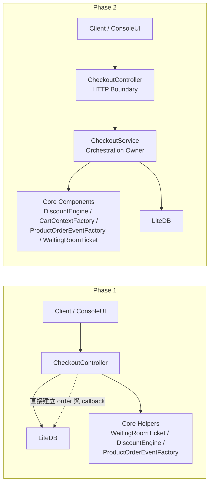

# 2026 Phase 2 文件集

這份目錄是依照 commit `bb5122c9b6285a20f8f40ac96662f0c0b54c6f73` 反推整理的 phase 2 文件，目的是固定這個版本已完成的 checkout orchestration 搬移、correctness 修正，以及 phase 1 到 phase 2 的邊界變化。

## 範圍與判讀原則

- 主要來源以這個 commit 的 `docs/decisions/`、`spec/`、`spec/testcases/`、`src/AndrewDemo.NetConf2023.API`、`src/AndrewDemo.NetConf2023.Core`、`src/AndrewDemo.NetConf2023.ConsoleUI`、`tests/AndrewDemo.NetConf2023.Core.Tests` 為準。
- 這版已進入 phase 2，`/spec` 與 `AndrewDemo.NetConf2023.Abstract` 視為已定案，重點在 `.Core` 與 host 專案是否依規格完成搬移與修正。
- 若規格、sample、註解、實作之間有落差，文件主體以 `spec + source + tests` 為準，殘留差異另外記錄在 [review-notes.md](./review-notes.md)。

## 文件索引

- [c4-model.md](./c4-model.md)
- [testcases/README.md](./testcases/README.md)
- [review-notes.md](./review-notes.md)
- phase 1 對照基準：[phase1 文件集](../2026-phase-1-37ae0a2ed76cbea448f668226a90f6ed312643a8/README.md)

## phase1 -> phase2 異動摘要

### 結構層級的變化

| 主題 | phase 1 | phase 2 |
| --- | --- | --- |
| checkout orchestration owner | `CheckoutController` 直接負責 waiting room、transaction、order、discount、callback | 新增 `.Core.Checkouts.CheckoutService`，controller 只保留 auth / HTTP mapping |
| Core command / result boundary | API request / response 與 orchestration 邏輯混在 controller | 新增 `CheckoutCreateCommand/Result`、`CheckoutCompleteCommand/Result` |
| waiting room 執行位置 | `CheckoutController` 直接建立 `WaitingRoomTicket` | `CheckoutService.CompleteAsync(...)` 內部控制 waiting room |
| complete 時序 | 先刪 `CheckoutTransactionRecord`，再建立 `Order` | 先 `Orders.Upsert(order)`，再刪 transaction |
| buyer 驗證 | 已登入 member 不一定要等於 transaction buyer | `transaction.MemberId != RequestMember.Id` 時回 `BuyerMismatch`，API 映射為 `403 Forbidden` |
| 驗證方式 | 主要靠 phase 1 既有 core tests | 新增 `CheckoutServiceTests`，把 create、complete success、product missing、buyer mismatch 補成自動化案例 |
| ConsoleUI checkout 路徑 | ConsoleUI 自行拼 checkout / order 流程 | ConsoleUI 改為共用 `CheckoutService`，與 API 對齊 canonical checkout 邏輯 |

### 對照圖 1：checkout 責任邊界

### 對照圖 2：complete 時序修正

```mermaid
flowchart TB
    subgraph P1["Phase 1 Complete Flow"]
        P1A["載入 transaction"]
        P1B["刪除 transaction"]
        P1C["載入 cart / buyer / products"]
        P1D["建立 order"]
        P1E["觸發 product callback"]
        P1F["更新 fulfillment status"]

        P1A --> P1B --> P1C --> P1D --> P1E --> P1F
    end

    subgraph P2["Phase 2 Complete Flow"]
        P2A["載入 transaction"]
        P2B["驗證 request member == transaction buyer"]
        P2C["載入 cart / buyer / products"]
        P2D["Orders.Upsert(order)"]
        P2E["刪除 transaction"]
        P2F["觸發 product callback"]
        P2G["更新 fulfillment status"]

        P2A --> P2B --> P2C --> P2D --> P2E --> P2F --> P2G
    end
```

### 這個版本真正落地的重點

1. `CheckoutController` 已不再直接操作 `CheckoutTransactions`、`Orders`、`WaitingRoomTicket`、`DiscountEngine`、`ProductOrderEventFactory`。
2. `.Core` 新增 `CheckoutService` 與對應 command / result model，讓 create / complete 都有明確 application service 邊界。
3. phase 1 已知的 buyer mismatch 與 transaction delete timing 問題，在 phase 2 已被納入 `spec`、`docs/decisions` 與 `CheckoutServiceTests`。
4. ConsoleUI 的 checkout 也改走 `CheckoutService`，表示 phase 2 並不是只修 API controller，而是讓 host 端都回到同一條核心流程。

## phase2 系統摘要

- `AndrewDemo.NetConf2023.API` 現在是純 HTTP composition root，checkout 只負責 access token 解析、member 驗證、command mapping 與 HTTP status mapping。
- `AndrewDemo.NetConf2023.Core` 正式擁有 checkout application layer，`CheckoutService` 負責 transaction、order、discount、callback 與 fulfillment status 的主流程。
- `AndrewDemo.NetConf2023.ConsoleUI` 已改為共用 phase 2 checkout service，而不再維持另一條獨立的 order 組裝流程。
- `spec/checkout-service-phase2-migration.md` 與 `spec/checkout-correctness-fixes.md` 一起構成 phase 2 的正式驗收基準。

## 驗證摘要

- 已執行 `dotnet test -m:1 tests/AndrewDemo.NetConf2023.Core.Tests/AndrewDemo.NetConf2023.Core.Tests.csproj`。
- 結果：`10` 個測試全部通過。
- 已執行 `dotnet build -m:1 src/AndrewDemo.NetConf2023.API/AndrewDemo.NetConf2023.API.csproj`。
- 結果：build 成功，僅有既存 XML comment warning，沒有新的 compile error。
