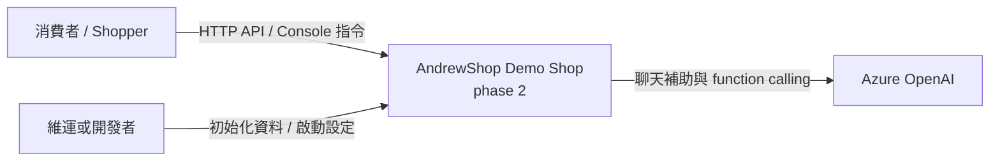
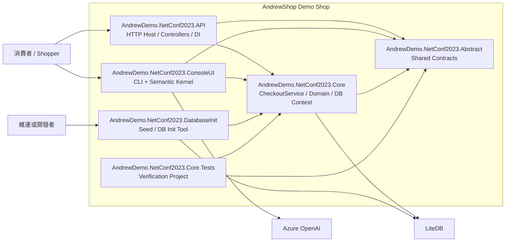
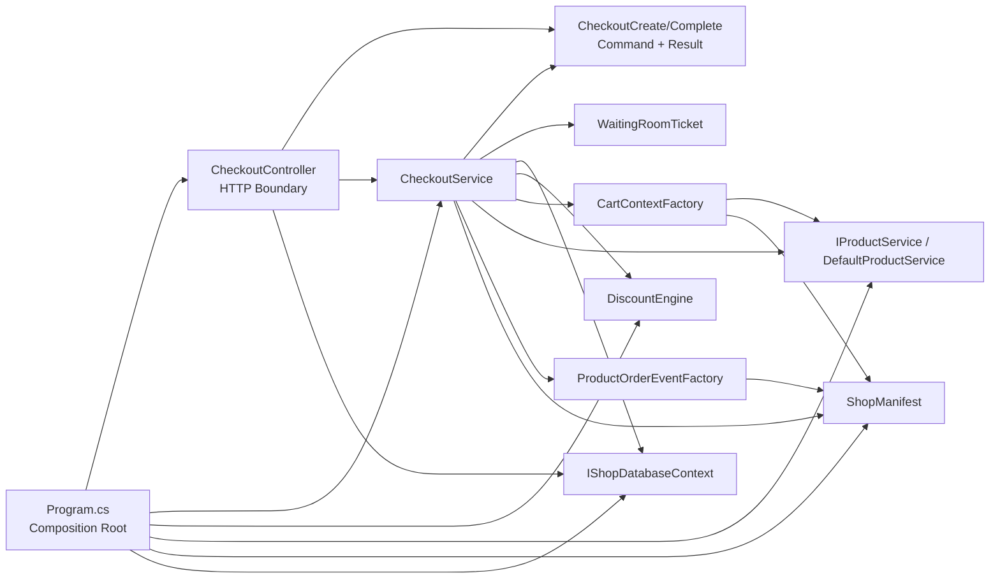

# Phase 2 C4 Model

這份 C4 只聚焦在 phase 2 的 checkout 主軸。container 層刻意直接對應到 project，方便和 solution 結構一一比對。

## Context

## Container

### Container 對應說明

| Container | 對應 project | phase 2 角色 |
| --- | --- | --- |
| API | `src/AndrewDemo.NetConf2023.API` | HTTP boundary、auth middleware、controller mapping |
| Console | `src/AndrewDemo.NetConf2023.ConsoleUI` | CLI 操作介面、Semantic Kernel function calling、共用 `CheckoutService` |
| Core | `src/AndrewDemo.NetConf2023.Core` | checkout orchestration、discount、product lookup、LiteDB context |
| Abstract | `src/AndrewDemo.NetConf2023.Abstract` | 已凍結 contract，phase 2 不任意更動 |
| DbInit | `src/AndrewDemo.NetConf2023.DatabaseInit` | 資料庫初始化 |
| Tests | `tests/AndrewDemo.NetConf2023.Core.Tests` | phase 2 checkout 驗證 |

## Component

phase 2 最重要的 component 變化發生在 checkout path，因此 component 圖以 `API + Core.Checkouts` 為中心。

## phase 2 解讀重點

- component owner 從 `CheckoutController` 轉移到 `CheckoutService`，這是 phase 1 -> phase 2 的核心差異。
- `CheckoutModels` 讓 `.Core` 不再直接吃 API request / response class，邊界明確化。
- `WaitingRoomTicket` 雖然不是新類別，但 phase 2 起使用決策已屬於 `CheckoutService`，不再由 controller 主導。
- `DiscountEngine`、`CartContextFactory`、`IProductService`、`ProductOrderEventFactory` 現在都由 `CheckoutService` 串接，形成單一 checkout application flow。
