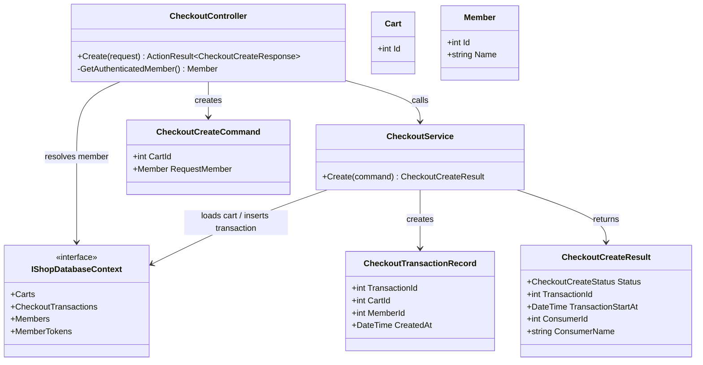
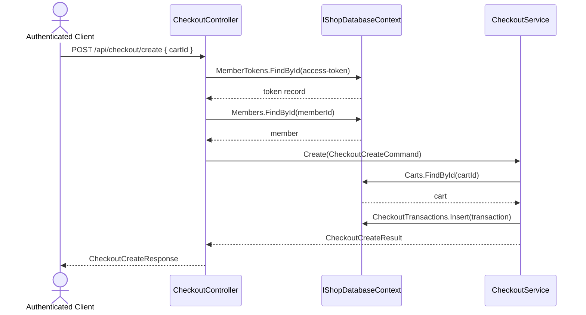

# TC-P2-01 CheckoutCreate 由 CheckoutService 擁有

## 目的

驗證 phase 2 是否已把 checkout create 的主流程從 `CheckoutController` 搬到 `.Core.Checkouts.CheckoutService`，讓 controller 只保留 HTTP boundary。

## 主要來源

- `spec/checkout-service-phase2-migration.md`
- `spec/testcases/checkout-service-phase2-migration.md`
- `src/AndrewDemo.NetConf2023.API/Controllers/CheckoutController.cs`
- `src/AndrewDemo.NetConf2023.Core/Checkouts/CheckoutService.cs`
- `src/AndrewDemo.NetConf2023.Core/Checkouts/CheckoutModels.cs`
- `tests/AndrewDemo.NetConf2023.Core.Tests/CheckoutServiceTests.cs`

## 前置條件

- 呼叫者已通過 middleware，`HttpContext.Items["access-token"]` 可解析為有效 member。
- 指定的 cart 已存在。

## 主流程

1. Client 呼叫 `POST /api/checkout/create`。
2. `CheckoutController` 只負責取出 authenticated member。
3. controller 建立 `CheckoutCreateCommand`。
4. controller 呼叫 `CheckoutService.Create(...)`。
5. `CheckoutService` 載入 cart、建立 `CheckoutTransactionRecord`、寫入資料庫。
6. service 回傳 `CheckoutCreateResult`。
7. controller 把 result 映射成 `CheckoutCreateResponse`。

## 預期結果

- `CheckoutController` 不再直接插入 `CheckoutTransactions`。
- `.Core` 成為 create transaction 的真正 owner。
- 對外 response 內容維持 phase 1 的 `transactionId / consumer / startAt` 形狀。

## Class Diagram

## Sequence Diagram

## 與 phase 1 的差異

- phase 1 的 create transaction 是 controller 直接存資料庫，phase 2 才真正把 orchestration 收回 `.Core`。
- create 路徑因此和 complete 路徑共享同一個 checkout application layer，而不是只有 complete 才有 business flow。
