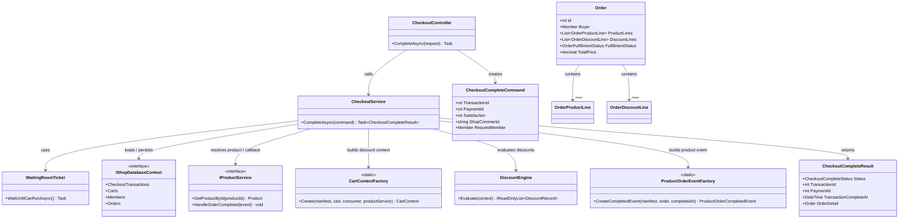
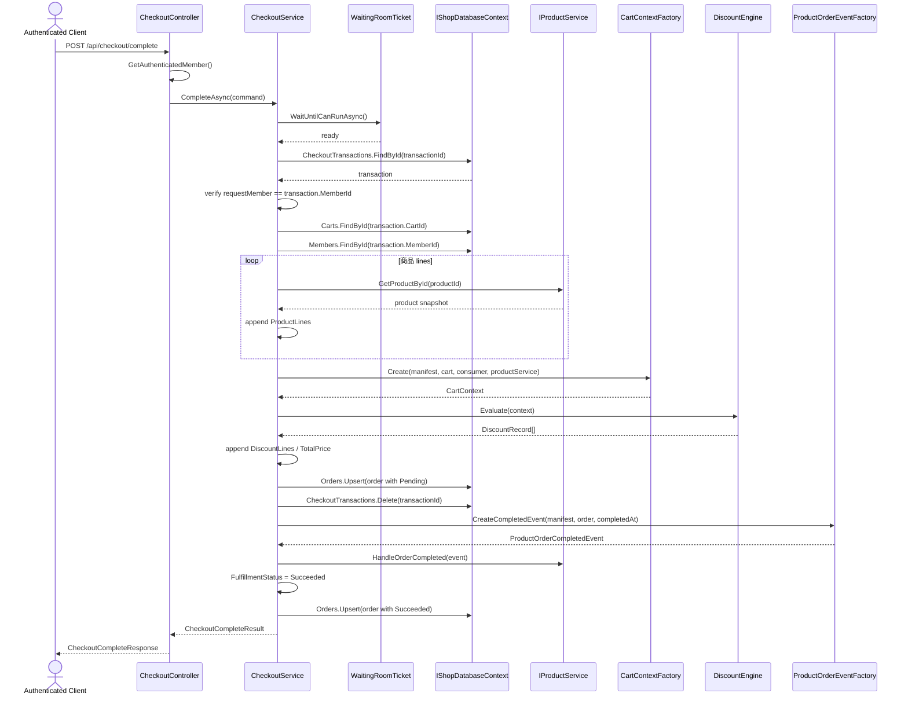

# TC-P2-02 CheckoutComplete 成功路徑與 transaction delete timing

## 目的

驗證 phase 2 成功把 complete orchestration 搬到 `CheckoutService`，並完成 phase 1 留下的 correctness 修正：order 先持久化，再刪除 checkout transaction。

## 主要來源

- `spec/checkout-service-phase2-migration.md`
- `spec/checkout-correctness-fixes.md`
- `spec/testcases/checkout-service-phase2-migration.md`
- `spec/testcases/checkout-correctness-fixes.md`
- `src/AndrewDemo.NetConf2023.Core/Checkouts/CheckoutService.cs`
- `src/AndrewDemo.NetConf2023.Core/Checkouts/CheckoutModels.cs`
- `tests/AndrewDemo.NetConf2023.Core.Tests/CheckoutServiceTests.cs`

## 前置條件

- checkout transaction、cart、buyer、published product 都存在。
- `DiscountEngine` 與 `IProductService` 可正常執行。

## 主流程

1. `CheckoutController` 解析 authenticated member，建立 `CheckoutCompleteCommand`。
2. `CheckoutService.CompleteAsync(...)` 先執行 `WaitingRoomTicket`。
3. service 載入 transaction，並驗證 buyer。
4. service 載入 cart 與 buyer，逐筆解析商品，建立 `Order.ProductLines`。
5. service 透過 `CartContextFactory + DiscountEngine` 建立 `DiscountLines` 與 `TotalPrice`。
6. service 先 `Orders.Upsert(order)`。
7. service 再刪除 `CheckoutTransactionRecord`。
8. service 觸發 `ProductOrderEventFactory.CreateCompletedEvent(...)` 與 `IProductService.HandleOrderCompleted(...)`。
9. callback 成功後把 `FulfillmentStatus` 更新為 `Succeeded`，再一次 `Orders.Upsert(order)`。
10. API 將 `CheckoutCompleteResult` 映射為 response。

## 預期結果

- order 持久化時機先於 transaction delete。
- `DiscountLines` 與 `ProductLines` 都由 `CheckoutService` 組裝，而不是 controller。
- callback 仍保留 phase 1 的同步行為，但已在 `.Core` 內統一管理。

## Class Diagram

## Sequence Diagram

## 與 phase 1 的差異

- phase 1 的 main flow 在 controller，phase 2 把整條 complete sequence 變成 `CheckoutService` 的責任。
- phase 1 先刪 transaction 再建 order；phase 2 才符合「order 建好後再刪 transaction」的 correctness 要求。
