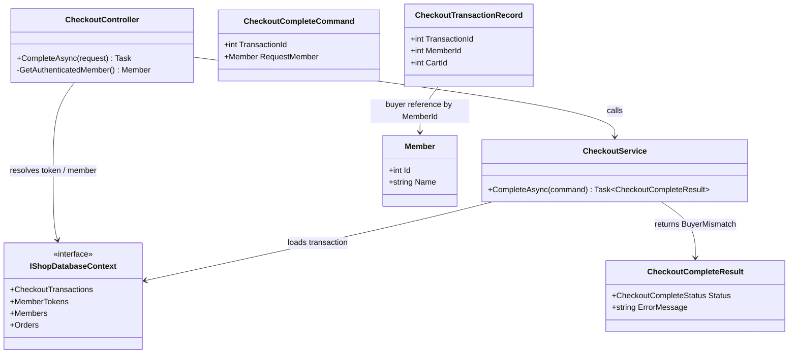
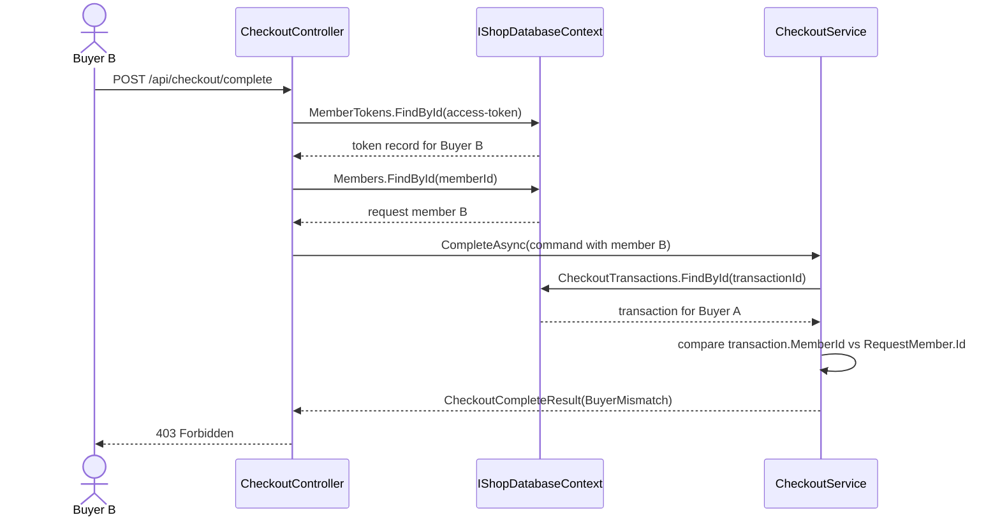

# TC-P2-03 Buyer mismatch 與 403 Forbidden 映射

## 目的

驗證 phase 2 是否補上 phase 1 的 authorization 缺口：若 request member 不等於 transaction buyer，checkout 必須被拒絕，而且 API 必須回 `403 Forbidden`。

## 主要來源

- `spec/checkout-correctness-fixes.md`
- `spec/testcases/checkout-correctness-fixes.md`
- `src/AndrewDemo.NetConf2023.API/Controllers/CheckoutController.cs`
- `src/AndrewDemo.NetConf2023.Core/Checkouts/CheckoutService.cs`
- `src/AndrewDemo.NetConf2023.Core/Checkouts/CheckoutModels.cs`
- `tests/AndrewDemo.NetConf2023.Core.Tests/CheckoutServiceTests.cs`

## 前置條件

- transaction 屬於 buyer A。
- 呼叫 API 的 access token 解析後得到 buyer B。
- transaction、cart 都仍存在。

## 主流程

1. Client 以 buyer B 的 token 呼叫 `POST /api/checkout/complete`。
2. `CheckoutController` 解析 access token，組出 `CheckoutCompleteCommand`。
3. `CheckoutService` 載入 transaction。
4. service 比對 `transaction.MemberId` 與 `RequestMember.Id`。
5. 若不一致，service 回傳 `CheckoutCompleteStatus.BuyerMismatch`。
6. `CheckoutController` 將該 result 映射為 `Forbid()`。

## 預期結果

- 不建立 order。
- 不刪除 transaction。
- HTTP 層不是 `400 BadRequest`，而是 `403 Forbidden`。

## Class Diagram

## Sequence Diagram

## 與 phase 1 的差異

- phase 1 缺少 buyer 驗證，任何已登入 member 都可能完成別人的 transaction。
- phase 2 把這個情境明確建模成 `BuyerMismatch`，再由 API 映射為 authorization failure。
