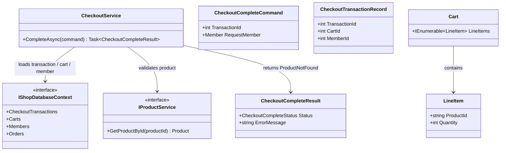
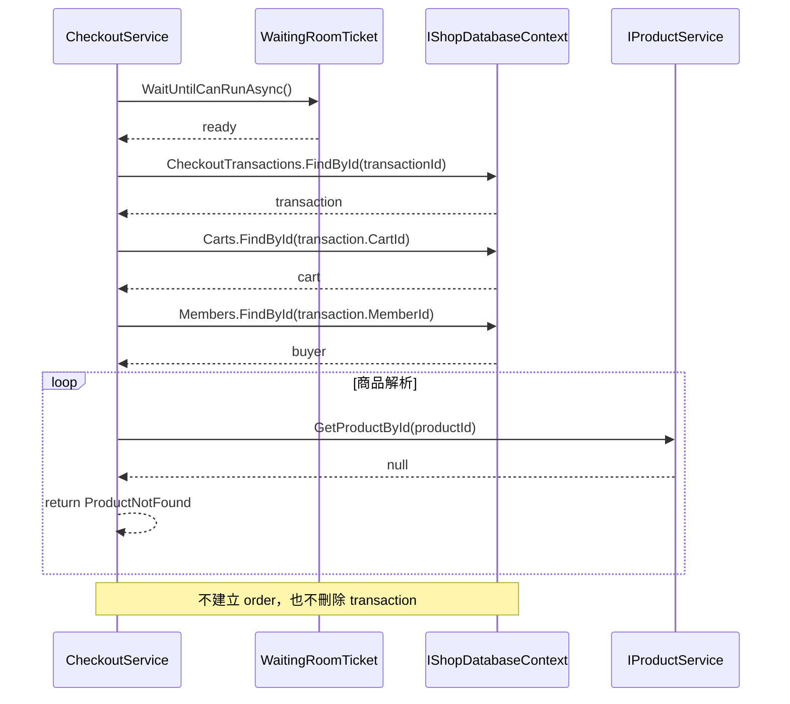

# TC-P2-04 商品不存在時保留 transaction 供重試

## 目的

驗證 phase 2 是否修正 phase 1 的 transaction delete timing 問題。當 cart 內商品無法被解析時，service 應該中止 complete，並保留 transaction 讓系統可以安全重試。

## 主要來源

- `spec/checkout-correctness-fixes.md`
- `spec/testcases/checkout-correctness-fixes.md`
- `src/AndrewDemo.NetConf2023.Core/Checkouts/CheckoutService.cs`
- `src/AndrewDemo.NetConf2023.Core/Checkouts/CheckoutModels.cs`
- `tests/AndrewDemo.NetConf2023.Core.Tests/CheckoutServiceTests.cs`

## 前置條件

- checkout transaction 存在。
- cart 內至少有一筆 `productId` 找不到對應 `Product`。
- request member 與 transaction buyer 一致。

## 主流程

1. 呼叫 `CheckoutService.CompleteAsync(...)`。
2. service 通過 waiting room、transaction 與 buyer 驗證。
3. service 載入 cart，逐筆用 `IProductService.GetProductById(productId)` 解析商品。
4. 某筆商品回傳 `null`。
5. service 立即回傳 `CheckoutCompleteStatus.ProductNotFound`。

## 預期結果

- `Orders` collection 不應出現新 order。
- `CheckoutTransactions` 內的原 transaction 仍存在。
- phase 2 允許後續修正商品資料後再重試 complete。

## Class Diagram

## Sequence Diagram

## 與 phase 1 的差異

- phase 1 因為 transaction 先被刪除，只要後續商品解析失敗就會留下無法重試的壞狀態。
- phase 2 把 delete timing 往後移，讓 `ProductNotFound` 變成可恢復的失敗。
