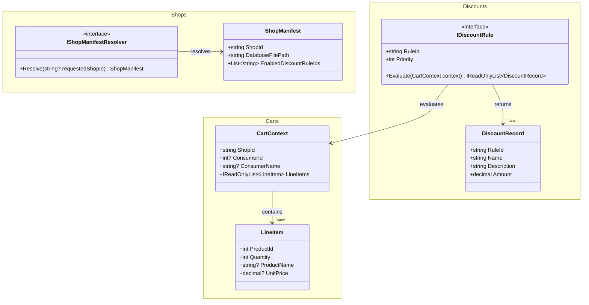

# AndrewDemo.NetConf2023.Abstract Phase 1 型別圖與命名說明

這份文件是目前 `.Abstract` 實際落地版本的說明稿，重點是幫你快速理解：

- 哪些型別留在 `Discount` domain
- 哪些型別移回 `Cart` domain
- `Shop` domain 在 Phase 1 只保留到什麼程度

## Class Diagram

## 命名原則

### `I...`

- 代表行為契約
- 例：`IDiscountRule`、`IShopManifestResolver`

### `...Manifest`

- 代表單一部署單位的正式宣告內容
- 例：`ShopManifest`

### `...Context`

- 代表執行當下的輸入狀態
- 例：`CartContext`

### `...Record`

- 代表規則執行後產生的一筆結果
- 例：`DiscountRecord`

## 每個型別的白話說明

### `ShopManifest`

- 白話：單一商店的正式啟動清單
- 內容包含 `ShopId`、資料庫路徑、啟用哪些 discount rule
- 這是 shop domain 在 Phase 1 的核心型別

### `IShopManifestResolver`

- 白話：給我一個 `shop-id`，我幫你找到對應的 `ShopManifest`
- 它只負責解析，不負責執行 discount 或建立 cart context

### `CartContext`

- 白話：現在如果立刻結帳，discount engine 需要看到的購物車狀態
- 它屬於 cart domain，不屬於 discount domain
- 目前包含 `ShopId`、consumer 基本資訊、以及 line items

### `LineItem`

- 白話：可在 `Cart` 與 `CartContext` 共用的一條購物車資料
- 它是唯讀型別
- raw `Cart.LineItems` 至少保證 `ProductId` 與 `Quantity`
- `CartContext.LineItems` 會再補上 `ProductName` 與 `UnitPrice`

### `DiscountEngine`

- 白話：折扣總控器
- 它是 `.Core` 的 concrete service，不放在 `.Abstract`
- 它接收 `CartContext`，依順序執行已註冊進來的 `IDiscountRule`
- 它不直接知道資料庫怎麼查，也不直接感知 runtime

### `IDiscountRule`

- 白話：單一折扣規則
- 每條 rule 只做單條規則判斷，例如第二件六折
- 是否啟用這條 rule，交由 host 啟動時依 `ShopManifest` 決定

### `DiscountRecord`

- 白話：折扣規則實際產生的一筆結果
- 例如：第二件六折，金額 `-20`
- 之後由外層流程決定要怎麼列在試算結果或訂單明細中

## 這次收斂後刻意移除的型別

下列型別不再屬於 `.Abstract` 的正式 contract：

- `ShopRuntimeOptions`
- `IShopRuntimeContext`
- `DiscountEvaluationContext`
- `DiscountConsumerSnapshot`

原因是它們不是 Phase 1 必要 contract，或是責任應回到 cart/application 邊界。

## 目前的邊界判讀

- `Shop` domain 只保留啟動時需要的 manifest 與 resolver
- `Cart` domain 持有試算輸入 `CartContext`
- `Discount` domain 在 `.Abstract` 只保留 rule 與 record
- `DiscountEngine` 留在 `.Core`

這是目前你已確認的 Phase 1 邊界版本。
