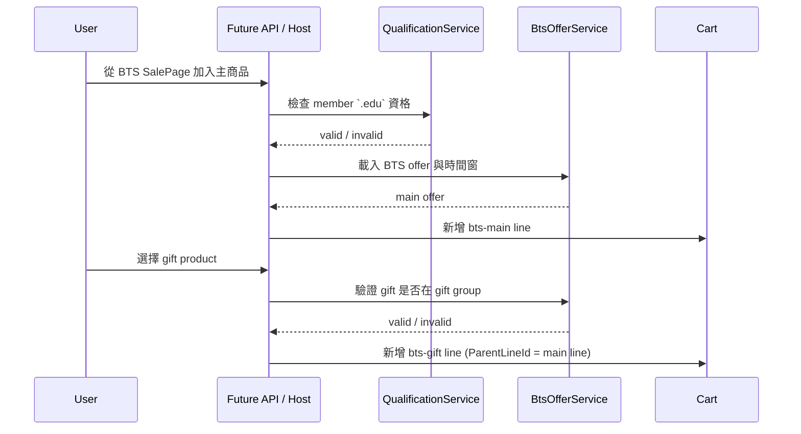
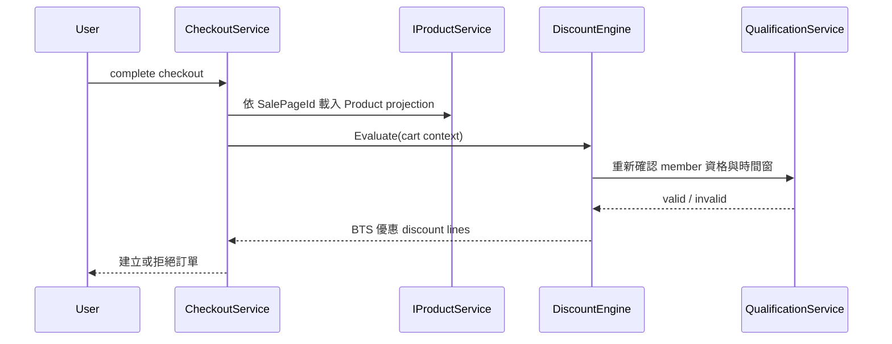

# Apple BTS Campaign 技術設計提案

## 狀態

- proposed
- 日期：2026-04-01

## 問題分析

目前已確認的商業基準如下：

- BTS 是同一個 shop 內的限期 campaign，不是獨立 `ShopId`
- 對外 `Product` 代表 `SalePage projection`
- `Product.Id = SalePageId`
- `SKU` 與庫存屬於內部資料模型，而且是 `.Core` 的標準能力
- 只有從 BTS 入口加入購物車才享有 BTS 資格
- `bts-price` 必須是資料庫中的明確價格
- 一張訂單允許多組 BTS 主商品 + 贈品組合

真正困難的地方不在 `Product` 名詞，而在三個 correctness constraint：

1. 主商品與贈品的關聯必須可被正確保存
2. 折扣必須能在購物車試算與 checkout 兩邊得到相同結果
3. 活動時間窗與 member 驗證狀態必須在 add-to-cart 與 checkout 兩個時點都可重算

對照目前 repo，主要落差如下：

- `products` collection 雖然可被解讀為 `SalePage projection`，但目前還沒有 sidecar merge 與 extension repository
- `Member` 只有 `ShopNotes`，沒有教育資格驗證 sidecar
- `Cart` 目前是 `ProdQtyMap<string, int>`，會把相同 `ProductId` 的多次加入合併
- `CartContext.LineItem` 沒有 line identity、line-to-line relation、evaluation time

這代表目前結構還無法正確表達：

- 同一個主商品在同一張 cart 中搭配不同贈品
- gift line 依附哪一個 main line
- checkout 時活動過期，需重新判定並禁止結帳

## 建模

### 穩定的合約句子

同一個 shop 內的 BTS campaign，應被建模為：

- 內部 `SalePage` / `SKU` / qualification / offer rule 的組合
- 對外仍維持 `Product` / `Member` / `Cart` / `Order`
- 價格與收據折扣由 `IProductService` projection 與 `IDiscountRule` 協作產生

### 模型切法

```mermaid
classDiagram
    class Product {
        string Id
        string Name
        decimal Price
        bool IsPublished
    }

    class SkuRecord {
        string SkuId
        string ModelCode
        string SpecSummary
    }

    class BtsMainOfferRecord {
        string CampaignId
        string MainProductId
        decimal BtsPrice
        string GiftGroupId
    }

    class BtsGiftOptionRecord {
        string GiftGroupId
        string GiftProductId
        decimal DiscountAmount
    }

    class MemberEducationVerificationRecord {
        int MemberId
        string Email
        string Status
        datetime ExpireAt
    }

    Product --> SkuRecord : points to
    BtsMainOfferRecord --> Product : main page
    BtsGiftOptionRecord --> Product : gift page
    MemberEducationVerificationRecord --> "Member" : qualifies
```

核心原則：

- `products` collection 先保留為公開 `Product` 主資料
- `Product.Id` 直接代表 `SalePageId`
- `Product.SkuId?` 直接保存 product 與 sku 的關聯
- `SkuRecord` 是 `.Core` 的標準資料模型，可被所有 extension 共用
- `BtsMainOfferRecord` 與 `BtsGiftOptionRecord` 管 campaign 規則
- member 資格不直接塞進 `Member` 主表，而是用 typed sidecar 管理

## 資料與儲存設計

### 1. 仍維持 tenant isolation mode

- 每個 `ShopId` 仍對應自己的 manifest 與 database file
- BTS 不引入新的 `ShopId`
- 同一個 shop 的 BTS campaign 與一般販售資料，放在同一個 shop-local database

### 2. 建議的內部 collections / tables

- `skus`
  - `SkuId`
  - 型號、規格、庫存控制資訊
- `inventory_records`
  - `SkuId`
  - `AvailableQuantity`
- `products`
  - 既有 collection
  - 每一筆 `Product` 就是一個對外 `SalePage`
  - `Product.Id = SalePageId`
- `member_education_profiles`
  - `1:1` root sidecar，記錄 member 是否啟用教育資格模組
- `member_education_verifications`
  - `1:N` history，記錄 `.edu` 驗證結果、email、expireAt、source
- `bts_campaigns`
  - 活動期間與 campaign 基本設定
- `bts_main_offers`
  - 每個主商品對應 `bts-price`、gift group、活動期間
- `bts_gift_options`
  - 某個 gift group 底下可選的 gift products 與折扣額
- `carts`
  - 不再只存 `ProdQtyMap`
  - 改存 line-based cart model

### 3. 哪些欄位可以 schema-free，哪些不行

建議原則：

- correctness-critical 資料必須 typed
  - `bts-price`
  - 活動 `start/end`
  - 驗證 `expireAt`
  - main / gift relation
- 非關鍵的陳列資訊才考慮 generic `Extension`
  - 額外 badge
  - 活動頁 UI hint
  - 非結帳關鍵的文案設定

原因很直接：

- BTS 金額與資格是交易正確性，不適合依賴 schema-free blob
- 顯示型資訊才適合讓 application 自由擴充

## 類別與邊界設計

### 1. `IProductService` 保留公開 contract，`Product` 直接帶內部 `SkuId?`

建議方向：

- `products` collection 仍保留為公開 product master
- `IProductService.GetPublishedProducts()` 先讀 `products`
- `IProductService.GetProductById(productId)` 仍以 `SalePageId` 查 `products`
- `SkuId?` 直接由 `Product` 提供
- 若 extension 需要額外欄位，再交由 sidecar repository 讀 `bts_main_offers` 等資料 merge

這樣做的好處是第一輪不用先重命名 collection，也不需要只為了 `Product-SKU` 關聯再維護一張 sidecar。

### 2. `AppleBTS Extension` 應是獨立 project，依賴 `.Abstract` 與 `.Core`

建議專案邊界：

- `.Core`
  - 維持通用 product / sku / inventory / cart / order / checkout orchestration
  - 提供 cart line aggregate、database access、product service base behavior
- `AndrewDemo.NetConf2023.AppleBts`
  - 定義 BTS sidecar records
  - 定義 BTS repositories
  - 定義 `.edu` qualification service
  - 定義 `BtsDiscountRule`
  - 定義必要的 product sidecar merge service

也就是說：

- `SKU` / inventory 不是 extension 擁有的功能
- `AppleBTS Extension` 只是在 checkout 與 discount pipeline 中額外使用它

這樣 BTS 規則不會污染 `.Core` 的通用名詞，但 `.Core` 仍保有足夠擴充點。

### 3. BTS qualification 與 offer lookup 應是 extension-side service

建議新增內部服務：

- `MemberEducationQualificationService`
  - 依 `MemberId` + `evaluationTime` 判定是否符合 `.edu` 資格
- `BtsOfferService`
  - 依 `SalePageId` 載入 main offer、gift group、gift options
- `SalePageProjectionService`
  - 依 `Product` 主資料與 sidecar merge 出需要的 projection / offer context

### 4. `IDiscountRule` 仍可承接 BTS，但需要更完整的 cart context

建議保留 BTS 折扣以 `IDiscountRule` 形式存在，原因：

- cart estimate 與 checkout 都能走同一條折扣邏輯
- 收據可以自然列出 `BTS 優惠`
- 不需要把 BTS 金額修正散落在 controller 與 checkout service

但前提是 `CartContext` 需要足夠資訊。

### 5. `Cart` 必須從 quantity map 改為 line-based aggregate

目前的 `ProdQtyMap<string, int>` 有三個根本限制：

1. 相同 `ProductId` 會被合併，失去 line identity
2. 無法表達某個 gift line 隸屬哪個 main line
3. 無法穩定保留「這筆 line 是在何時、以何種資格加入」

建議改成：

- `CartLineId`
- `ProductId`
- `Quantity`
- `AddedAt`
- `ParentLineId?`
- `LineRole`
  - `normal`
  - `bts-main`
  - `bts-gift`

其中：

- `ProductId` 仍是 `SalePageId`
- `ParentLineId` 用來把 gift line 綁到 main line
- `AddedAt` 讓資格與時間窗能做 deterministic re-check

這是 `.Core` 目前最重要的重構點，優先順序高於 API。

補充：

- 這個重構已被提升為 `.Core` 主線
- AppleBTS Extension 不應再被視為它的驅動理由
- 後續 BTS 只是在這個能力上疊加 campaign rule

### 6. checkout 應成為 inventory correctness owner

若 cart line 對應的 `Product` 有 `SkuId`：

- checkout 必須驗證庫存
- inventory 扣減與 order 建立必須放在同一個資料庫 transaction 中
- 若中途失敗，必須 rollback，不得留下部分扣減

若 `SkuId = null`：

- checkout 不做實體庫存檢查

對目前 repo 而言，這代表 `CheckoutService` 不只是 order owner，也應成為 inventory correctness owner。

## 流程設計

### BTS 加入購物車



### Checkout



## 目前建議的 Phase 1 技術決策

### 必要變更 1：`Product` 名詞保留，`products` collection 視為 `SalePage` 主資料

這是第一輪最薄的落法，因為：

- 與 `Product.Id = SalePageId` 一致
- 不需要馬上重命名既有 collection
- 可直接搭配 sidecar table / collection 擴充

### 必要變更 2：`Cart` 改成 line-based

這是 BTS correctness 的最小門檻。

如果不做：

- 多組 main/gift 組合會失真
- 折扣 pairing 只能靠推測
- checkout 與 estimate 很容易算出不同結果

### 必要變更 3：先完成 `.Core` cart / sku / inventory refactor，再處理 `AppleBTS Extension`

這一輪的主線不是 API，而是：

- `.Core` 是否能支撐 line-based cart
- `.Core` 是否建立標準 `SKU` / inventory 能力
- `AppleBTS Extension` 是否能用 sidecar + rule 的方式接進來
- `IProductService` / `DiscountEngine` 是否仍足夠作為擴充點

API 是否需要新 endpoint、query、route 分流，等 `.Core` 與 extension 穩定後再決定。

### 必要變更 4：`CartContext` 在 Phase 1 應補足 line identity 與 evaluation time

目前建議補的欄位：

- `CartContext.EvaluatedAt`
- `LineItem.LineId`
- `LineItem.ParentLineId`

這些欄位不是為了 BTS 特化，而是讓折扣引擎能處理 line-based offer。

### 必要變更 5：`.Core` 需要標準 `SkuId?` 與 transactional inventory

建議方向：

- `Product.SkuId?` 直接保存 nullable `SkuId`
- `skus` 與 `inventory_records` 由 `.Core` 擁有
- `CheckoutService` 以 LiteDB transaction 包住 inventory validate / deduct / order persist / checkout transaction delete

## 評估

### 方案 A：維持目前 `products + ProdQtyMap`

優點：

- 改動最小

缺點：

- 無法穩定表達 main / gift 關聯
- 無法支撐多組 BTS 組合
- discount rule 會缺乏 deterministic input

結論：

- 不建議

### 方案 B：保留 `products` 作為 sale page 主資料，搭配 sidecar + line-based cart

優點：

- 與商業模型一致
- `.Abstract` 對外名詞仍簡潔
- 符合 sidecar 擴充模式
- 讓 `.Core` 可以先建立通用 SKU / inventory 能力
- 可以把 BTS 邏輯集中在 extension repository、qualification 與 discount pipeline

缺點：

- 仍需要在 Phase 1 重新確認 cart / discount contract

結論：

- 建議採用

## 風險與重開條件

以下任一條件成立時，應明確重開 Phase 1 contract 設計：

- 決定讓同一個 `SalePageId` 同時承擔一般入口與 BTS 入口
- 決定 gift pairing 不保存 line relation，只做統計式推導
- 決定不讓 `IDiscountRule` 參與 BTS，而改由 checkout service 直接改價
- 決定把 `bts-price`、活動時間窗、驗證資料改放 schema-free blob

## 建議下一步

1. 先確認 `CartContext` 是否允許在 Phase 1 補 `EvaluatedAt`、`LineId`、`ParentLineId`
2. 確認 `.Core` 的 `SkuId?`、`skus`、`inventory_records` 正式 spec
3. 確認 `AppleBTS Extension` 的專案邊界與 sidecar collection 命名
4. 確認後，再把上述設計正式寫入 `/spec`
5. Phase 2 先重構 `.Core` 與 extension，再決定 API host 是否需要調整
