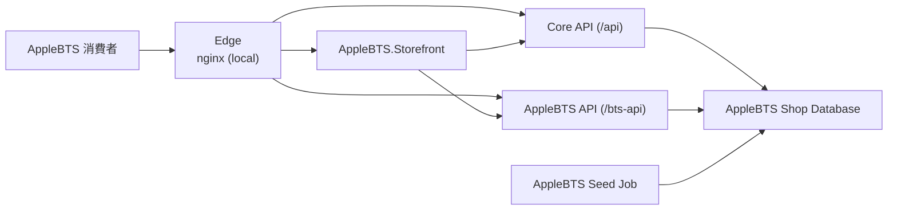
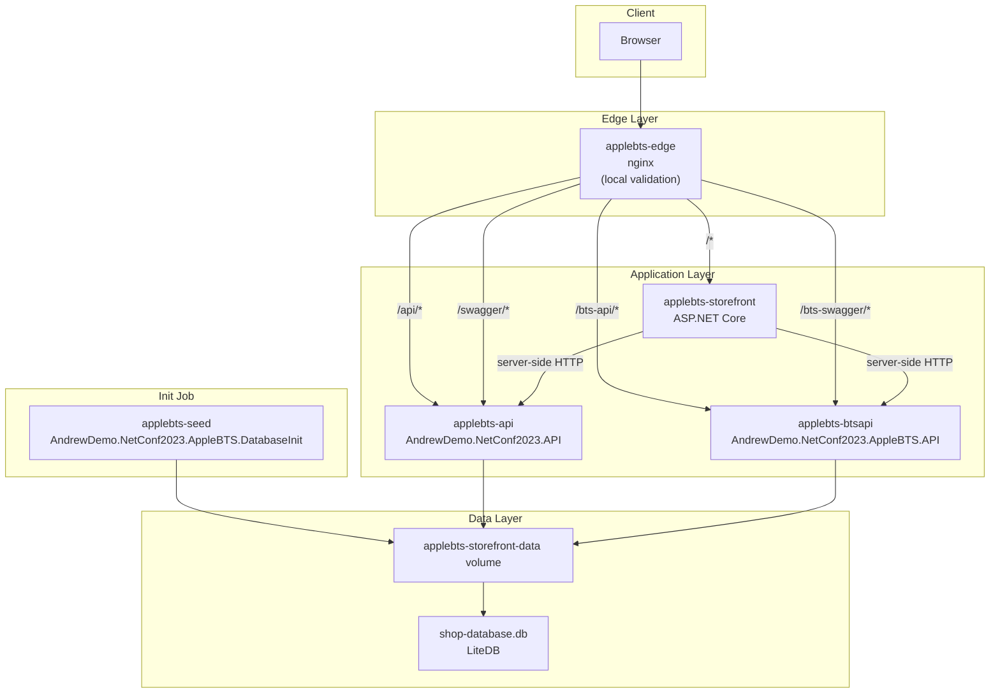
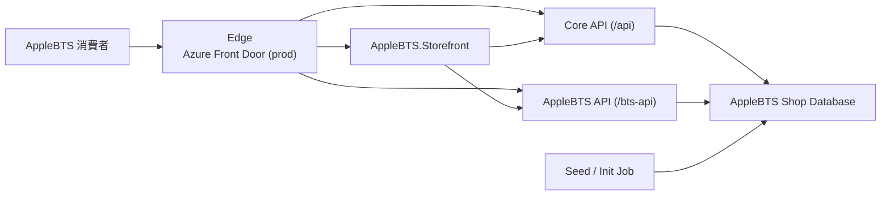
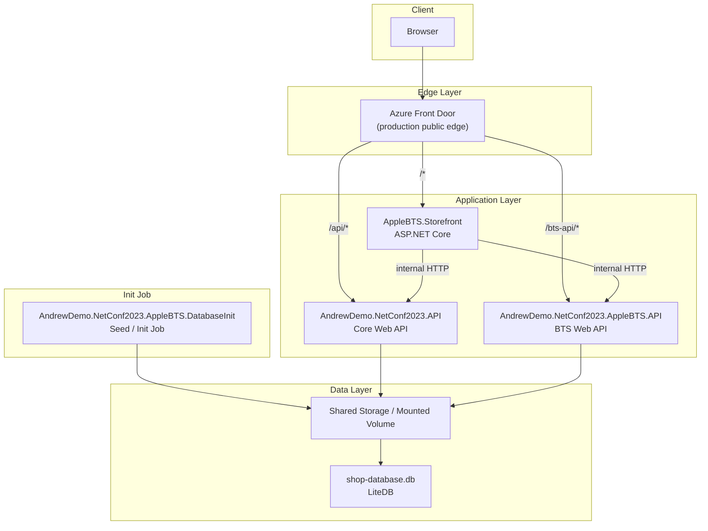

# AppleBTS Storefront Docker Compose 與 Production 部署結構說明

## 目的

這份文件只說明 `AppleBTS.Storefront` 的部署拓樸，讓它能和下列文件對照：

- [CommonStorefront Docker Compose 部署結構說明](./docker-compose-deployment-topology.md)

本文只關注：

- `AppleBTS.Storefront`
- 標準 `.API`
- `AppleBTS.API`
- `AppleBTS.DatabaseInit`
- `nginx`
- shared volume / LiteDB
- `Azure Front Door` 與 `nginx` 的角色對照

這份文件**不說明**：

- `.Abstract` / `.Core` 內部 class 關係
- AppleBTS 的業務規則細節
- package / project reference 細節

---

## 與 CommonStorefront 的主要差異

| 項目 | CommonStorefront | AppleBTS Storefront |
|---|---|---|
| Storefront | `common-storefront` | `applebts-storefront` |
| API 數量 | 1 個 backend：`common-api` | 2 個 backend：`applebts-api` + `applebts-btsapi` |
| 專屬 API | 無 | 有，`/bts-api/*` |
| Seed Job | `common-seed` | `applebts-seed` |
| Seed 來源 | `src/seed` snapshot | `AndrewDemo.NetConf2023.AppleBTS.DatabaseInit` 重建 DB |
| Storefront server-side 呼叫 | 只呼叫 `/api` | 同時呼叫 `/api` 與 `/bts-api` |
| DB 內容 | `.Core / Phase 1` 標準資料 | Apple 商品 + AppleBTS sidecar collections |
| Local edge 路由 | `/*`、`/api/*`、`/swagger/*` | `/*`、`/api/*`、`/bts-api/*`、`/swagger/*`、`/bts-swagger/*` |

---

## 角色說明

### `nginx`

`nginx` 在 AppleBTS docker compose 裡的角色是：

- **本機驗證環境的 reverse proxy**
- 提供 browser 單一入口
- 負責 path routing：
  - `/*` -> `AppleBTS.Storefront`
  - `/api/*` -> `AndrewDemo.NetConf2023.API`
  - `/bts-api/*` -> `AndrewDemo.NetConf2023.AppleBTS.API`
  - `/swagger/*` -> 標準 API Swagger
  - `/bts-swagger/*` -> AppleBTS API Swagger

### `Azure Front Door`

`Azure Front Door` 在正式部署時的角色，對應到本機的 `nginx`：

- **正式環境的 public edge**
- 對外提供網站入口
- 依 path 將流量轉發到 storefront、標準 API、AppleBTS API

也就是說：

- 在 **docker compose 本機驗證** 中，edge 由 `nginx` 扮演
- 在 **production** 中，edge 由 `Azure Front Door` 扮演

---

## 部署單位

在 AppleBTS 情境下，可部署單位如下：

- `applebts-edge`
  - `nginx`
- `applebts-storefront`
  - `AndrewDemo.NetConf2023.AppleBTS.Storefront`
- `applebts-api`
  - `AndrewDemo.NetConf2023.API`
- `applebts-btsapi`
  - `AndrewDemo.NetConf2023.AppleBTS.API`
- `applebts-seed`
  - `AndrewDemo.NetConf2023.AppleBTS.DatabaseInit`
- `applebts-storefront-data`
  - shared volume
- `shop-database.db`
  - LiteDB 檔案

---

## Docker Compose C4 Context Diagram



---

## Docker Compose C4 Container Diagram



---

## Production C4 Context Diagram



---

## Production C4 Container Diagram



---

## Docker Compose 實際拓樸

對應檔案：

- [compose/applebts-storefront.compose.yaml](../compose/applebts-storefront.compose.yaml)
- [compose/nginx/applebts-storefront.conf](../compose/nginx/applebts-storefront.conf)

實際結構如下：

```text
Browser
  -> applebts-edge (nginx) :5138
     -> /*               -> applebts-storefront
     -> /api/*           -> applebts-api
     -> /bts-api/*       -> applebts-btsapi
     -> /swagger/*       -> applebts-api
     -> /bts-swagger/*   -> applebts-btsapi

applebts-storefront
  -> server-side HTTP -> applebts-api
  -> server-side HTTP -> applebts-btsapi

applebts-seed
  -> applebts-storefront-data volume

applebts-api
  -> applebts-storefront-data volume
  -> /data/shop-database.db

applebts-btsapi
  -> applebts-storefront-data volume
  -> /data/shop-database.db
```

---

## 與 CommonStorefront 對照時的觀察重點

### 1. AppleBTS 多了一個 backend API

`CommonStorefront` 只有：

- storefront
- `/api`

`AppleBTS.Storefront` 則多了：

- `/bts-api`

因此 storefront 端的 server-side orchestration 必須同時整合兩個 backend。

### 2. AppleBTS 的 seed 不是 snapshot copy，而是 code-based rebuild

`CommonStorefront` 使用：

- `src/seed` 的 DB snapshot

`AppleBTS.Storefront` 使用：

- `AndrewDemo.NetConf2023.AppleBTS.DatabaseInit`

也就是由 code 直接重建 Apple 商品與 AppleBTS sidecar。

### 3. 兩個 API 共用同一份資料庫

AppleBTS 的重點不是多 DB，而是：

- 標準 API 與 AppleBTS API 連同一份 DB
- 只是各自負責不同路徑與能力

### 4. Browser 仍然只看到單一入口

雖然 AppleBTS 後面是：

- storefront
- `/api`
- `/bts-api`

但 browser 看到的仍是一個同源網站入口。這點和 `CommonStorefront` 相同，只是 path routing 更複雜。
