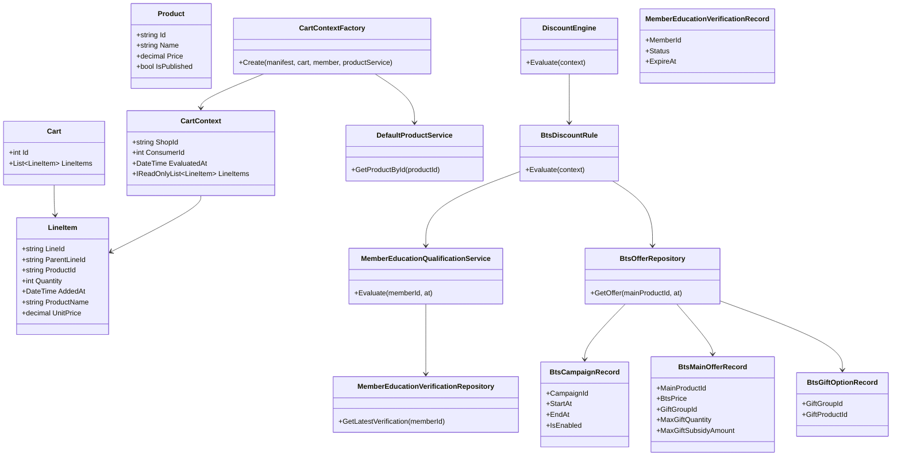
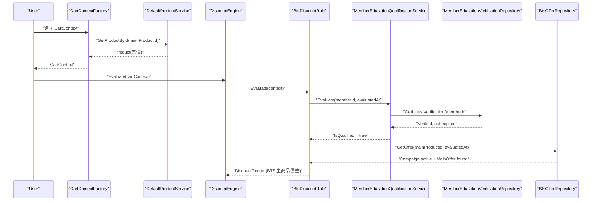
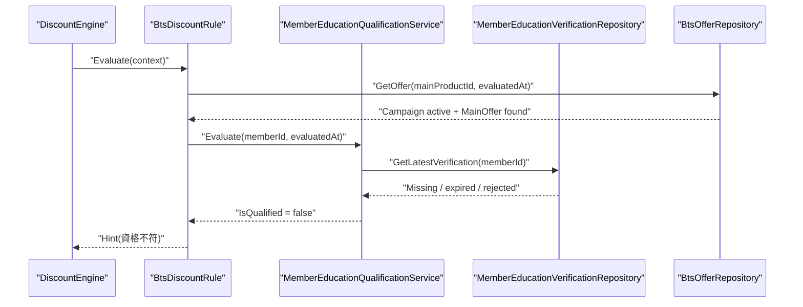
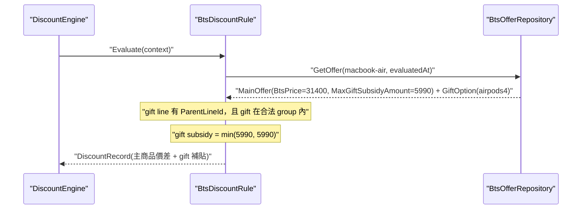
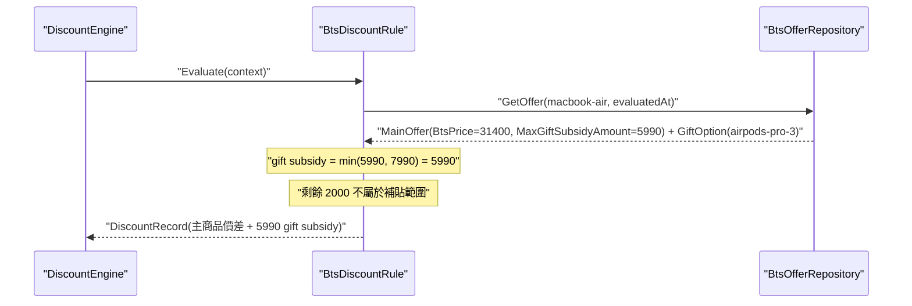
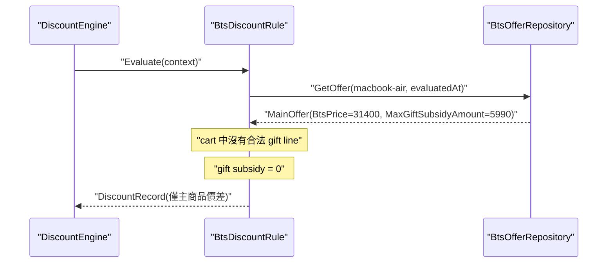
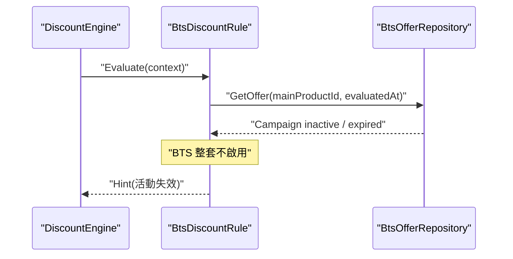
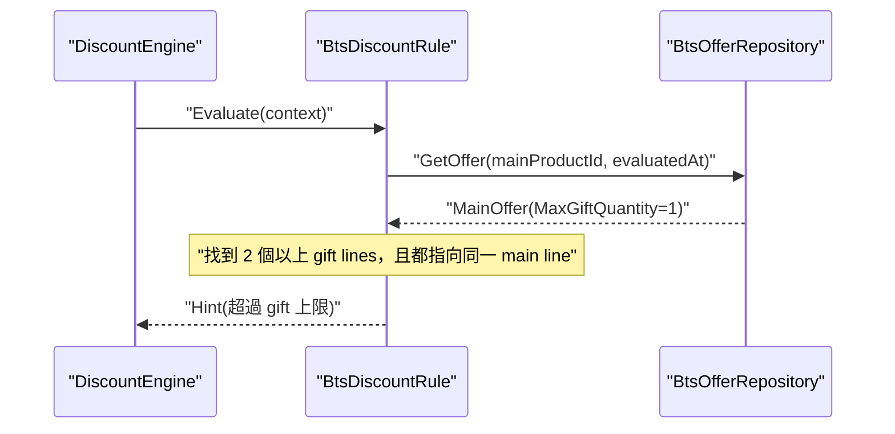

# Apple BTS 情境圖解

## 狀態

- confirmed
- 日期：2026-04-02

## 範圍

本文件針對以下已確認情境，說明目前 AppleBTS extension 最小設計下的責任分工與執行流程：

- `M-01`
- `M-02`
- `P-01`
- `P-03`
- `P-04`
- `C-03`
- `C-05`

這些圖都建立在目前已確認的前提上：

- `.Core` 仍沿用 `DefaultProductService`
- `Product.Price` 維持原價
- `BtsMainOfferRecord.BtsPrice` 定義主商品 BTS 價格
- `BtsMainOfferRecord.MaxGiftSubsidyAmount` 定義贈品補貼上限
- gift relation 由 `ParentLineId` 表達
- `BtsDiscountRule` 透過 `DiscountEngine` 接入原流程

## 完整 Decision Table

以下 decision table 代表目前 AppleBTS 專屬規格內，已知且已確認的情境空間。

補充：

- `C-01` 主商品移除時連帶移除子商品，已回歸 `.Core` 的 cart 規格，因此不列入 AppleBTS 專屬 decision table
- `Campaign = N` 時，整套 BTS 不啟用，因此 member qualification 與 gift 相關判定一律忽略

| ID | 類型 | 情境 | 決策結果 | 單元測試狀態 |
|---|---|---|---|---|
| `M-01` | Main | Campaign=Y, Qualification=Y, MainOffer=Y | 主商品採 `BtsPrice` | next |
| `M-02` | Main | Campaign=Y, Qualification=N, MainOffer=Y | 主商品回原價，回 `Hint` | next |
| `M-03` | Main | Campaign=N, Qualification=-, MainOffer=- | 整套 BTS 不啟用，主商品回原價，可回 `Hint` | next |
| `M-04` | Main | Campaign=Y, Qualification=Y, MainOffer=N | 主商品回原價 | next |
| `G-01` | Gift | 主商品已成立 BTS，有 GiftGroup，未選 gift | 主商品只採 `BtsPrice`，gift subsidy = 0 | next |
| `G-02` | Gift | 主商品已成立 BTS，gift 有 `ParentLineId`，且屬於合法 group | `gift subsidy = min(MaxGiftSubsidyAmount, GiftPrice)` | next |
| `G-03` | Gift | gift 無 `ParentLineId` | 不成立 gift subsidy | next |
| `G-04` | Gift | gift 有 `ParentLineId`，但不在合法 group | 不成立 gift subsidy | next |
| `G-05` | Gift | 主商品沒有 `GiftGroupId` | gift 邏輯全部忽略，gift subsidy = 0 | next |
| `P-01` | Pricing | `macbook-air + airpods4`，cap=5990，gift=5990 | `31400 + 5990 - 5990 = 31400` | next |
| `P-02` | Pricing | `macbook-air + apple-pencil`，cap=5990，gift=4500 | `31400 + 4500 - 4500 = 31400` | next |
| `P-03` | Pricing | `macbook-air + airpods-pro-3`，cap=5990，gift=7990 | `31400 + 7990 - 5990 = 33400` | next |
| `P-04` | Pricing | `macbook-air` 不選 gift | 主商品成交價 = `BtsPrice`，不得移轉未使用補貼 | next |
| `C-03` | Corner | checkout / estimate 時活動過期 | 主商品回原價，gift subsidy 失效，回 `Hint` | next |
| `C-04` | Corner | checkout / estimate 時資格過期 | 主商品回原價，gift subsidy 失效，回 `Hint` | next |
| `C-05` | Corner | 同一主商品選超過 1 個 gift，`MaxGiftQuantity = 1` | 回 `Hint` | next |
| `C-06` | Corner | 主商品只有特價沒有贈品 | 只套 `BtsPrice`，不進 gift 邏輯 | next |

## 共用 Class Diagram

## M-01

### 情境

- campaign 有效
- member 資格有效
- 主商品有 `BtsMainOfferRecord`

結果：

- 主商品使用 `BtsPrice`
- 若沒有 gift，也至少可成立主商品 BTS 價格

### Sequence Diagram

## M-02

### 情境

- campaign 有效
- member 資格無效
- 主商品有 `BtsMainOfferRecord`

結果：

- 主商品回原價
- 回一筆 `Hint`

### Sequence Diagram

## P-01

### 情境

- 主商品 `macbook-air`
- `BtsPrice = 31400`
- `MaxGiftSubsidyAmount = 5990`
- gift = `airpods4`
- gift 原價 = `5990`

結果：

- 主商品成交價 = `31400`
- gift 補貼 = `min(5990, 5990) = 5990`
- 總額 = `31400`

### Sequence Diagram

## P-03

### 情境

- 主商品 `macbook-air`
- `BtsPrice = 31400`
- `MaxGiftSubsidyAmount = 5990`
- gift = `airpods-pro-3`
- gift 原價 = `7990`

結果：

- 主商品成交價 = `31400`
- gift 補貼 = `min(5990, 7990) = 5990`
- 使用者需補差額 `2000`
- 總額 = `31400 + 7990 - 5990 = 33400`

### Sequence Diagram

## P-04

### 情境

- 主商品 `macbook-air`
- 有 gift group
- 使用者未選 gift

結果：

- 主商品成交價 = `BtsPrice`
- gift subsidy = `0`
- 不得把未使用的 subsidy 移轉到主商品

### Sequence Diagram

## C-03

### 情境

- 使用者加入商品時活動有效
- checkout / estimate 時活動已過期

結果：

- 主商品回原價
- gift subsidy 不成立
- 回 `Hint`

### Sequence Diagram

## C-05

### 情境

- 同一個主商品 line 底下出現超過 1 個 gift line
- `MaxGiftQuantity = 1`

結果：

- 回 `Hint`
- 不應成立多個 gift subsidy

### Sequence Diagram

## 建議的實作落點

這些情境共同對應到同一條主線：

1. `.Core`
   - `DefaultProductService`
   - `CartContextFactory`
   - `DiscountEngine`
2. `.AppleBTS`
   - `BtsOfferRepository`
   - `MemberEducationQualificationService`
   - `BtsDiscountRule`

也就是說，後續若實作沒有沿著這三段責任切開，就代表設計開始偏離目前已定案的邊界。
