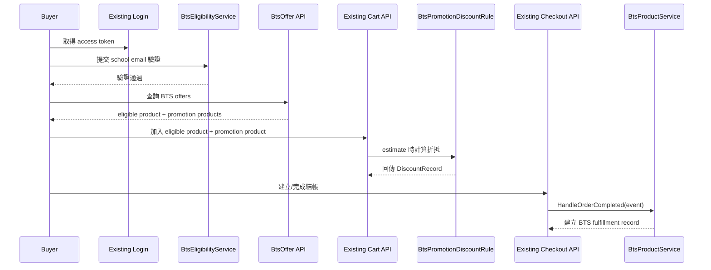

# Apple Store BTS POC 業務需求整理與擴充設計

## 狀態

- status: draft-for-review
- 日期：2026-03-31

## 參考來源與前提

- 截至 2026-03-31，你提供的台灣教育商店頁面主要是教育商店入口與教育價格頁，未直接列出當期 BTS 限時活動條款。
- 因此這份 POC 設計採兩層參考：
  - Apple 台灣教育商店購買資格與購買數量條款
  - Apple 2025 Back to School 官方條款的交易結構
- 本 repo 目前缺少 `/docs/project-roadmap.md`，因此本文件先以 `AGENTS.md` 與既有 accepted decisions 作為主線依據。

外部參考：

- Apple 台灣教育商店購買資格與購買數量：
  - <https://www.apple.com/tw-edu/shop/help/shopping_experience>
- Apple 台灣教育商店價格頁：
  - <https://www.apple.com/tw-edu/shop/buy-ipad>
- Apple Back to School 官方條款：
  - <https://www.apple.com/shop/back-to-school/terms-conditions>

## 為何這個需求值得插隊

這個需求與既有主線並不衝突，反而直接驗證目前 roadmap 上兩個核心方向：

- `DiscountRule` 模組化
- `ProductService` 模組化

如果這個 POC 能成立，代表目前的 `ShopManifest + IProductService + DiscountEngine/IDiscountRule` 邊界，已經足以承接「資格驗證 + 商品價格差異 + 特定商品加贈品組合」這種真實商務活動。

## POC 內業務需求整理

### 明確需求

1. 只有通過 UNiDAYS 驗證的買家可以享有 BTS 活動資格。
2. 商品有不同價格。
3. 特定商品可搭配特定贈品組合。

### 從 Apple 機制抽出的關鍵行為

這輪 POC 建議只模擬以下最關鍵的交易機制：

- 活動商品分成兩類：
  - `Eligible Product`：主商品，例如 Mac / iPad
  - `Promotion Product`：贈品或可折抵配件，例如 AirPods / Apple Pencil
- 買家必須先具有教育資格，才可取得活動優惠。
- 優惠不是「下單後人工補送」，而是交易當下就能決定是否成立。
- 特定主商品只對應特定贈品集合，不是所有商品都可任選所有贈品。
- 贈品或配件的優惠額度依組合而定。

### POC 建議保留，且不做複雜化的部分

- 驗證機制可用 mock 規則模擬：
  - email 結尾符合 `.edu.xxx`
  - 或以 host 設定檔提供 regex / allowlist
- 不做跨國地區差異。
- 不做 Apple 那種完整購買數量上限與年度稽核。
- 不做退貨後追討贈品差額。
- 不做金流分期、出貨拆單、實體門市驗證。
- 不做 outbox / retry / message bus。

## 與目前系統邊界的對照

### 目前已存在的可用邊界

- `IProductService`
  - 已可負責商品查詢
  - 已可在 order complete 後收到 callback
- `IDiscountRule + DiscountEngine`
  - 已可在 cart estimate 與 checkout 時計算折扣
- `ShopManifest`
  - 已可依 shop 啟動不同 product service 與 discount rules

### 目前明顯的限制

1. `.Abstract` 的 `Product` 只有單一 `Price`
   - 不能同時在 shared contract 內放「原價 / 教育價 / 贈品資訊」三套欄位。
2. `IProductService.GetPublishedProducts()` 沒有 buyer context
   - 不能根據目前登入者直接回傳個人化價格。
3. `Member` 沒有 email 欄位
   - 不能把學生驗證資料直接存進既有 member model。
4. `Product` contract 沒有 promotion metadata
   - `/api/products` 不能直接表達「這台 Mac 可搭這些贈品」。
5. `.Core` 與 `.Abstract` 不能改
   - 代表所有 BTS 特化能力都必須落在 host-side service、controller、設定與 side-by-side collections。

### 對應結論

- 這輪不能把 BTS 做成 shared contract 演進。
- 這輪應把 BTS 做成「單一 shop 的 host-side module」。
- `IProductService` 負責「商品與 fulfillment」。
- `DiscountEngine` 負責「活動折抵」。
- 驗證狀態、贈品組合、活動 eligibility 都走 side-by-side 資料。

## 建議的 POC 切法

### 建議採用的店鋪模型

建議把這個 POC 視為一個獨立的 `bts-education` shop，而不是在同一個 shop 同時服務一般售價與教育活動售價。

原因：

- `Product.Price` 只有一個欄位。
- `IProductService` 沒有 buyer-aware pricing contract。
- Apple 教育商店本來就是獨立入口，這種建模方式最貼近現有 contract。

因此：

- `IProductService` 回傳的 `Price` 直接代表 BTS / 教育商店價格。
- 若要同時顯示「一般價 vs 教育價」，改由 host-specific offer API 補充，不塞進 shared `Product`。

補充：

- 2026-03-31 新增硬性需求後，`bts-education` 與一般商店雖然是不同 `shop`，但 `member` 與 `product/inventory` 主檔必須共用。
- 因此較新的 canonical 方向不是「每個 shop 各自一套會員/商品資料」，而是：
  - shared member master
  - shared product master / inventory
  - shop-specific price projection
  - shop-specific promotion / eligibility extension
- 2026-04-01 進一步確認後，`apple store` 與 `apple bts` 若為兩組不同 host，應使用不同 `ShopId`，但仍連到同一個 physical database。
- 詳細設計請以 [shared-member-and-product-master-design.md](/Users/andrew/code-work/andrewshop.apidemo/docs/shared-member-and-product-master-design.md) 與對應 decision 為準。

## 建議的擴充元件

### 1. `BtsEligibilityService`

角色：

- 驗證目前 member 是否已通過 mock UNiDAYS 資格
- 將驗證結果存成 side-by-side record

建議責任：

- `VerifyMember(memberId, schoolEmail)`
- `GetEligibility(memberId)`
- `RequireEligibility(memberId)`

建議規則：

- email 符合 `.edu.xxx` 視為通過
- 可再加上有效期限，例如 30 天
- 驗證結果 keyed by `MemberId`

### 2. `BtsProductService : IProductService`

角色：

- 接管 BTS shop 的商品查詢
- 解析主商品與活動贈品商品
- 在 `HandleOrderCompleted(...)` 內處理贈品資格落單結果

建議責任：

- `GetPublishedProducts()`
  - 回傳 BTS shop 要曝光的主商品
- `GetProductById(productId)`
  - 可解析主商品與 promotion product
- `HandleOrderCompleted(event)`
  - 檢查訂單內是否存在符合活動條件的主商品 + 贈品組合
  - 建立 `BtsFulfillmentRecord`

### 3. `BtsPromotionDiscountRule : IDiscountRule`

角色：

- 代表 BTS 活動折抵規則
- 由 `DiscountEngine` 注入執行

建議責任：

- 檢查 cart 內是否同時存在：
  - 合格主商品
  - 合格 promotion product
  - 已驗證 member
- 若成立，產生負數 `DiscountRecord`

建議語意：

- 折扣名稱：`BTS 贈品折抵`
- 描述：標示主商品 / 贈品 / offer id
- `Amount`：負數，例如 `-179.00`

### 4. `BtsCheckoutGuard`

角色：

- 在進入 `CheckoutService` 前先做活動規則防呆

為何需要：

- `.Core.CheckoutService` 已 frozen，不能加 BTS-specific validation。
- 促銷組合是否合法，必須在 API host 先擋掉。

建議責任：

- promotion product 不可單獨結帳
- 未驗證 member 不可帶有 BTS 促銷組合結帳
- promotion product 必須與對應 eligible product 成對出現

## 建議的 side-by-side 資料模型

### `bts_eligibility_records`

- `MemberId`
- `SchoolEmail`
- `ValidationProvider`
- `ValidationStatus`
- `VerifiedAt`
- `ExpiresAt`

用途：

- 不修改 `Member`
- 讓 `DiscountRule` 與 checkout guard 都可依 `MemberId` 查驗資格

### `bts_offer_catalog`

- `OfferId`
- `EligibleProductId`
- `PromotionProductId`
- `PromotionType`
- `PromotionSavings`
- `MaxPromotionQuantity`
- `IsActive`

用途：

- 不修改 `Product`
- 用 side-by-side catalog 表達「哪個主商品可搭哪個 promotion product 與折抵金額」

補充：

- 若後續確認一般商店與 BTS 商店都要共用同一份商品主檔，則 `bts_offer_catalog` 應視為 shared product master 的 extension collection，而不是 BTS shop 專屬複製商品資料。

### `bts_fulfillment_records`

- `OrderId`
- `MemberId`
- `OfferId`
- `EligibleProductId`
- `PromotionProductId`
- `FulfillmentStatus`
- `CreatedAt`

用途：

- 利用現有 `IProductService.HandleOrderCompleted(...)` 做活動落單紀錄
- 不污染 shared `Order` model

## 建議的 API 擴充

### 保留既有 API

- `/api/products`
- `/api/carts/{id}/items`
- `/api/carts/{id}/estimate`
- `/api/checkout/create`
- `/api/checkout/complete`

### 新增 host-specific API

#### `POST /api/bts/eligibility/verify`

用途：

- 讓目前登入 member 提交 school email 做 mock UNiDAYS 驗證

request：

- `schoolEmail`

response：

- `status`
- `verifiedAt`
- `expiresAt`

#### `GET /api/bts/eligibility/me`

用途：

- 查目前 member 是否已通過活動資格驗證

#### `GET /api/bts/offers`

用途：

- 回傳主商品與可搭配的 promotion products
- 補足 `/api/products` 無法表達 promotion metadata 的缺口

建議欄位：

- `OfferId`
- `EligibleProduct`
- `PromotionProducts`
- `PromotionSavings`
- `RequiresEligibility`

## 對應到 `IProductService` / discount orchestration 的責任分工

### `IProductService` 負責

- 商品清單與商品價格
- promotion product 解析
- order complete 後的 BTS 活動 fulfillment 記錄

### `DiscountEngine + IDiscountRule` 負責

- 根據 cart 內容與 member 資格判斷是否給折抵
- 產生 order / estimate 可見的折扣明細

### 關於你提到的 `IDiscountService`

目前 repo 的正式 contract 並沒有 `IDiscountService`，而是：

- `.Abstract`: `IDiscountRule`
- `.Core`: `DiscountEngine`

所以這輪建議把 `IDiscountService` 理解成「host-side 的折扣編排能力」，實際落點就是：

- 新增 `BtsPromotionDiscountRule`
- 由既有 `DiscountEngine` 組裝執行

## 建議流程

## 關鍵案例 decision table

| 案例 | 驗證狀態 | 購物車內容 | 預期結果 | 責任元件 |
|---|---|---|---|---|
| A1 | 已驗證 | eligible product + 合法 promotion product | 可試算折抵、可結帳 | `BtsPromotionDiscountRule` + `BtsCheckoutGuard` |
| A2 | 未驗證 | eligible product + 合法 promotion product | 不給折抵，且不可完成 BTS 活動結帳 | `BtsEligibilityService` + `BtsCheckoutGuard` |
| A3 | 已驗證 | promotion product only | 視為無效組合 | `BtsCheckoutGuard` |
| A4 | 已驗證 | 非活動商品 + promotion product | 視為無效組合 | `BtsCheckoutGuard` |
| A5 | 已驗證 | eligible product only | 可正常購買，但沒有贈品折抵 | `IProductService` + `DiscountEngine` |
| A6 | 已驗證 | eligible product + 不相容 promotion product | 視為無效組合 | `BtsOfferCatalog` + `BtsCheckoutGuard` |

## 這輪明確不做的事情

- 不修改 `.Abstract`
- 不修改 `.Core`
- 不把 BTS metadata 塞進 shared `Product`
- 不把 school email 塞進 shared `Member`
- 不做年度購買上限
- 不做 audit / charge back / refund recalculation
- 不做 durable retry / outbox
- 不做多國規則與多期間 campaign engine

## 建議的實作順序

1. 在 `.API` 或新的 host-side module 中建立 BTS side-by-side collections 與 service。
2. 實作 `BtsEligibilityService`。
3. 實作 `BtsProductService`，讓 BTS shop 能回傳主商品與 promotion products。
4. 實作 `BtsPromotionDiscountRule` 並掛進既有 `DiscountEngine`。
5. 在 controller 前面加入 `BtsCheckoutGuard`。
6. 補 `GET /api/bts/offers` 與 `POST /api/bts/eligibility/verify`。
7. 用 `HandleOrderCompleted(...)` 建立 `bts_fulfillment_records`。

## 後續如果要進一步正式化

只有當你之後確認下列需求會成為長期主線，才值得重新開 Phase 1 動 shared contract：

- 一般商店與教育商店要共用同一份 `Product` contract，且要同時顯示多種價格
- 驗證狀態要成為正式 member domain 的一部分
- promotion metadata 要成為跨 shop 的共用欄位
- checkout contract 要正式表達 campaign qualification / entitlement
