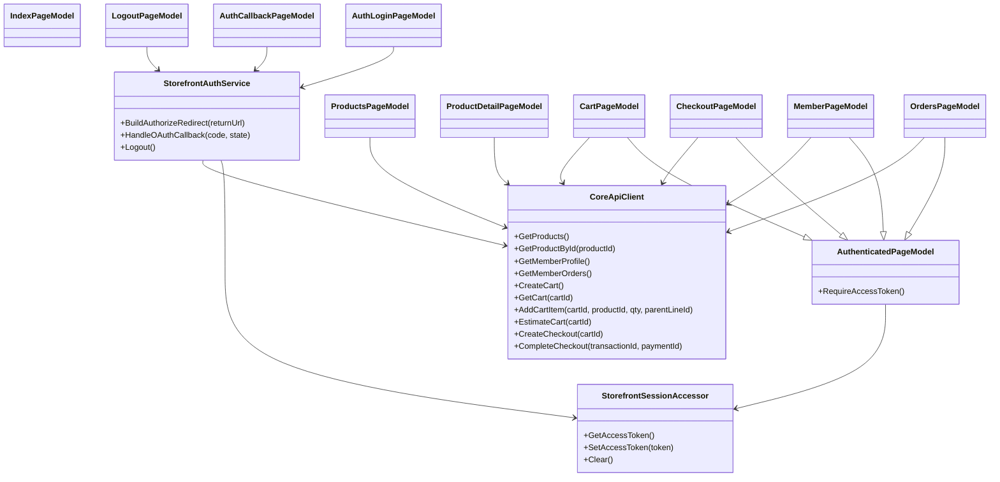
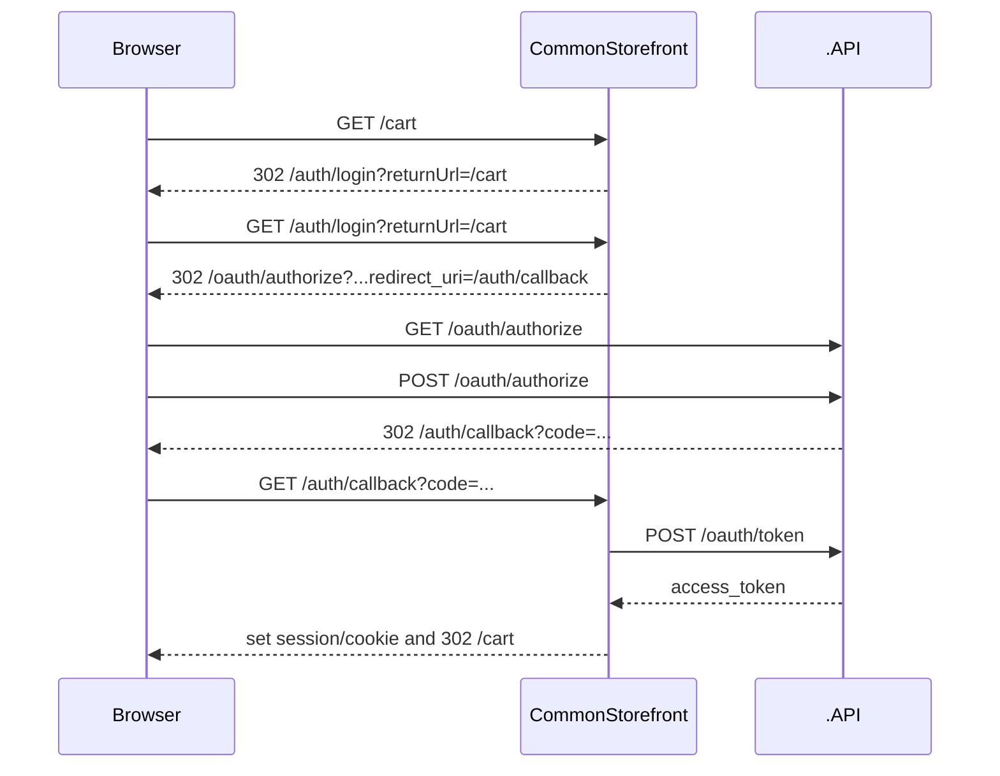
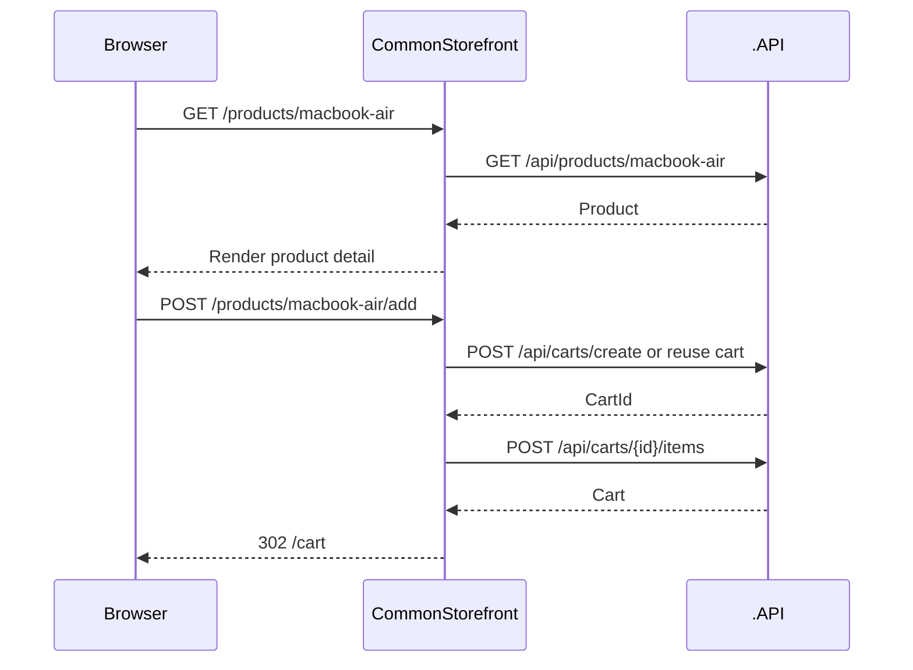

# CommonStorefront Phase 1 設計稿

## 目的

`AndrewDemo.NetConf2023.CommonStorefront` 是 storefront family 的 baseline implementation。

這份文件只收斂第一版最小可用範圍：

- page routes
- auth / session flow
- BFF typed client 邊界
- Razor Pages page model 與 partial boundary
- 主要驗收情境

這份設計不涵蓋：

- AppleBTS 專屬頁面
- PetShop reservation 頁面
- 複雜 client-side interaction
- 品牌化視覺設計

## 目標

- 用最簡單的 ASP.NET Core server-rendered 架構完成 baseline storefront
- UI 風格對齊 GOV.UK 類型的任務導向頁面
- auth 與 token 保留在 server side
- 讓後續 `AppleBTS.Storefront` 與 `PetShop.Storefront` 能沿用相同 page grammar 與 session/BFF 架構

## 邊界

### CommonStorefront 負責

- 顯示一般商品型錄
- 顯示商品詳細頁
- 顯示與操作購物車
- 顯示與操作 checkout
- 顯示 member profile / orders
- server-side 處理 login redirect / callback / logout
- server-side 呼叫 `.API`

### CommonStorefront 不負責

- 自行實作 OAuth authority
- 直接存取 database
- 直接在 browser 端持 bearer token 呼叫 `/api`
- AppleBTS 專屬型錄、qualification、gift options
- PetShop reservation workflow

## 專案切分

### 1. `AndrewDemo.NetConf2023.Storefront.Shared`

第一版建議放：

- `StorefrontSessionAccessor`
- `StorefrontAuthService`
- `CoreApiClient`
- 共用 view models
- `_Layout`
- `_Header`
- `_SkipLink`
- `_ErrorSummary`

### 2. `AndrewDemo.NetConf2023.CommonStorefront`

只放：

- `Pages/*`
- Common-specific page models
- Common-specific view composition

## Class Diagram

## Page Routes

| Route | 說明 | 是否需登入 | 主要 backend 呼叫 |
|---|---|---:|---|
| `/` | 首頁 | N | 無，或商品摘要 |
| `/products` | 商品列表 | N | `GET /api/products` |
| `/products/{id}` | 商品詳細頁 | N | `GET /api/products/{id}` |
| `/cart` | 購物車 | Y | `GET /api/carts/{id}`、`POST /api/carts/{id}/estimate` |
| `/checkout` | 結帳頁 | Y | `POST /api/checkout/create`、`POST /api/checkout/complete` |
| `/member` | 會員資料 | Y | `GET /api/member` |
| `/member/orders` | 訂單列表 | Y | `GET /api/member/orders` |
| `/auth/login` | 導向 login authority | N | redirect 到 `/oauth/authorize` |
| `/auth/callback` | OAuth callback | N | `POST /oauth/token` |
| `/auth/logout` | 登出 | Y | 清除 session / cookie |

## Session 與 Auth Flow

### 原則

- browser 不直接持 bearer token 呼叫 `.API`
- access token 由 storefront server side 保存
- 第一版建議以 server-side session 為主

### Sequence Diagram: Login

### Sequence Diagram: Product Detail -> Add to Cart

## Page Model 邊界

### Anonymous Pages

- `Index`
- `Products`
- `ProductDetail`
- `AuthLogin`
- `AuthCallback`

### Authenticated Pages

- `Cart`
- `Checkout`
- `Member`
- `Orders`
- `AuthLogout`

建議抽一個 `AuthenticatedPageModel`，集中處理：

- 讀取 access token
- 若未登入則 redirect 到 `/auth/login`
- 共用 member summary 載入需求

## Typed Client 邊界

第一版不要拆太細，保留一個 shared typed client 即可：

- `CoreApiClient`

method 邊界建議：

- `GetProductsAsync()`
- `GetProductByIdAsync(productId)`
- `GetMemberProfileAsync(accessToken)`
- `GetMemberOrdersAsync(accessToken)`
- `CreateCartAsync(accessToken)`
- `GetCartAsync(accessToken, cartId)`
- `AddCartItemAsync(accessToken, cartId, productId, qty, parentLineId)`
- `EstimateCartAsync(accessToken, cartId)`
- `CreateCheckoutAsync(accessToken, cartId)`
- `CompleteCheckoutAsync(accessToken, transactionId, paymentId)`

## Layout / Partial Boundary

第一版只做最小集合：

- `_Layout`
- `_SkipLink`
- `_Header`
- `_Footer`
- `_NotificationBanner`
- `_ErrorSummary`
- `_ProductSummaryCard`
- `_PriceSummary`

原則：

- partial 只做共用 UI 結構
- 不把流程邏輯塞進 partial
- vertical-specific partial 留給後續 `AppleBTS.Storefront`

## 驗收 Decision Table

| ID | 情境 | 覆蓋狀態 | 備註 |
|---|---|---|---|
| CS-01 | 首頁與主要導覽可操作 | covered | 對應 `TC-CS-001` |
| CS-02 | 商品列表可閱讀與導向詳細頁 | covered | 對應 `TC-CS-002` |
| CS-03 | 商品詳細頁可加入購物車 | covered | 對應 `TC-CS-003` |
| CS-04 | 未登入進入受保護頁會走 `/auth/login` | covered | 對應 `TC-CS-004` |
| CS-05 | callback 用 server-side token exchange | covered | 對應 `TC-CS-005` |
| CS-06 | 購物車可看到 discounts / hints | covered | 對應 `TC-CS-006` |
| CS-07 | 結帳頁可完成主要任務 | covered | 對應 `TC-CS-007` |
| CS-08 | 會員頁與訂單頁可讀取資料 | covered | 對應 `TC-CS-008` |
| CS-09 | 手機版可操作 | covered | 對應 `TC-CS-009` |
| CS-10 | 鍵盤操作與 skip link | covered | 對應 `TC-CS-010` |
| CS-11 | browser 不直接呼叫 `/oauth/token` | covered | 對應 `TC-CS-011` |
| CS-12 | storefront server side 不繞 Front Door 呼叫 backend | covered | 對應 `TC-CS-012` |

## 後續工作

1. freeze `CommonStorefront` spec
2. scaffold `Storefront.Shared`
3. scaffold `CommonStorefront`
4. 先完成 Common，再讓 AppleBTS / PetShop 沿用
