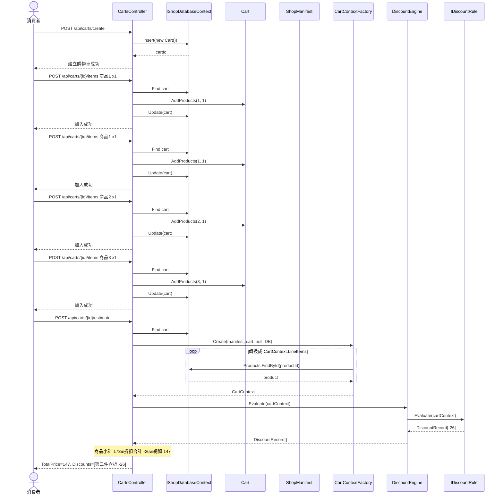
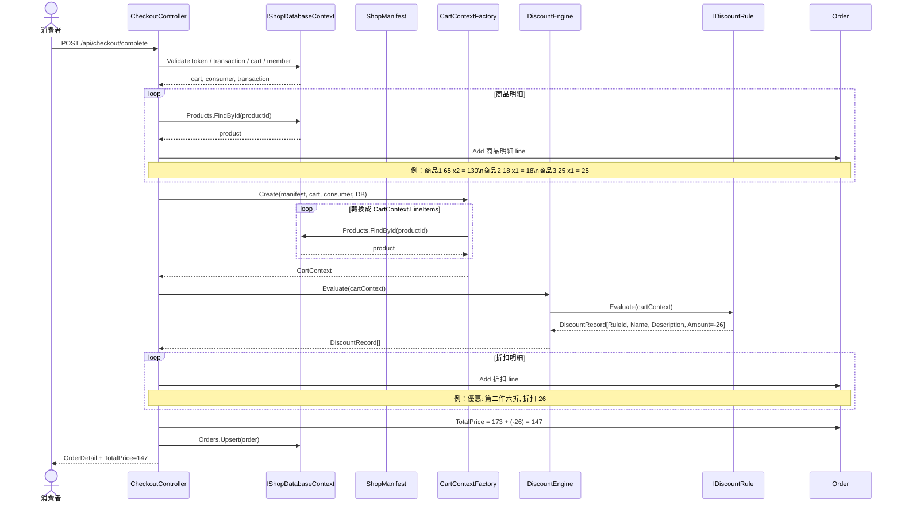

# Discount Engine 使用情境 Sequence Diagram

這份文件是依照目前最新 contract 更新後的設計驗證稿，目的是讓你理解：

- `CartContext` 會在什麼時候被建立
- `DiscountEngine` / `IDiscountRule` 會如何被呼叫
- 折扣明細與總額最終是怎麼被組裝出來

## 先講結論

目前設計裡：

- `ShopManifest` 在 host 啟動時先被解析
- `.API` 依 `ShopManifest.EnabledDiscountRuleIds` 組裝本次部署要啟用的 `IDiscountRule`
- `CartContextFactory` 在試算或結帳時，把 `Cart + Member + Database + ShopManifest` 轉成 `CartContext`
- `DiscountEngine` 只接收 `CartContext`，並執行已經注入的 rules
- `DiscountEngine` 回傳 `DiscountRecord[]`
- 最後怎麼列成 API response 或訂單明細，仍由外層流程處理

## 驗證案例前提

### Shop A 啟動組態

- `ShopId = shop-a`
- `EnabledDiscountRuleIds = ["product-1-second-item-40-off"]`

### 商品與價格

- 商品 1：`65`
- 商品 2：`18`
- 商品 3：`25`

### 購物車內容

- 商品 1 x 2
- 商品 2 x 1
- 商品 3 x 1

### 預期折扣與總金額

- 商品小計：`65 * 2 + 18 + 25 = 173`
- 折扣：商品 1 第二件六折，折扣金額 `65 * -0.4 = -26`
- 結帳總額：`173 - 26 = 147`

## 情境一：加入購物車後做試算

## 情境二：完成結帳並列出最終明細

## 這個過程中 contract 是怎麼互動的

### 1. 啟動時先解析 `ShopManifest`

- `Program` 先從 `SHOP_ID` / `shop-id` 解析出 [ShopManifest](/Users/andrew/code-work/andrewshop.apidemo/src/AndrewDemo.NetConf2023.Abstract/Shops/ShopManifest.cs#L5)
- `.API` 依 `EnabledDiscountRuleIds` 過濾出本次部署要啟用的 `IDiscountRule`
- `DiscountEngine` 本身不直接讀 runtime

### 2. 試算前先建立 `CartContext`

- `Cart` 與 `Member` 不會直接丟進 rule
- 會先經過 [CartContextFactory](/Users/andrew/code-work/andrewshop.apidemo/src/AndrewDemo.NetConf2023.Core/Carts/CartContextFactory.cs#L7)
- builder 會查商品資料，產生 [CartContext](/Users/andrew/code-work/andrewshop.apidemo/src/AndrewDemo.NetConf2023.Abstract/Carts/CartContext.cs#L6)

這代表：

- rule 看不到資料庫
- rule 不直接碰 `ShopManifest`
- rule 只看得到 cart-side input

### 3. `DiscountEngine` 只做規則協調

[DiscountEngine](/Users/andrew/code-work/andrewshop.apidemo/src/AndrewDemo.NetConf2023.Core/Discounts/DiscountEngine.cs#L8) 的責任只有一個：

- `Evaluate(context)` -> `DiscountRecord[]`

它目前不負責：

- 商品小計
- 訂單建構
- API response shape

### 4. `IDiscountRule` 只做單條規則判斷

[IDiscountRule](/Users/andrew/code-work/andrewshop.apidemo/src/AndrewDemo.NetConf2023.Abstract/Discounts/DiscountContracts.cs#L11) 每次只拿一個 `CartContext`，回傳自己產生的 `DiscountRecord[]`

目前的 built-in 規則是：

- [Product1SecondItemDiscountRule](/Users/andrew/code-work/andrewshop.apidemo/src/AndrewDemo.NetConf2023.Core/Discounts/Product1SecondItemDiscountRule.cs#L7)

### 5. `DiscountRecord` 是折扣系統輸出，不是訂單行本身

[DiscountRecord](/Users/andrew/code-work/andrewshop.apidemo/src/AndrewDemo.NetConf2023.Abstract/Discounts/DiscountContracts.cs#L17) 目前只有：

- `RuleId`
- `Name`
- `Description`
- `Amount`

外層流程再決定怎麼把它轉成：

- `CartEstimateResponse.Discounts`
- `Order.OrderLineItem`

## 目前這套設計的互動順序

最短版可以濃縮成這 6 步：

1. Host 啟動後解析 `ShopManifest`
2. 啟動階段依 manifest 組裝啟用的 `IDiscountRule`
3. 外層流程把 cart/member 轉成 `CartContext`
4. `DiscountEngine.Evaluate(cartContext)`
5. 每個 rule 回傳 `DiscountRecord[]`
6. 外層流程把 `DiscountRecord[]` 轉成試算結果或訂單折扣明細
