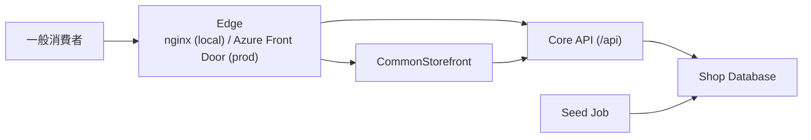
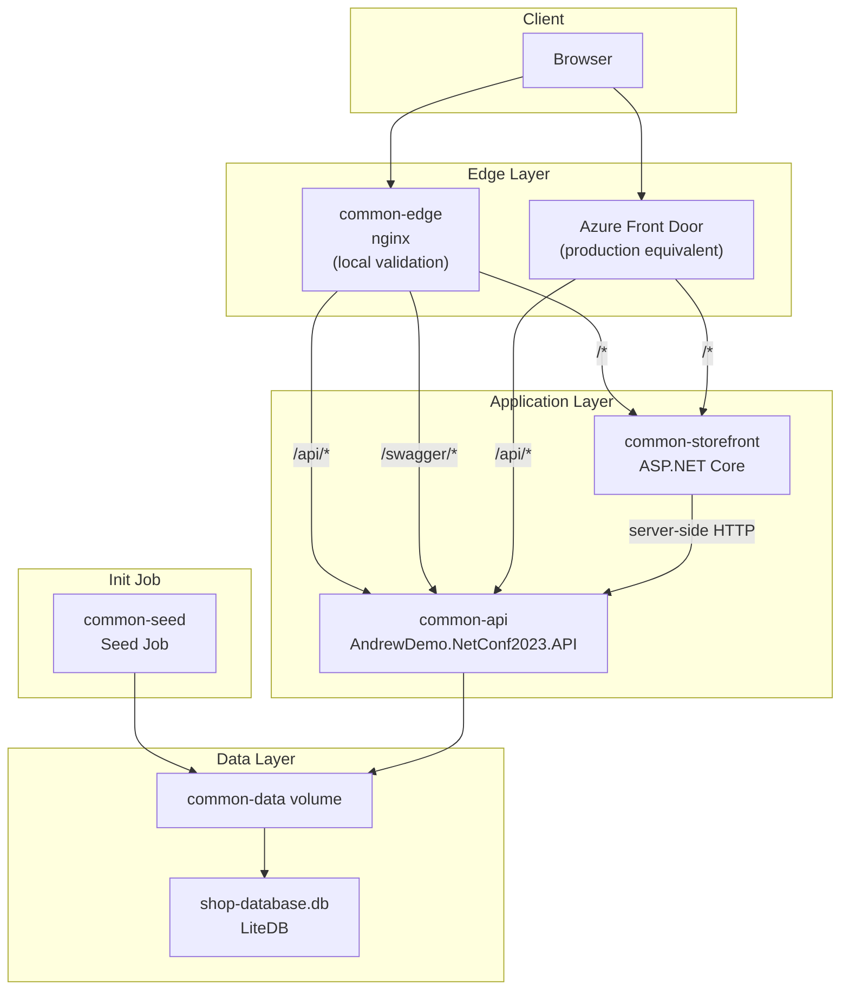

# CommonStorefront Docker Compose 部署結構說明

## 目的

這份文件只說明 **`.Core / Phase 1` 情境** 下，`CommonStorefront` 的 docker compose 驗證拓樸。

這份文件只關注：

- `CommonStorefront`
- 標準 `.API`
- `DatabaseInit` seed job
- `nginx`
- shared volume / LiteDB
- `Azure Front Door` 與 `nginx` 的角色對照

這份文件**不說明**：

- AppleBTS compose
- PetShop compose
- package / project reference 細節
- `.Abstract` / `.Core` 內部 class 關係

---

## 角色說明

### `nginx`

`nginx` 在這個 docker compose 裡的角色是：

- **本機驗證環境的 reverse proxy**
- 提供 browser 單一入口
- 負責 path routing：
  - `/*` -> `CommonStorefront`
  - `/api/*` -> `.API`
  - `/swagger/*` -> `.API` Swagger UI

`nginx` 的目的，是讓本機驗證時能模擬未來正式站點的同源入口，特別是：

- `/auth/login -> /api/login/authorize -> /auth/callback`
- `/products`
- `/cart`
- `/checkout`

### `Azure Front Door`

`Azure Front Door` 在正式部署時的角色，對應到本機的 `nginx`：

- **正式環境的 public edge**
- 對外提供網站入口
- 依 path 將流量轉發到 storefront 或 API

也就是說：

- 在 **docker compose 本機驗證** 中，這層由 `nginx` 扮演
- 在 **正式部署** 中，這層由 `Azure Front Door` 扮演

兩者都是 edge / routing 角色，但：

- `nginx` 是 local validation 用
- `Azure Front Door` 是 production public ingress 用

---

## 部署單位

在這個情境下，可部署單位只有這幾個：

- `common-edge`
  - `nginx`
- `common-storefront`
  - `AndrewDemo.NetConf2023.CommonStorefront`
- `common-api`
  - `AndrewDemo.NetConf2023.API`
- `common-seed`
  - `DatabaseInit` 的 seed snapshot 容器
- `common-data`
  - shared volume
- `shop-database.db`
  - LiteDB 檔案

---

## C4 Context Diagram



---

## C4 Container Diagram



---

## Docker Compose 實際拓樸

對應檔案：

- [compose/commonstorefront.compose.yaml](/Users/andrew/code-work/andrewshop.apidemo/compose/commonstorefront.compose.yaml)
- [compose/nginx/commonstorefront.conf](/Users/andrew/code-work/andrewshop.apidemo/compose/nginx/commonstorefront.conf)

實際結構如下：

```text
Browser
  -> common-edge (nginx) :5128
     -> /*          -> common-storefront
     -> /api/*      -> common-api
     -> /swagger/*  -> common-api

common-storefront
  -> server-side HTTP -> common-api

common-seed
  -> common-data volume

common-api
  -> common-data volume
  -> /data/shop-database.db
```

---

## 網路流向說明

### 1. 商品瀏覽

```text
Browser
  -> nginx
  -> CommonStorefront
  -> CommonStorefront server-side 呼叫 common-api
  -> common-api 讀取 database
```

### 2. OAuth 登入

```text
Browser
  -> nginx
  -> /auth/login
  -> /api/login/authorize
  -> /auth/callback
  -> CommonStorefront server-side 呼叫 /api/login/token
```

### 3. Seed 初始化

```text
common-seed
  -> 將 shop-database.db 複製到 common-data volume

common-api
  -> 從 common-data volume 掛載並使用同一份 database
```

---

## 這份拓樸的重點

### 1. Browser 只接觸 edge

browser 不直接知道：

- `common-storefront` 的 internal address
- `common-api` 的 internal address

browser 只看到：

- `http://localhost:5128`

### 2. Storefront 是 BFF

`CommonStorefront` 不是純靜態頁面，而是：

- server-side render
- server-side 呼叫 `.API`
- 在 server side 處理 auth callback 與 session

### 3. Storefront 不直接讀 database

在這個 Phase 1 情境中：

- storefront 只呼叫 `.API`
- `.API` 才讀 shared volume 內的 database

### 4. `nginx` 只負責 routing，不承載業務邏輯

`nginx` 只做：

- path routing
- 同源入口整合

不做：

- token exchange
- cart logic
- checkout logic
- domain orchestration

---

## 與正式部署的對照

若進入正式部署，可用這樣理解：

- `common-edge (nginx)` -> 對照 `Azure Front Door`
- `common-storefront` -> storefront service
- `common-api` -> backend API service
- `common-seed` -> init container / seed job
- `common-data volume + LiteDB` -> 目前 PoC 的資料層

這份 docker compose 的核心價值，是先把 **`.Core / Phase 1` 的 storefront + API + login + checkout** 驗證路徑跑通。
