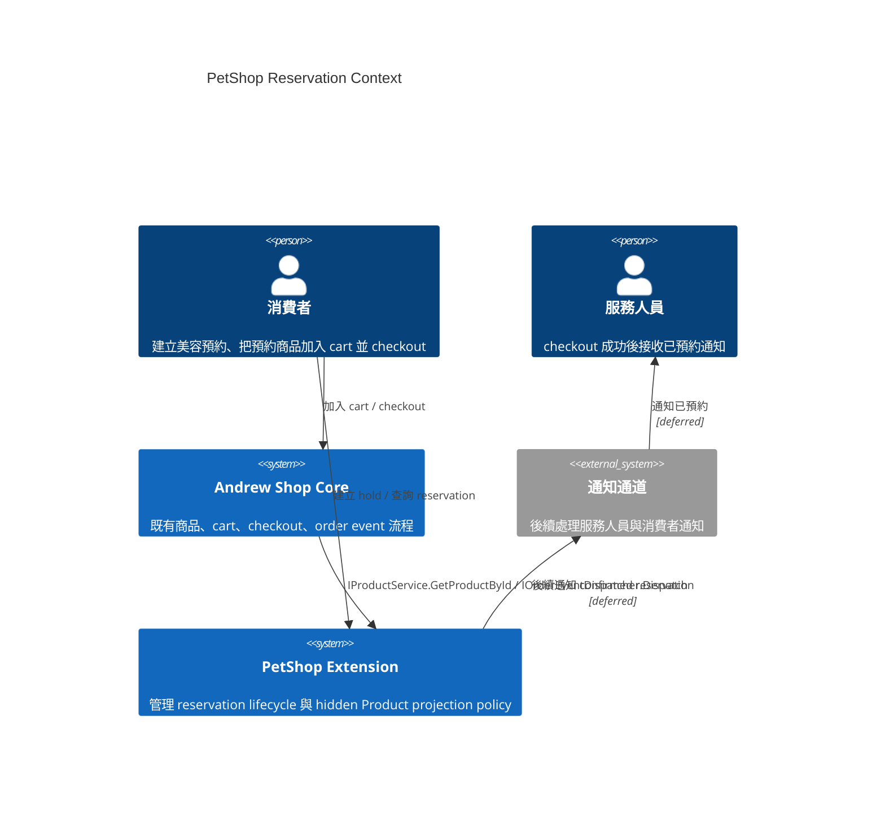
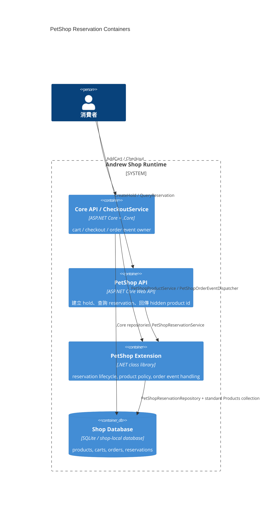
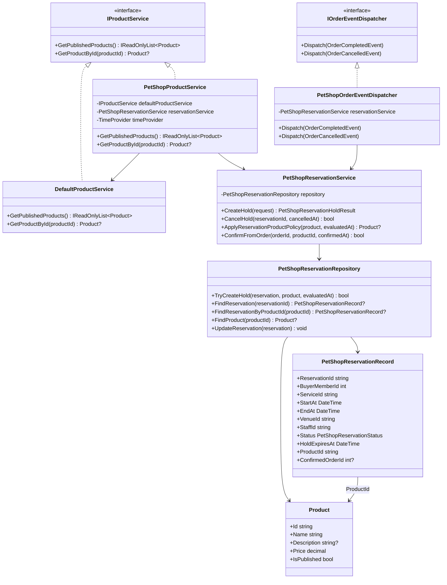
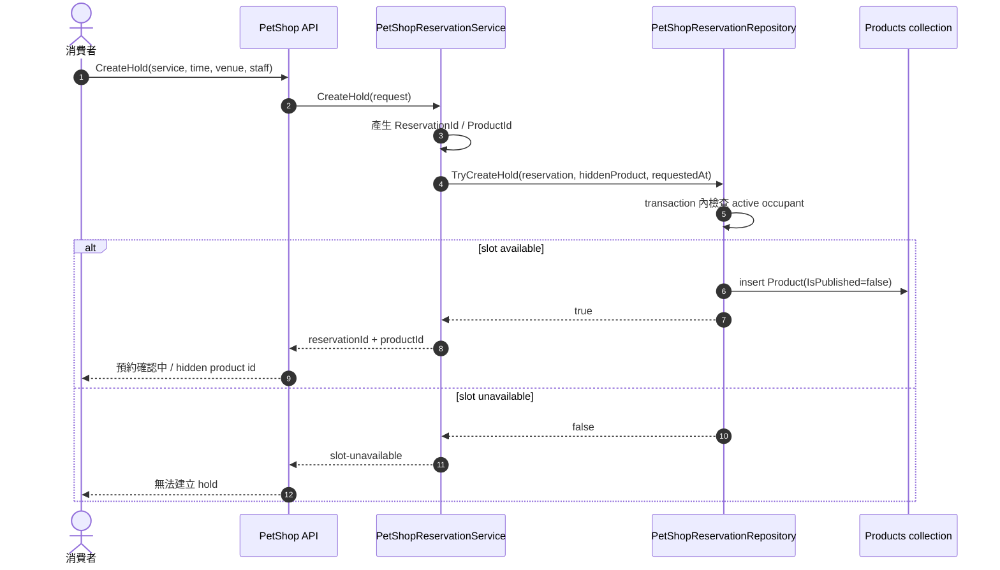
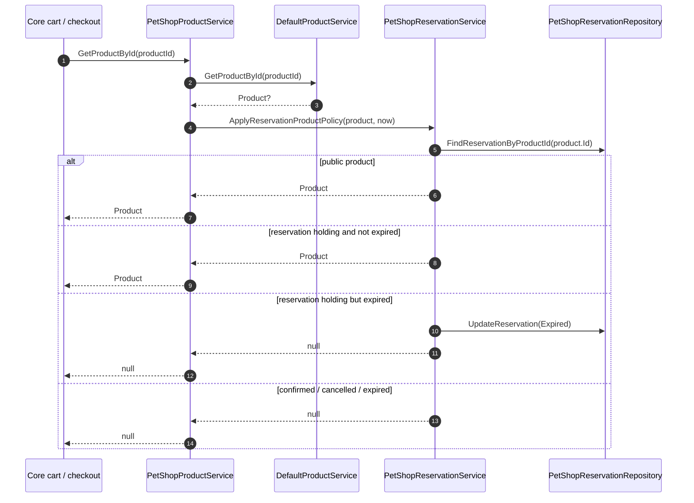
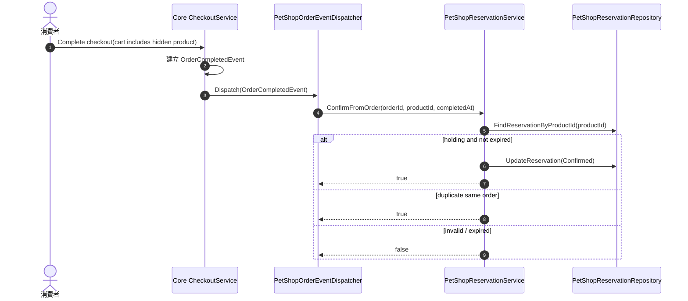
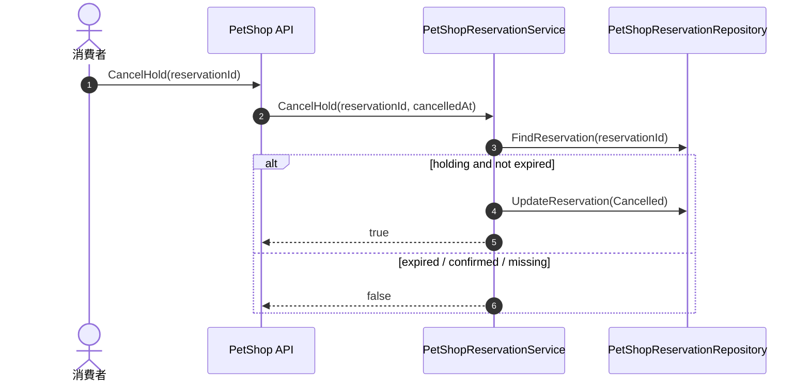
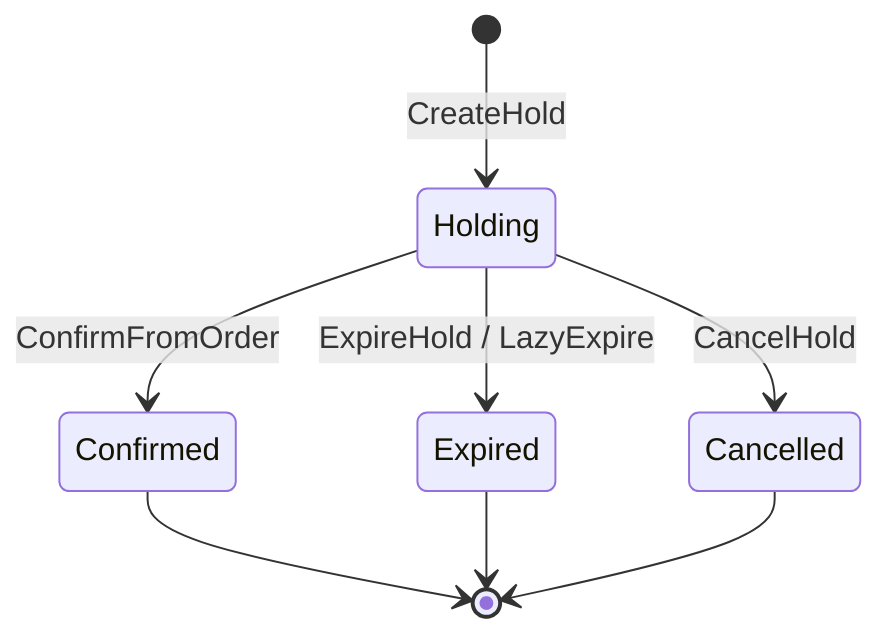

# PetShop Reservation / Hidden Product Projection Lifecycle 設計記錄

## 狀態

- phase: M4-P1A
- status: accepted
- review accepted: 2026-04-23

## 目的

本文件是 M4-P1A 已確認的設計記錄，只處理 `reservation` 與 hidden standard `Product` projection 的生命週期，以及哪些操作需要連動。

本階段不處理 discount、UI、通知可靠度、背景排程、checkout 後取消交易、confirmed reservation 取消 / 改期 API 與 multi-subscriber event bus。

本階段的 `CancelHold` 只代表 checkout 前取消尚未結帳的 hold，不代表訂單成立後取消交易。

## 核心判斷

- `reservation` 是預約子系統的主要 aggregate，保存預約事實與業務狀態。
- checkout bridge 不再建立 PetShop 自有 `dynamic-product` entity；改用標準 `Product` record，並固定 `IsPublished = false`。
- `reservation.ProductId` 指向這筆 hidden `Product`，讓預約結果能被既有 cart / checkout 當成商品解析。
- hidden `Product` 不保存獨立 lifecycle status；可不可購買完全由對應 reservation status 與 `HoldExpiresAt` 推導。
- `PetShopProductService` 是 `IProductService` decorator：先沿用標準 product lookup，再套用 reservation product policy。
- checkout 成功後，PetShop 透過 `IOrderEventDispatcher.Dispatch(OrderCompletedEvent)` 將 reservation 從 `Holding` 推進為 `Confirmed`。

## Review Diagrams

### C4 Context

### C4 Container

### Class Diagram

### Sequence - Create Hold

### Sequence - Product Lookup / Lazy Expire

### Sequence - Checkout Confirm

### Sequence - Cancel Hold

## Reservation 狀態機

### Reservation 狀態語意

| 狀態 | 語意 | 是否阻擋 slot | `GetProductById(ProductId)` |
|---|---|---:|---:|
| `Holding` | 預約確認中，保留 30 分鐘 | 是，未過期時阻擋 | 未過期時回傳 hidden `Product` |
| `Confirmed` | 已預約，checkout 已完成 | 是 | 回傳 `null` |
| `Expired` | hold 超過期限且未 checkout | 否 | 回傳 `null` |
| `Cancelled` | checkout 前 hold 已取消 | 否 | 回傳 `null` |

只有 `Holding` 與 `Confirmed` 會真的佔用預約資源。`Expired` / `Cancelled` 即使保留資料庫記錄，也不影響其他客戶 reserve 同樣的時間、場地與服務人員。

`Expired` / `Cancelled` 不允許回到 `Holding`。若使用者要重新預約，必須建立新的 reservation 與新的 hidden `Product`。這樣可保留原 reservation 的 audit trail，並避免舊 product id 被重新啟用後造成 cart / order event 的語意混淆。

## Hidden Product Projection 語意

hidden product projection 不是獨立 aggregate，也沒有自己的 status。它是標準 `Product` record：

- `Product.Id`: 由 PetShop reservation flow 產生的 opaque id。
- `Product.Name` / `Description` / `Price`: checkout snapshot。
- `Product.IsPublished`: 固定為 `false`，因此不會出現在 `GetPublishedProducts()`。
- `reservation.ProductId`: 指向這筆 hidden `Product`。

### Product 解析規則

| Product 條件 | Reservation 條件 | `PetShopProductService.GetProductById` |
|---|---|---|
| `IsPublished = true`，沒有 reservation mapping | 不適用 | 回傳 `Product` |
| `IsPublished = false`，沒有 reservation mapping | 不適用 | 回傳 `null` |
| `IsPublished = false` | `Holding` 且未過期 | 回傳 `Product` |
| `IsPublished = false` | `Holding` 但已過期 | lazy expire reservation，回傳 `null` |
| `IsPublished = false` | `Confirmed` / `Expired` / `Cancelled` | 回傳 `null` |

## 連動轉移

| 操作 | Reservation 前後 | Hidden Product record | Product 解析結果 | 主要 owner | 交易一致性 |
|---|---|---|---|---|---|
| `CreateHold` | `null -> Holding` | `null -> Product(IsPublished=false)` | 未過期時可解析 | `PetShopReservationService` | 必須同 transaction 檢查 slot 衝突並建立 reservation / product |
| `GetProductById` | 不改狀態；若已過期可 lazy expire | 不改 product record | active hold 回傳 `Product`，否則 `null` | `PetShopProductService` + `PetShopReservationService` | 可 lazy update；不可回傳過期商品 |
| `ExpireHold` | `Holding -> Expired` | 不改 product record | `null` | `PetShopReservationService` | 應以 transaction 更新 reservation |
| `ConfirmFromOrder` | `Holding -> Confirmed` | 不改 product record | checkout 後 `null` | `PetShopOrderEventDispatcher` + `PetShopReservationService` | 應以 transaction 更新 reservation；必須 idempotent |
| `CancelHold` | `Holding -> Cancelled` | 不改 product record | `null` | `PetShopReservationService` | checkout 前 hold 取消；應以 transaction 更新 reservation |

`CreateHold` 是第一版唯一需要檢查「是否與其他 reservation 衝突」的操作，必須設計成 database transaction：在同一個交易中確認目標 slot 沒有 active occupant，並建立 `reservation` / hidden `Product`。

`ConfirmFromOrder`、`ExpireHold`、`CancelHold` 不重新做 slot 衝突檢查，但仍應用 transaction 維持 reservation 狀態一致。hidden `Product` 不需要同步改狀態，因為是否可 checkout 已由 reservation 狀態推導。

`GetProductById` 不應取得或延長 slot，只能讀取有效 snapshot；若發現 hold 已過期，可以 lazy expire，但不可回傳已過期商品。

## 已確認決策

1. 只有 `Holding` 與 `Confirmed` 會真的佔用預約資源。
2. `Expired` / `Cancelled` 不回到 `Holding`，重新預約必須建立新的 reservation。
3. `CreateHold` 是第一版唯一需要檢查 slot 衝突的一致性操作，必須設計成 database transaction。
4. 原 `dynamic-product` 收斂成標準 hidden `Product` record；不建立獨立 entity / status，soft delete 語意改由 reservation terminal state 表達。
5. checkout 成功後，透過 `IOrderEventDispatcher.Dispatch(OrderCompletedEvent)` 回頭把 reservation 改成 `Confirmed`。

## 服務操作收斂

P1A 採 concrete-first。PetShop extension 內部不先建立 `IPetShopIdGenerator`、`IPetShopReservationStore` 這類尚未證明需要抽換的 interface；只有跨 `.Core` / extension 的既有正式擴充點維持 interface，例如 `IProductService` 與 `IOrderEventDispatcher`。

### `PetShopReservationService`

這是 reservation lifecycle 的 application service。

第一版操作：

- `CreateHold(request)`: 建立 `reservation` 與 hidden standard `Product`，產生不可猜的 `ProductId`，reservation 狀態為 `Holding`。
- `CancelHold(reservationId, cancelledAt)`: checkout 前取消 `Holding` reservation，轉為 `Cancelled`。
- `ApplyReservationProductPolicy(product, now)`: 依 reservation status 決定 hidden product 是否可被 cart / checkout 解析。
- `ExpireHold(reservationId, now)`: 將 `Holding` 改為 `Expired`。
- `ConfirmFromOrder(orderId, productId, confirmedAt)`: 由 order event 觸發，將 `Holding` 改為 `Confirmed`，並寫入 `OrderId`。

`CreateHold` 成功後才會建立 hidden `Product`。`Expired` / `Cancelled` / `Confirmed` 後，hidden product record 保留但不可解析，物理清理可留給後續 maintenance job，避免舊 cart line、稽核與 order event retry 找不到對應紀錄。

`CreateHold` 的輸入欄位較多，保留 request DTO；`CancelHold` 與 `ConfirmFromOrder` 參數少且語意穩定，直接使用 method parameters，不採用 command pattern。

`ReservationId` 與 `ProductId` 第一版由 `PetShopReservationService` 內部產生，不建立 `IPetShopIdGenerator`。若後續要換成 database sequence、ULID、Snowflake 或跨節點 ID 策略，再依實際需求重構。

### `PetShopReservationRepository`

這是 PetShop extension 內部的 concrete persistence boundary。

第一版行為：

- `TryCreateHold(reservation, product, evaluatedAt)`: 在同一個 transaction / critical section 內完成 slot conflict check 與 reservation / hidden `Product` 建立。
- `FindReservation(reservationId)`: 查詢 reservation。
- `FindReservationByProductId(productId)`: 由 order line / product lookup 反查 reservation。
- `FindProduct(productId)`: 從 `.Core` 標準 Products collection 查詢 `Product` record。
- `UpdateReservation(reservation)`: 更新 reservation lifecycle state。

保留 repository 是因為 `CreateHold` 的一致性需要明確 owner；不抽 `IPetShopReservationStore` 是因為目前沒有第二種 storage implementation，也沒有跨 module contract 需求。未來若真的需要 SQLite / in-memory / remote service 多實作並存，再抽 interface。

### `PetShopProductService : IProductService`

`IProductService` 是 checkout bridge 的讀取邊界，不應負責預約狀態轉移的主要邏輯。

第一版行為：

- `GetPublishedProducts()`: 委派給標準 product service，不回傳 hidden reservation product。
- `GetProductById(productId)`: 先由標準 product service 讀取 `Product`，再套用 `ApplyReservationProductPolicy`。
- 找不到、過期、已 confirmed、已 cancelled 的 reservation product 都回傳 `null`。

### `PetShopOrderEventDispatcher : IOrderEventDispatcher`

第一版行為：

- `Dispatch(OrderCompletedEvent)`: 逐筆檢查 order line 的 `ProductId`，找到 PetShop reservation product 後呼叫 `ConfirmFromOrder(...)`。
- 非 PetShop reservation product line 應忽略，不應造成整張訂單 dispatch 失敗。
- 重複處理同一 order event 必須 idempotent。
- `Dispatch(OrderCancelledEvent)`: P1A 先保留 no-op 或記錄；checkout 後取消交易屬於後續延伸需求。

checkout 成功後，reservation 只透過 `IOrderEventDispatcher.Dispatch(OrderCompletedEvent)` 回頭轉為 `Confirmed`。若 dispatcher 失敗，既有 checkout 語意是不 rollback order；reservation 會停留在 `Holding` 或後續過期，需由後續 retry / 補償設計處理。

## 第一版風險與後續決策點

- `.Core` 目前不做 buyer-aware product validation；PetShop API / Storefront 必須確保 hidden product id 只回傳給 reservation owner。
- `.Core` 目前不限制 quantity；PetShop reservation product 第一版應在 P1B 決定是否透過 API / UI 限制 cart quantity，或另開 `.Core` validation hook。
- lazy expiration 足以支持第一版 demo，但若多 instance / 高併發成為目標，應引入 storage-native unique constraint 或 slot lock record。
- discount 延後到 M4-P4；屆時需要決定 discount rule 如何辨識 reservation service line。
- checkout 後取消交易先略過，作為未來延伸需求；現階段 `Dispatch(OrderCancelledEvent)` 不改 reservation 狀態。

## 情境決策表

以下情境用同一組測試資料。欄位採 Y / N / `-` 表達會影響結果的重要決策；`-` 代表該案例中此決策不適用，通常是前一個條件已經讓流程停止。

- `ServiceId = grooming-basic`
- `StartAt = 2026-05-01T02:00:00Z`
- `EndAt = 2026-05-01T03:00:00Z`
- `VenueId = room-a`
- `StaffId = staff-amy`
- `HoldDuration = 30 min`

| Case | 建立預約時是否衝突? | checkout 前是否取消 hold? | 是否在 hold 時效內 checkout? | 是否為同一 order event 重送? | 預期 Reservation | 預期 Product Projection | 備註 |
|---|---:|---:|---:|---:|---|---|---|
| D1 | Y | - | - | - | 不建立 | 不建立新 hidden `Product` | `CreateHold` 回傳 slot unavailable |
| D2 | N | Y | N | - | `Holding -> Cancelled` | product record 保留，lookup 回傳 `null` | checkout 前取消 hold |
| D3 | N | N | N | - | `Holding -> Expired` | product record 保留，lookup 回傳 `null` | hold 過期，資源釋放 |
| D4 | N | N | Y | N | `Holding -> Confirmed` | product record 保留，checkout 後 lookup 回傳 `null` | checkout 成功後維持已預約 |
| D5 | N | - | - | - | 新 reservation `Holding` | 建立新 hidden `Product` | 只有歷史 `Expired` / `Cancelled` 紀錄時，不視為衝突 |
| D6 | N | N | Y | Y | 保持 `Confirmed` | lookup 維持 `null` | 同一 `OrderCompletedEvent` 重送，idempotent |

## 狀態變化模擬

表格欄位固定為 `sn`、`time`、`event`、`reservation-status`、`product-record`、`product-resolution`、`description`。

狀態欄位用 `before -> after` 表示該 event 對資料狀態造成的結果；`無 -> X` 代表該 event 建立資料，`X -> X` 代表事件沒有改變該筆資料狀態。

### D1 建立預約時發生衝突

| sn | time | event | reservation-status | product-record | product-resolution | description |
|---:|---|---|---|---|---|---|
| 1 | `2026-05-01T01:00:00Z` | `ExistingHoldCommitted` | `res-001: 無 -> Holding` | `pet-rsv-prod-001: 無 -> Hidden` | `GetProductById -> Product` | 會員 `101` 已持有同 slot，`HoldExpiresAt = 2026-05-01T01:30:00Z`。 |
| 2 | `2026-05-01T01:10:00Z` | `CreateHoldRequested` | `res-001: Holding -> Holding` | `pet-rsv-prod-001: Hidden -> Hidden` | `GetProductById -> Product` | 會員 `202` 對 `room-a + staff-amy + 02:00Z-03:00Z` 呼叫 `CreateHold`。 |
| 3 | `2026-05-01T01:10:00Z` | `SlotConflictDetected` | `res-001: Holding -> Holding` | `pet-rsv-prod-001: Hidden -> Hidden` | `GetProductById -> Product` | `res-001` 是尚未過期的 active occupant，因此 slot 不可用。 |
| 4 | `2026-05-01T01:10:00Z` | `CreateHoldRejected` | `res-002: 無 -> 無` | `pet-rsv-prod-002: 無 -> 無` | `GetProductById -> null` | 回傳 `slot-unavailable`；不建立新的 reservation，也不建立新的 hidden product。 |

### D2 checkout 前取消 hold

| sn | time | event | reservation-status | product-record | product-resolution | description |
|---:|---|---|---|---|---|---|
| 1 | `2026-05-01T01:00:00Z` | `CreateHoldCommitted` | `res-001: 無 -> Holding` | `pet-rsv-prod-001: 無 -> Hidden` | `GetProductById -> Product` | 建立預約確認中 hold，保留到 `2026-05-01T01:30:00Z`。 |
| 2 | `2026-05-01T01:15:00Z` | `CancelHoldRequested` | `res-001: Holding -> Holding` | `pet-rsv-prod-001: Hidden -> Hidden` | `GetProductById -> Product` | 會員 `101` 在 checkout 前取消 hold。 |
| 3 | `2026-05-01T01:15:00Z` | `HoldCancelled` | `res-001: Holding -> Cancelled` | `pet-rsv-prod-001: Hidden -> Hidden` | `GetProductById -> null` | product record 不刪除；reservation terminal state 讓該 product 不可再 checkout，slot 釋放。 |
| 4 | `2026-05-01T01:15:00Z` | `ProductLookupAfterCancel` | `res-001: Cancelled -> Cancelled` | `pet-rsv-prod-001: Hidden -> Hidden` | `GetProductById -> null` | direct lookup 也無法取得可 checkout product。 |

### D3 未在 hold 時效內 checkout

| sn | time | event | reservation-status | product-record | product-resolution | description |
|---:|---|---|---|---|---|---|
| 1 | `2026-05-01T01:00:00Z` | `CreateHoldCommitted` | `res-001: 無 -> Holding` | `pet-rsv-prod-001: 無 -> Hidden` | `GetProductById -> Product` | `HoldExpiresAt` 是 `2026-05-01T01:30:00Z`。 |
| 2 | `2026-05-01T01:31:00Z` | `ProductLookupRequested` | `res-001: Holding -> Holding` | `pet-rsv-prod-001: Hidden -> Hidden` | `GetProductById -> pending` | cart 或 checkout 嘗試解析 `pet-rsv-prod-001`。 |
| 3 | `2026-05-01T01:31:00Z` | `LazyExpireApplied` | `res-001: Holding -> Expired` | `pet-rsv-prod-001: Hidden -> Hidden` | `GetProductById -> null` | `PetShopProductService.GetProductById` 發現 hold 已過期，標記 reservation expired。 |
| 4 | `2026-05-01T01:31:00Z` | `ProductLookupRejected` | `res-001: Expired -> Expired` | `pet-rsv-prod-001: Hidden -> Hidden` | `GetProductById -> null` | 既有 cart / checkout product validation 擋下後續結帳。 |

### D4 在 hold 時效內 checkout 成功

| sn | time | event | reservation-status | product-record | product-resolution | description |
|---:|---|---|---|---|---|---|
| 1 | `2026-05-01T01:00:00Z` | `CreateHoldCommitted` | `res-001: 無 -> Holding` | `pet-rsv-prod-001: 無 -> Hidden` | `GetProductById -> Product` | 同 transaction 檢查 slot 無 active occupant，建立 hold 與 hidden product。 |
| 2 | `2026-05-01T01:12:00Z` | `CheckoutProductLookup` | `res-001: Holding -> Holding` | `pet-rsv-prod-001: Hidden -> Hidden` | `GetProductById -> Product` | checkout 解析 `pet-rsv-prod-001`，回傳 `Product` snapshot。 |
| 3 | `2026-05-01T01:12:00Z` | `OrderCreated` | `res-001: Holding -> Holding` | `pet-rsv-prod-001: Hidden -> Hidden` | `GetProductById -> Product` | `.Core` 建立 `OrderId = 9001`，order line 包含 `ProductId = pet-rsv-prod-001`。 |
| 4 | `2026-05-01T01:12:00Z` | `OrderCompletedDispatched` | `res-001: Holding -> Confirmed` | `pet-rsv-prod-001: Hidden -> Hidden` | `GetProductById -> null` | `PetShopOrderEventDispatcher` 呼叫 `ConfirmFromOrder`，寫入 `ConfirmedOrderId = 9001`。 |
| 5 | `2026-05-01T01:12:00Z` | `ProductLookupAfterConfirm` | `res-001: Confirmed -> Confirmed` | `pet-rsv-prod-001: Hidden -> Hidden` | `GetProductById -> null` | slot 仍被 `Confirmed` reservation 佔用，但 product 不可再次 checkout。 |

### D5 只有歷史 Expired / Cancelled 紀錄時重新建立預約

| sn | time | event | reservation-status | product-record | product-resolution | description |
|---:|---|---|---|---|---|---|
| 1 | `2026-05-01T01:31:00Z` | `HistoricalExpiredExists` | `res-001: 無 -> Expired` | `pet-rsv-prod-001: 無 -> Hidden` | `GetProductById -> null` | 同 slot 只有歷史 expired 紀錄，不佔位。 |
| 2 | `2026-05-01T01:31:00Z` | `CreateHoldRequestedAfterExpired` | `res-001: Expired -> Expired` | `pet-rsv-prod-001: Hidden -> Hidden` | `GetProductById -> null` | 會員 `202` 對同 slot 呼叫 `CreateHold`；舊資料不復活。 |
| 3 | `2026-05-01T01:31:00Z` | `CreateHoldCommittedAfterExpired` | `res-002: 無 -> Holding` | `pet-rsv-prod-002: 無 -> Hidden` | `GetProductById -> Product` | 因為沒有 active occupant，建立新的 reservation 與新的 hidden product。 |
| 4 | `2026-05-01T01:31:00Z` | `HistoricalCancelledExists` | `res-010: 無 -> Cancelled` | `pet-rsv-prod-010: 無 -> Hidden` | `GetProductById -> null` | 同 slot 只有歷史 cancelled 紀錄時，也不佔位。 |
| 5 | `2026-05-01T01:31:00Z` | `CreateHoldRequestedAfterCancelled` | `res-010: Cancelled -> Cancelled` | `pet-rsv-prod-010: Hidden -> Hidden` | `GetProductById -> null` | 系統不復活舊 reservation / product。 |
| 6 | `2026-05-01T01:31:00Z` | `CreateHoldCommittedAfterCancelled` | `res-011: 無 -> Holding` | `pet-rsv-prod-011: 無 -> Hidden` | `GetProductById -> Product` | 建立新的 reservation 與新的 hidden product。 |

### D6 order event 重送

| sn | time | event | reservation-status | product-record | product-resolution | description |
|---:|---|---|---|---|---|---|
| 1 | `2026-05-01T01:12:00Z` | `OrderAlreadyConfirmed` | `res-001: 無 -> Confirmed` | `pet-rsv-prod-001: 無 -> Hidden` | `GetProductById -> null` | 初始資料已是 checkout 成功後結果，`ConfirmedOrderId = 9001`。 |
| 2 | `2026-05-01T01:13:00Z` | `DuplicateOrderCompletedEventReceived` | `res-001: Confirmed -> Confirmed` | `pet-rsv-prod-001: Hidden -> Hidden` | `GetProductById -> null` | 因 retry 或重送，再次收到同一筆 `OrderCompletedEvent(OrderId = 9001)`。 |
| 3 | `2026-05-01T01:13:00Z` | `IdempotentConfirmSkipped` | `res-001: Confirmed -> Confirmed` | `pet-rsv-prod-001: Hidden -> Hidden` | `GetProductById -> null` | `ConfirmFromOrder` 偵測同一 order 已確認，回傳成功但不重複改狀態。 |
