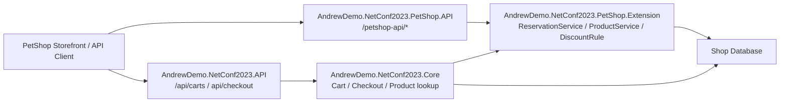
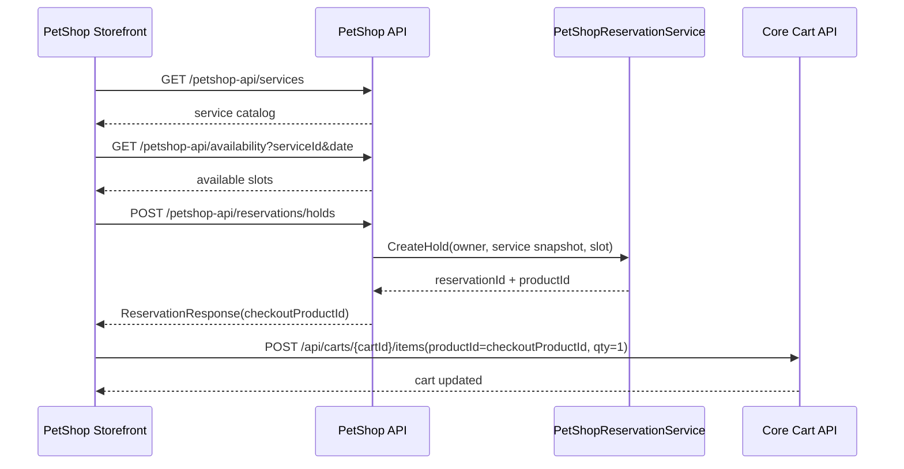

# PetShop Reservation API Spec

## 狀態

- phase: M4-P1B
- status: accepted
- 日期：2026-04-24

## 範圍

本文件定義 `AndrewDemo.NetConf2023.PetShop.API` 第一版 API contract。

第一版 API 只處理：

- 查詢 PetShop 可預約服務
- 查詢可預約時段
- 建立 reservation hold
- 查詢 reservation 狀態
- checkout 前取消 reservation hold
- 將 hidden reservation product id 安全回傳給 reservation owner

第一版 API 不處理：

- 直接加入購物車
- 直接 checkout
- checkout 後取消交易
- confirmed reservation 取消或改期
- staff/admin 排班維護
- durable notification channel / outbox

cart 與 checkout 仍沿用 Core API：

- `POST /api/carts/create`
- `POST /api/carts/{cartId}/items`
- `POST /api/carts/{cartId}/estimate`
- `POST /api/checkout/create`
- `POST /api/checkout/complete`

## API Boundary



## API Conventions

- route prefix 固定為 `/petshop-api`，比照 AppleBTS 的 `/bts-api` vertical API 命名。
- request / response 使用 JSON。
- date/time 欄位使用 ISO 8601 UTC。
- 需要會員身分的 API 沿用既有 Bearer token middleware，從 `Authorization: Bearer {accessToken}` 解析會員。
- 服務清單與 availability 查詢可匿名呼叫。
- 建立 hold、查詢 reservation、取消 hold 必須登入。
- hidden reservation product id 只會回傳給 reservation owner，且只在 reservation 仍為有效 `Holding` 時回傳。
- API 不提供 `add-to-cart` convenience endpoint；client 取得 `checkoutProductId` 後，仍呼叫 Core cart API 加入購物車。

## Status Values

API response 使用 string status，避免把 C# enum ordinal 暴露成外部 contract。

| value | meaning |
|---|---|
| `holding` | 預約確認中，佔位，hidden product 可被 owner 加入 cart |
| `confirmed` | 已預約，checkout completed 並已綁定 order |
| `expired` | hold 逾時，slot 已釋放 |
| `cancelled` | checkout 前取消 hold，slot 已釋放 |

## Error Response

第一版使用簡單 error body，不先導入跨專案 ProblemDetails wrapper。

```json
{
  "code": "slot-unavailable",
  "message": "The selected reservation slot is no longer available."
}
```

固定錯誤碼：

| code | HTTP status | meaning |
|---|---:|---|
| `unauthorized` | 401 | 未登入或 token 失效 |
| `validation-failed` | 400 | request 欄位格式錯誤 |
| `service-not-found` | 404 | service id 不存在或不可預約 |
| `reservation-not-found` | 404 | reservation id 不存在 |
| `reservation-owner-mismatch` | 403 | reservation 不屬於目前登入會員 |
| `slot-unavailable` | 409 | 建立 hold 時 slot 已被其他 active reservation 佔用 |
| `hold-expired` | 409 | 操作時 hold 已過期 |
| `reservation-not-cancellable` | 409 | reservation 目前狀態不可 checkout 前取消 |

## Data Contracts

### PetShopServiceResponse

```json
{
  "serviceId": "grooming-basic",
  "name": "基礎美容",
  "description": "基礎美容預約服務",
  "price": 2000,
  "durationMinutes": 60
}
```

欄位：

| field | type | required | note |
|---|---|---:|---|
| `serviceId` | string | Y | 預約服務識別碼 |
| `name` | string | Y | 顯示名稱，也會成為 hidden product name snapshot |
| `description` | string? | N | 顯示描述，也會成為 hidden product description snapshot |
| `price` | decimal | Y | 建立 hold 時的 hidden product price snapshot |
| `durationMinutes` | int | Y | API 依 `startAt + durationMinutes` 推導 `endAt` |

### AvailabilitySlotResponse

```json
{
  "serviceId": "grooming-basic",
  "startAt": "2026-05-01T02:00:00Z",
  "endAt": "2026-05-01T03:00:00Z",
  "venueId": "room-a",
  "venueName": "美容室 A",
  "staffId": "staff-amy",
  "staffName": "Amy"
}
```

欄位：

| field | type | required | note |
|---|---|---:|---|
| `serviceId` | string | Y | 對應服務 |
| `startAt` | datetime | Y | UTC |
| `endAt` | datetime | Y | UTC |
| `venueId` | string | Y | 場地 |
| `venueName` | string? | N | 顯示名稱 |
| `staffId` | string | Y | 服務人員 |
| `staffName` | string? | N | 顯示名稱 |

### CreateReservationHoldRequest

```json
{
  "serviceId": "grooming-basic",
  "startAt": "2026-05-01T02:00:00Z",
  "venueId": "room-a",
  "staffId": "staff-amy"
}
```

欄位：

| field | type | required | note |
|---|---|---:|---|
| `serviceId` | string | Y | API 必須用 service catalog 解析名稱、價格與 duration |
| `startAt` | datetime | Y | UTC |
| `venueId` | string | Y | 場地 |
| `staffId` | string | Y | 服務人員 |

`endAt`、`serviceName`、`price`、`holdDuration` 不由 client 傳入；API 由 server-side catalog 與 policy 推導，避免 client 竄改價格或保留時間。

### ReservationResponse

```json
{
  "reservationId": "pet-rsv-001",
  "status": "holding",
  "buyerMemberId": 101,
  "serviceId": "grooming-basic",
  "serviceName": "基礎美容",
  "price": 2000,
  "startAt": "2026-05-01T02:00:00Z",
  "endAt": "2026-05-01T03:00:00Z",
  "venueId": "room-a",
  "staffId": "staff-amy",
  "holdExpiresAt": "2026-05-01T01:30:00Z",
  "checkoutProductId": "pet-rsv-prod-001",
  "confirmedOrderId": null,
  "createdAt": "2026-05-01T01:00:00Z",
  "updatedAt": "2026-05-01T01:00:00Z"
}
```

欄位：

| field | type | required | note |
|---|---|---:|---|
| `reservationId` | string | Y | reservation 主鍵 |
| `status` | string | Y | `holding` / `confirmed` / `expired` / `cancelled` |
| `buyerMemberId` | int | Y | reservation owner |
| `serviceId` | string | Y | 服務識別碼 |
| `serviceName` | string | Y | hidden product snapshot name |
| `price` | decimal | Y | hidden product snapshot price |
| `startAt` | datetime | Y | UTC |
| `endAt` | datetime | Y | UTC |
| `venueId` | string | Y | 場地 |
| `staffId` | string | Y | 服務人員 |
| `holdExpiresAt` | datetime | Y | hold 保留期限 |
| `checkoutProductId` | string? | N | 只有 owner 查詢有效 `holding` reservation 時回傳；其他狀態為 `null` |
| `confirmedOrderId` | int? | N | checkout 成功後綁定的 order id |
| `createdAt` | datetime | Y | UTC |
| `updatedAt` | datetime | Y | UTC |

## Endpoints

### GET `/petshop-api/services`

取得可預約服務清單。

Auth: anonymous

Response:

- `200 OK`: `PetShopServiceResponse[]`

### GET `/petshop-api/availability`

查詢指定服務在指定日期的可預約時段。

Auth: anonymous

Query:

| name | type | required | note |
|---|---|---:|---|
| `serviceId` | string | Y | 服務識別碼 |
| `date` | date | Y | 以商店營運時區解讀，再輸出 UTC slot |
| `venueId` | string | N | 指定場地 |
| `staffId` | string | N | 指定服務人員 |

Response:

- `200 OK`: `AvailabilitySlotResponse[]`
- `404 Not Found`: `service-not-found`

Availability 只作為 UI 提示；真正一致性仍由 `POST /petshop-api/reservations/holds` 的 database transaction 與 slot conflict check 決定。

第一版只回傳可用 slot；已被 active reservation 佔用的 slot 不出現在 response。

### POST `/petshop-api/reservations/holds`

建立 reservation hold，成功後同時建立 hidden standard `Product(IsPublished=false)`。

Auth: required

Request: `CreateReservationHoldRequest`

Response:

- `201 Created`: `ReservationResponse`
- `400 Bad Request`: `validation-failed`
- `401 Unauthorized`: `unauthorized`
- `404 Not Found`: `service-not-found`
- `409 Conflict`: `slot-unavailable`

成功回應的 `Location` header 應指向 `/petshop-api/reservations/{reservationId}`。

狀態效果：

- `reservation: none -> holding`
- `hidden product: none -> created`
- `checkoutProductId` 回傳給 reservation owner
- slot 保留 30 分鐘

### GET `/petshop-api/reservations`

查詢目前登入會員的 reservations。

Auth: required

Response:

- `200 OK`: `ReservationResponse[]`
- `401 Unauthorized`: `unauthorized`

list endpoint 僅回傳目前登入會員自己的 reservations。

回應時也必須套用 lazy expiration；若某筆 `Holding` 已超過 `HoldExpiresAt`，回應應呈現 `expired`，且 `checkoutProductId = null`。

### GET `/petshop-api/reservations/{reservationId}`

查詢 reservation 狀態。

Auth: required

Response:

- `200 OK`: `ReservationResponse`
- `401 Unauthorized`: `unauthorized`
- `403 Forbidden`: `reservation-owner-mismatch`
- `404 Not Found`: `reservation-not-found`

查詢時必須套用 lazy expiration；若 `Holding` 已超過 `HoldExpiresAt`，回應應呈現 `expired`，且 `checkoutProductId = null`。

### POST `/petshop-api/reservations/{reservationId}/cancel-hold`

checkout 前取消 reservation hold。

Auth: required

Request: empty JSON object 或 empty body。

Response:

- `200 OK`: `ReservationResponse`
- `401 Unauthorized`: `unauthorized`
- `403 Forbidden`: `reservation-owner-mismatch`
- `404 Not Found`: `reservation-not-found`
- `409 Conflict`: `hold-expired`
- `409 Conflict`: `reservation-not-cancellable`

取消已是 `cancelled` 的 reservation 可視為 idempotent success，回傳 `200 OK` 與目前 reservation 狀態。

狀態效果：

- `holding -> cancelled`
- hidden product record 保留
- `checkoutProductId = null`
- slot 釋放

## Required Extension Operations

第一版 API implementation 可繼續使用 concrete-first 邊界，不需要新增 interface。

| API need | 建議操作 |
|---|---|
| service catalog | 新增 concrete `PetShopServiceCatalog` 或 seed-backed repository |
| availability | 新增 concrete `PetShopAvailabilityService`，根據 catalog slot 與 active reservation 判斷 |
| create hold | 沿用 `PetShopReservationService.CreateHold(...)` |
| query reservation | 擴充 `PetShopReservationService` 增加 read snapshot method，並套用 lazy expiration |
| cancel hold | 沿用 `PetShopReservationService.CancelHold(...)`，API façade 負責 owner check 與錯誤碼 mapping |

## Main Sequence



## Accepted Notes

- `GET /petshop-api/availability` 第一版只回傳可用 slot。
- `POST /petshop-api/reservations/{reservationId}/cancel-hold` 明確採 command semantics，不改成 `DELETE`。
- 第一版必須提供 `GET /petshop-api/reservations` 查詢目前會員自己的 reservations。
