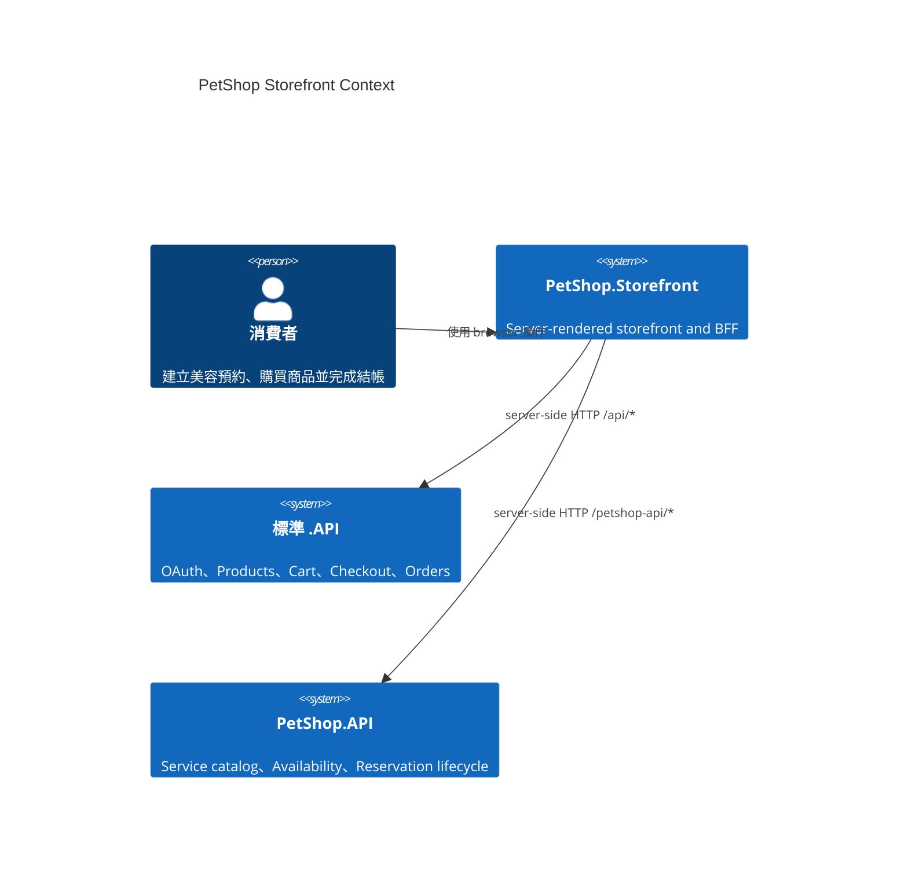
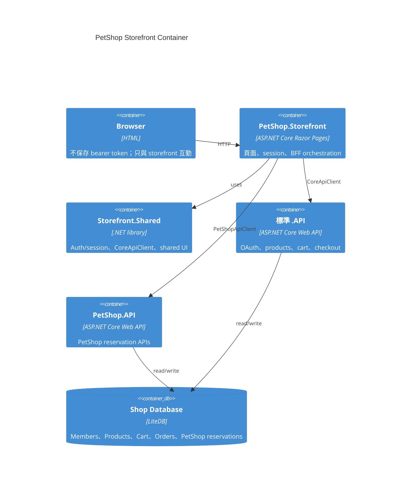
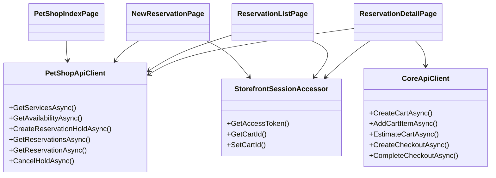
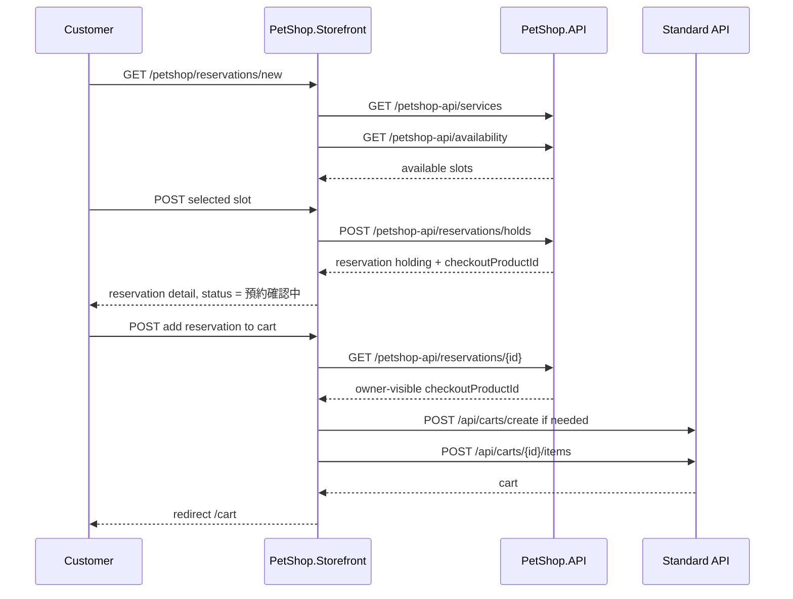
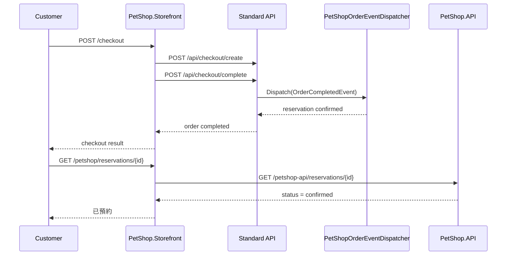

# PetShop Storefront Baseline 規格

## 狀態

- phase: M4-P3
- status: accepted; implemented; browser-smoke-passed
- 日期：2026-04-24

## 範圍

本規格定義 `AndrewDemo.NetConf2023.PetShop.Storefront` 第一版 storefront 邊界。

本階段涵蓋：

- PetShop storefront route map
- server-side BFF client boundary
- reservation flow 的 UI 狀態與主要 action
- cart / checkout 與 CommonStorefront baseline 的重用方式
- member reservation / order status 顯示方向
- P3A / P3B / P3C 的實作驗收基準

本階段不涵蓋：

- Pet profile / medical notes
- staff/admin 排班維護 UI
- confirmed 後取消 / 改期
- checkout 後取消交易
- durable notification / outbox UI
- SPA framework 或 browser-side token API client

## 目標

- 使用者能從 storefront 建立寵物美容 reservation hold。
- reservation hold 成功後，使用者可把 reservation hidden product 加入標準 cart。
- reservation 與一般商品可透過標準 cart / checkout 一起結帳。
- checkout completed 後，reservation 狀態可在 storefront 顯示為 confirmed。
- PetShop Storefront 不破壞 storefront family 的 BFF / auth / UI grammar。

## Canonical 術語

- `PetShop.Storefront`: PetShop vertical website。
- `PetShopApiClient`: PetShop Storefront server-side BFF client，負責呼叫 `/petshop-api/*`。
- `reservation hold`: PetShop reservation 的 `holding` 狀態，對使用者顯示為「預約確認中」。
- `checkoutProductId`: reservation hold 對應的 hidden standard `Product.Id`，只能在 server side BFF action 中用來加入 cart，不應作為主要 UI 文案對使用者呈現。
- `standard cart / checkout`: 既有 `/cart`、`/checkout` 與標準 `.API` 流程。

## 正式規格

### 1. 技術基準

- `PetShop.Storefront` 必須採 ASP.NET Core Razor Pages 或 MVC server-rendered page。
- 必須沿用 `Storefront.Shared` 的 auth/session、`CoreApiClient`、layout 與共用 UI partials。
- 必須採 server-side BFF 模式。
- browser 不得直接持 bearer token 呼叫 `/api` 或 `/petshop-api`。
- 第一版不引入 SPA framework 或 Node.js frontend build pipeline。

### 2. Backend 呼叫邊界

`PetShop.Storefront` 必須透過 server side 呼叫 backend APIs：

- 標準 product / cart / checkout / member / orders 使用 `CoreApiClient`。
- PetShop service catalog / availability / reservations 使用 `PetShopApiClient`。
- `PetShopApiClient` 的 base URL 由 `Storefront:PetShopApi:BaseUrl` 設定。

`PetShopApiClient` 第一版必須支援：

- `GetServicesAsync`
- `GetAvailabilityAsync`
- `CreateReservationHoldAsync`
- `GetReservationsAsync`
- `GetReservationAsync`
- `CancelHoldAsync`

### 3. Page Routes

`PetShop.Storefront` 必須至少提供：

- `/`
- `/petshop`
- `/petshop/reservations/new`
- `/petshop/reservations`
- `/petshop/reservations/{id}`
- `/products`
- `/products/{id}`
- `/cart`
- `/checkout`
- `/member`
- `/member/orders`
- `/auth/login`
- `/auth/callback`
- `/auth/logout`

其中 `/products`、`/cart`、`/checkout`、`/member`、`/auth/*` 可直接沿用 CommonStorefront / Storefront.Shared 的 grammar 與既有頁面模式。

### 4. Page Auth Boundary

以下 PetShop 頁面可匿名瀏覽：

- `/petshop`
- `/petshop/reservations/new` 的服務與 availability 查詢狀態

以下 action 必須要求登入：

- 建立 reservation hold
- 查詢自己的 reservations
- 查詢單筆 reservation detail
- 將 holding reservation 加入 cart
- checkout 前取消 hold

若未登入使用者執行受保護 action，storefront 必須先導向 `/auth/login`，並保留 return url。

### 5. PetShop 首頁 `/petshop`

`/petshop` 必須顯示：

- 美容服務清單
- 每個服務的名稱、說明、價格、服務時間
- 前往建立 reservation 的入口
- 登入後可看到「我的預約」入口或目前 reservation 摘要

### 6. 建立預約 `/petshop/reservations/new`

建立預約頁必須：

- 讀取 service catalog。
- 讓使用者選擇服務與日期。
- 只顯示 PetShop API 回傳的可用 slot。
- slot 顯示至少包含時間、場地與服務人員。
- 使用者選定 slot 後，server side 呼叫 `/petshop-api/reservations/holds`。
- create hold 成功後，頁面或 redirect destination 必須顯示：
  - reservation id
  - 服務名稱
  - 預約時間
  - 場地
  - 服務人員
  - 狀態：「預約確認中」
  - hold 到期時間
  - 加入購物車 action
  - 取消 hold action

### 7. 加入購物車

加入購物車必須由 server side action 執行：

- 讀取目前會員 access token。
- 呼叫 `PetShopApiClient.GetReservationAsync` 取得 owner-visible reservation detail。
- 確認 reservation status 為 `holding` 且 `checkoutProductId` 不為空。
- 透過 `CoreApiClient` 建立或讀取目前 cart。
- 呼叫標準 `/api/carts/{cartId}/items` 將 `checkoutProductId` 加入 cart。
- 成功後導向 `/cart`。

UI 不應把 `checkoutProductId` 當作可複製或可搜尋的商品識別碼呈現給使用者。

### 8. 取消 Hold

checkout 前取消 hold 必須：

- 只在 reservation status 為 `holding` 時顯示主要 action。
- 由 server side 呼叫 `POST /petshop-api/reservations/{id}/cancel-hold`。
- 成功後顯示 `cancelled` 狀態。
- 取消後不得再顯示加入購物車 action。

### 9. Cart / Checkout Integration

- `/cart` 必須能顯示 reservation hidden product 的名稱與價格。
- 若同次 cart 包含有效 reservation line 且一般商品金額大於 1000，`/cart` estimate 必須顯示 `PetShop 預約購買滿額折扣`。
- `/checkout` 仍使用標準 checkout flow。
- checkout completed 後，reservation confirmed transition 由標準 `.API` 的 `IOrderEventDispatcher` 完成。
- storefront 不自行修改 reservation confirmed status。

### 10. Member Reservation / Order Status

- `/petshop/reservations` 必須顯示目前會員的 reservation list。
- `/petshop/reservations/{id}` 必須顯示 reservation detail 與目前狀態。
- `/member` 應提供 PetShop reservation 摘要或前往 `/petshop/reservations` 的入口。
- `/member/orders` 若訂單包含 reservation product 或 PetShop discount，必須沿用現有 discount line 顯示 grammar，清楚列出折扣名稱、說明與金額。

## C4 Context

## C4 Container

## Class Diagram

## Sequence: Create Hold And Add To Cart

## Sequence: Checkout Confirmation

## 非目標

- 不建立 PetShop 專屬 checkout API。
- 不讓 UI 顯示或複製 hidden product id。
- 不在 storefront 內做 slot conflict 判定；slot 一致性由 PetShop API / Extension 負責。
- 不處理 checkout 後取消交易。
- 不導入 background expiration worker UI。
- 不導入 durable notification UI。
