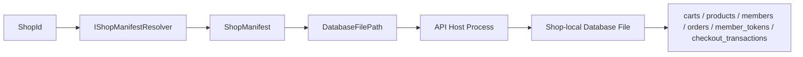

# Shop Runtime Data Isolation Mode 規格

## 狀態

- phase: 1
- status: draft-for-freeze
- 日期：2026-04-01

## 範圍

本規格只涵蓋以下主題：

1. `ShopManifest.DatabaseFilePath` 的 canonical 語意
2. 目前 runtime 的資料拓樸是否採 tenant isolation mode
3. `ShopId`、manifest、database file 之間的對應關係
4. `.API` 與 `.Core` 在啟動與資料存取上的結構假設

本規格暫不涵蓋：

- 跨 shop 的 shared member master
- 跨 shop 的 shared product master / inventory
- row-level `ShopId` discriminator 的 tenant share mode
- 多 host 共用同一個 physical database 的結構
- `BusinessStoreId` / `StoreGroupId` 一類的 business identity

## 目標

- 讓後續開發清楚理解目前 repo 的 shop runtime 拓樸
- 明確定義目前系統採 tenant isolation mode，而非 tenant share mode
- 避免後續專案誤把現行結構理解成 row-level multi-tenant

## Canonical 術語

- `ShopId`: 啟動時選擇商店組態的識別碼
- `ShopManifest`: 單一 shop runtime 的啟動設定
- `DatabaseFilePath`: 該 shop runtime 對應的資料庫檔案路徑
- `Tenant Isolation Mode`: 每個 shop runtime 使用自己的專屬資料庫
- `Tenant Share Mode`: 同一個資料庫內包含多個 shop 資料，再以 discriminator 區分

## 核心規則

### 1. 目前系統採 `Tenant Isolation Mode`

canonical 結論：

- 每個 `ShopId` 解析到一份 `ShopManifest`
- 每份 `ShopManifest` 指向一個 `DatabaseFilePath`
- 該 database file 視為該 shop runtime 的專屬資料庫

因此目前系統不是：

- 同一個 database 先裝入多個 shop 的資料
- 再靠 `ShopId` 或 row-level discriminator 去篩選

### 2. `ShopId` 不作為資料列層級的 tenant key

目前設計中：

- `ShopId` 的用途是選擇 manifest 與 runtime wiring
- 不是每筆資料都要帶的資料庫 tenant key

因此下列 collection / table 的 canonical 結構，不依賴 row-level `ShopId` 過濾：

- `members`
- `products`
- `carts`
- `orders`
- `member_tokens`
- `checkout_transactions`

### 3. `DatabaseFilePath` 是 runtime 邊界的一部分

`ShopManifest.DatabaseFilePath` 不只是部署參數，而是目前 tenant isolation mode 的一部分。

規則：

- 必填
- 啟動時由 host 解析為實際連線路徑
- 該路徑對應目前 process 所使用的唯一 shop database

### 4. 單一 process 只服務單一 shop database

目前 runtime 假設：

- 啟動階段只解析一個 `ShopManifest`
- 啟動後只建立一個 `ShopDatabaseContext`
- 該 context 只連向一個 database file

因此單一 process 啟動後：

- 不會同時服務多個 shop database
- 不會在 request 期間切換資料庫

## `.API` 行為要求

- `.API` 啟動時必須先解析 `ShopId`
- host 必須依 `ShopManifest.DatabaseFilePath` 建立資料庫連線
- host 不得假設 database 內有多個 shop 的 row-level 資料可切換
- 若未來要改成 tenant share mode，必須重開 Phase 1

## `.Core` 行為要求

- `ShopDatabaseContext` 目前以單一 connection string 建立單一 `LiteDatabase`
- `.Core` 內建 collection 名稱固定：
  - `carts`
  - `products`
  - `members`
  - `orders`
  - `member_tokens`
  - `checkout_transactions`
- `.Core` 不負責依 `ShopId` 對上述 collection 做 row-level filter
- 目前 collection 被視為該 shop database 的本地資料

## Canonical 拓樸

## 非目標

- 本規格不定義跨 shop 資料同步
- 本規格不定義 shared physical database
- 本規格不定義 row-level multi-tenant
- 本規格不定義共享 member / product / inventory 模式

## 未來若要改成 `Tenant Share Mode`

那不屬於目前主線，且不得被視為相容的小改。

必須重開 Phase 1，至少重新確認：

- `ShopId` 是否要成為資料列層級 discriminator
- 哪些資料是 shared，哪些資料是 shop-scoped
- `ShopDatabaseContext` 是否要拆成 shared context 與 runtime context
- 既有 collection schema 是否需要加入 `ShopId`
